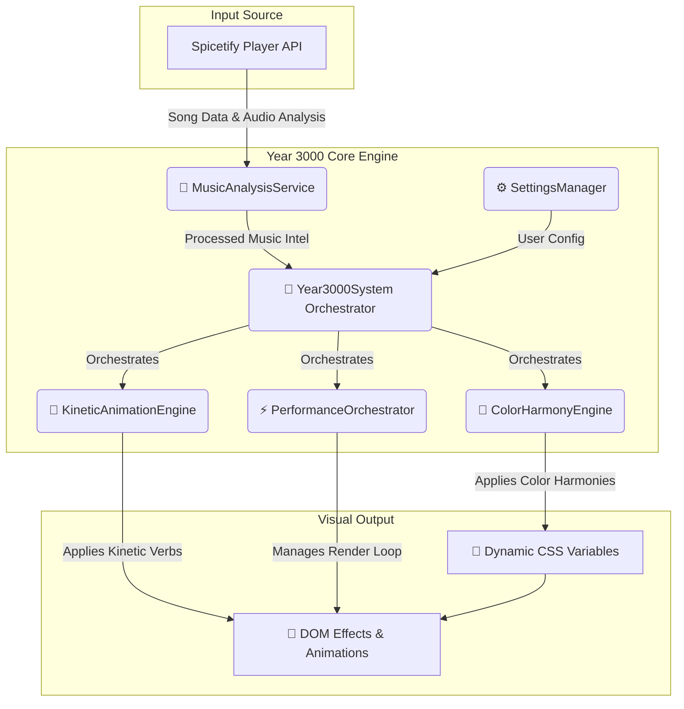
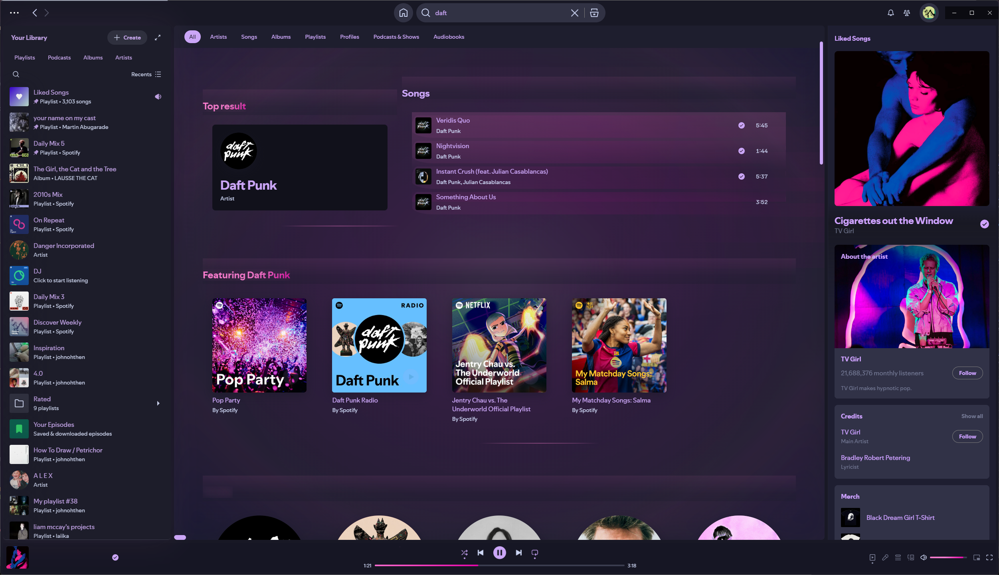

# 🌌 Catppuccin StarryNight: Year 3000 Visual System

<div align="center">


[](https://spicetify.app/)
[](https://github.com/catppuccin)
[](#)
[](https://github.com/minipuft/catppuccin-starrynight)
[](#)
[](#)
[](LICENSE)

**🚀 The Revolutionary Music-Reactive Visual Experience Platform**

_Transform Spotify into an intelligent, music-synchronized visual ecosystem with enterprise-grade performance optimization and next-generation kinetic animation systems._

[⚡ Quick Install](#-one-command-installation) • [🎯 Advanced Features](#-what-makes-this-revolutionary) • [🏗️ Architecture](#-system-architecture) • [🛠️ Advanced Config](#-advanced-configuration)

---

</div>

## 🌟 What Makes This Revolutionary?

My attempt at a **sophisticated audio-visual intelligence platform** that creates a living, breathing interface synchronized to your music:

- **🧠 Year 3000 Color Harmony System** → Advanced color extraction with complete RGB variable pipeline for gradients
- **⚡ Kinetic Animation Engine** → 5 sophisticated animation systems: ripple, bloom, refract, oscillate, harmonize
- **🎵 Music-Reactive Intelligence** → Real-time BPM synchronization with visual effects orchestration
- **🏗️ Enterprise Architecture** → Modular systems with performance optimization and hot-reload capabilities
- **🎨 Dynamic Visual Adaptation** → Complete RGB variable system enables all gradients to work with album art colors
- **🚀 Performance Orchestration** → Consolidated animation loops, timer management, and resource optimization
- 🌌 **Aesthetic Gravity** → Attention-flow systems that guide visual focus

Transform your music experience from **static interface** to **living, breathing visual symphony**.

## 🚀 Revolutionary Music-Visual Synchronization

**🎯 The Future of Audio-Visual Interfaces: Your Music Becomes Your Interface**

This system doesn't just change colors – it creates a **complete sensory ecosystem** that responds intelligently to your music:

```javascript
// 🎵 Real-time music analysis drives visual systems
const musicAnalysis = await Spicetify.getAudioData(trackUri);
year3000System.harmonizeVisuals({
  tempo: musicAnalysis.tempo,
  energy: musicAnalysis.energy,
  valence: musicAnalysis.valence,
});

// 🌊 Kinetic animations synchronized to beat
kineticEngine.activateVerb("bloom", {
  intensity: musicAnalysis.energy,
  tempo: musicAnalysis.tempo,
});
```

**🌟 Revolutionary Capabilities:**

- **🎼 Musical Intelligence**: Visual effects automatically adapt to tempo, energy, and mood
- **🌊 Kinetic Verb System**: Five advanced animation primitives create complex visual language
- **🎨 Harmonic Color Evolution**: Colors don't just change – they harmonize and flow intelligently
- **⚡ Performance Orchestration**: Enterprise-grade optimization keeps everything smooth
- **🔄 Real-Time Adaptation**: Interface literally dances with your music

This is what **next-generation music interfaces** look like – where your music and your interface become one unified experience.

## ⚡ Advanced System Architecture

<table>
<tr>
<td width="50%">

**🧠 Year 3000 Core Engine**

- 🎵 **Music Analysis Service** → Real-time audio feature extraction
- 🌊 **Kinetic Animation Engine** → 5 sophisticated animation systems
- 🎨 **Color Harmony Foundation** → Intelligent color synchronization
- ⚡ **Performance Orchestrator** → Consolidated animation and timer management
- 🔧 **Hot-Reload System** → Development-grade live updates
- 📱 **Responsive Intelligence** → Adaptive performance based on device capabilities

</td>
<td width="50%">

**🏗️ Enterprise Architecture**

- 🎯 **Modular System Design** → Independent, composable visual systems
- 🚀 **Performance Optimization** → Consolidated requestAnimationFrame loops
- 📊 **Resource Management** → Memory usage monitoring and cleanup
- 🔍 **Debug Interface** → Comprehensive system introspection tools
- ⚙️ **Configuration Management** → Hot-reloadable settings and profiles
- 🛡️ **Graceful Degradation** → Progressive enhancement based on system capabilities

</td>
</tr>
<tr>
<td colspan="2">

**🎨 Complete Kinetic Animation Suite**

- 🌊 **Ripple** → Expanding energy waves synchronized to beat drops
- 🌸 **Bloom** → Organic growth effects that pulse with musical dynamics
- 🔮 **Refract** → Light-bending effects that shift with harmonic changes
- 🌀 **Oscillate** → Rhythmic breathing patterns matched to tempo
- 🎼 **Harmonize** → Complex multi-layered animations for musical complexity
- ⏰ **Temporal Echo** → Future-preview effects that anticipate musical changes
- 🌌 **Aesthetic Gravity** → Attention-flow systems that guide visual focus

</td>
</tr>
</table>

### 🏗️ System Architecture Diagram

This diagram illustrates how the Year 3000 engine processes music data and transforms it into a synchronized visual experience.



### 📚 Documentation Hub

Dive deeper into the architecture, systems, and capabilities of the Year 3000 engine.

| Guide                                                                 | Description                                                                  |
| --------------------------------------------------------------------- | ---------------------------------------------------------------------------- |
| [🏗️ Visual Systems Architecture](docs/VISUAL_SYSTEMS_ARCHITECTURE.md) | A high-level overview of the entire visual engine and its core components.   |
| [🎨 Color Harmony Engine](docs/theming/COLOR_HARMONY_ENGINE.md)       | Deep dive into the dynamic color extraction and palette-blending algorithms. |
| [🎵 BeatSync & BPM Harmony](docs/BeatSync/BMP_HARMONY_ENGINE.md)      | Details on the enhanced BPM detection and music synchronization logic.       |
| [✨ Kinetic Animations Guide](src/core/_kinetic-animations.scss)      | Reference for all available "Kinetic Verb" animations and their CSS classes. |
| [🚀 Spicetify Design Bible](docs/spotify/spicetify-design-bible.md)   | Best practices and design principles for the Year 3000 visual systems.       |

---

## 🖼️ **Visual Showcase**

<div align="center">

### 🎵 **Theme in Action**

<table>
<tr>
<td align="center" width="33%">

<br/>
<sub><b>🏠 Home Interface</b><br/>Clean, elegant navigation</sub>
</td>
<td align="center" width="33%">

<br/>
<sub><b>💿 Album View</b><br/>Dynamic color adaptation</sub>
</td>
<td align="center" width="33%">

<br/>
<sub><b>💖 Liked Songs</b><br/>Personal music haven</sub>
</td>
<td align="center" width="33%">

<br/>
<sub><b>🔍 Search View</b><br/>Intuitive discovery experience</sub>
</td>
</tr>
</table>

</div>

_The perfect harmony of pastel perfection and cosmic wonder_

---

## 🎯 **What makes this special?**

<table>
<tr>
<td width="50%">

### 🎨 **Visual Excellence**

- 🌈 **4 Catppuccin Flavors**: Latte, Frappé, Macchiato, Mocha
- ⭐ **15 Accent Colors**: Every Catppuccin shade available
- 🖼️ **Album Art Integration**: Complete RGB variable system for dynamic gradients

</td>
<td width="50%">

### ⚡ **Smart Features**

- 🎵 **Dynamic Gradients**: Complete RGB variable pipeline enables all gradients with album art colors
- 🔧 **Highly Customizable**: Tweak every visual aspect
- 🚀 **Performance Optimized**: Smooth as silk
- 📱 **Responsive Design**: Perfect on any screen size

</td>
</tr>
</table>

<!-- Screenshots section -->
<details>
<summary>📸 <strong>See it in action</strong></summary>

### Color Schemes


_Mocha - The signature dark theme_


_Latte - Elegant light mode_

### Dynamic Features


_Watch colors transform with your music_


_Subtle shooting stars for that cosmic touch_

</details>

---

## 🚀 **Quick Installation**

### **Method 1: PowerShell Script** _(Recommended)_

```powershell
# Run this one-liner in PowerShell (Admin not required)
iwr -useb "https://raw.githubusercontent.com/minipuft/catppuccin-starrynight/main/install.ps1" | iex
```

**✨ The script automatically:**

- 📦 Installs theme files to both Roaming and Local AppData
- 🔌 Configures the progressive loading extension
- 🎨 Sets up Year 3000 Color Harmony System
- ⚡ Applies optimal performance settings
- 🛡️ Handles API compatibility issues gracefully

### **Method 2: Manual Setup**

<details>
<summary>👆 <strong>Click to expand manual instructions</strong></summary>

**Prerequisites:** [Spicetify CLI](https://spicetify.app/docs/getting-started) installed

1. **📁 Download and extract the theme**

   ```powershell
   cd "$env:APPDATA\spicetify\Themes"
   # Extract catppuccin-starrynight folder here (with Extensions directory)
   ```

2. **⚡ Apply the complete system**
   ```powershell
   spicetify config current_theme catppuccin-starrynight
   spicetify config color_scheme mocha
   spicetify config extensions catppuccin-starrynight/Extensions/catppuccin-starrynight.js
   spicetify backup apply
   ```

**🔧 Extension Features:**

- 🌟 Progressive API detection with graceful degradation
- 🎵 Music-reactive visual effects with the Year 3000 system
- 🔄 Automatic upgrade when missing APIs become available
- ⚡ Performance-optimized animation coordination
- 🛡️ Resilient to Spotify configuration system failures

</details>

---

## 🎨 **Customization**

### **🌈 Choose Your Flavor**

<div align="center">

| Flavor           | Command                                   | Best For           |
| ---------------- | ----------------------------------------- | ------------------ |
| 🌅 **Latte**     | `spicetify config color_scheme latte`     | Light theme lovers |
| 🌆 **Frappé**    | `spicetify config color_scheme frappe`    | Cozy evening vibes |
| 🌃 **Macchiato** | `spicetify config color_scheme macchiato` | Balanced contrast  |
| 🌌 **Mocha**     | `spicetify config color_scheme mocha`     | Pure dark elegance |

</div>

### **✨ Accent Colors**

Choose from **15 beautiful shades**:

```
rosewater • flamingo • pink • maroon • red • peach • yellow • green
teal • sapphire • blue • sky • mauve • lavender • none
```

### **⚙️ Smart Settings**

Access theme settings directly in Spotify preferences:

| Setting              | Options                                      | What it does                                             |
| -------------------- | -------------------------------------------- | -------------------------------------------------------- |
| **Accent Color**     | `dynamic` `rosewater` `flamingo` `pink` etc. | Choose dynamic album colors or static Catppuccin accents |
| **Dynamic Gradient** | `disabled` `minimal` `balanced` `intense`    | Controls album art background effects                    |
| **Star Animation**   | `disabled` `minimal` `balanced` `intense`    | Adjusts shooting star overlay                            |
| **Performance Mode** | `auto` `high` `balanced` `eco`               | Optimizes for your system                                |

---

## 🔧 **Advanced Tweaking**

<details>
<summary>🎛️ <strong>CSS Variable Playground</strong></summary>

Add these to your `user.css` for fine-tuning:

```css
:root {
  /* 🌈 Gradient Controls */
  --sn-gradient-opacity: 0.25; /* 0.0 - 1.0 */
  --sn-gradient-blur: 30px; /* 10px - 50px */
  --sn-gradient-transition: 1.2s; /* Animation speed */

  /* 🎨 RGB Variable System (Year 3000) */
  --sn-dynamic-accent-rgb: 202, 158, 230; /* Central dynamic accent RGB */
  --sn-gradient-primary-rgb: 202, 158, 230; /* Primary gradient RGB */
  --sn-gradient-secondary-rgb: 186, 187, 241; /* Secondary gradient RGB */

  /* ⭐ Star Controls */
  --sn-star-count: 5; /* 0 - 10 */
  --sn-star-speed: 6s; /* 3s - 15s */
  --sn-star-opacity: 0.8; /* 0.0 - 1.0 */

  /* 🎨 Color Intensity */
  --sn-color-saturation: 1.3; /* 0.5 - 2.0 */
  --sn-color-brightness: 1.1; /* 0.8 - 1.5 */
}
```

</details>

<details>
<summary>⚡ <strong>Performance Optimization</strong></summary>

For lower-end systems:

```css
/* 🔋 Battery Saver Mode */
.sn-eco-mode {
  --sn-gradient-opacity: 0.1;
  --sn-star-count: 1;
  --sn-gradient-blur: 50px;
  --sn-animation-duration: 0.3s;
}

/* 🚫 Disable Heavy Effects */
.sn-minimal {
  --sn-gradient-opacity: 0;
  --sn-star-count: 0;
}
```

</details>

---

## 🛠️ **Troubleshooting**

<details>
<summary>🔍 <strong>Common Issues & Solutions</strong></summary>

### **Theme not showing up**

```powershell
spicetify restore backup apply
```

### **Dynamic colors not working**

1. ✅ Check extension is installed: `spicetify config extensions`
2. ✅ Ensure "Dynamic" is selected in accent color settings
3. ✅ Restart Spotify completely
4. ✅ Verify catppuccin-starrynight.js is in Extensions folder
5. ✅ Check console logs for "Year 3000 Color Harmony System initialized"
6. ✅ Test RGB variables with `Year3000Debug.validateRgbVariables()` in console
7. ✅ Extension automatically falls back to degraded mode if APIs unavailable

### **Performance issues**

1. 🔧 Set Dynamic Gradient to "minimal"
2. 🔧 Disable star animations
3. 🔧 Enable "eco mode" in settings

### **PowerShell execution policy error**

```powershell
Set-ExecutionPolicy -Scope CurrentUser RemoteSigned
```

### **Colors look wrong**

1. 🎨 Try a different color scheme
2. 🎨 Reset settings to default
3. 🎨 Check monitor color profile

</details>

---

## 📂 **Project Structure**

```
catppuccin-starrynight/
├── 📄 README.md              # You are here!
├── 🎨 user.css               # Compiled theme styles
├── ⚙️ color.ini              # Color definitions
├── 🔧 theme.js               # Settings & controls
├── 📦 app.scss               # Main SCSS entry
├── 📁 src/                   # Source files
│   ├── _main.scss            # Core UI styles
│   ├── _navbar.scss          # Navigation
│   ├── _now_playing.scss     # Player controls
│   ├── _sn_gradient.scss     # Dynamic gradients
│   ├── _sn_stars.scss        # Star animations
│   └── _mixins.scss          # Reusable components
├── 📁 assets/                # Visual resources
│   ├── frappe/               # Frappé assets
│   ├── latte/                # Latte assets
│   ├── macchiato/            # Macchiato assets
│   └── mocha/                # Mocha assets
└── 📁 Extensions/
    └── theme-vibrant-enhanced.js  # Color magic ✨
```

---

## 🏆 **Credits & Recognition**

<div align="center">

### Built with love, inspired by legends

| Project                                                                        | Contribution                     | License  |
| ------------------------------------------------------------------------------ | -------------------------------- | -------- |
| 🐱 [**Catppuccin**](https://github.com/catppuccin/spicetify)                   | Color palette & UI foundation    | MIT      |
| 🌟 [**StarryNight Vibrant**](https://github.com/ElPioterro/StarryNightVibrant) | Dynamic effects inspiration      | MIT      |
| 🎵 [**Spicetify**](https://github.com/spicetify/spicetify-cli)                 | The magic that makes it possible | LGPL-2.1 |

### Special Thanks

- 💜 **Catppuccin Community** - For the most beautiful color palette ever created
- ⭐ **StarryNight Contributors** - For showing us dynamic themes are possible
- 🚀 **Spicetify Team** - For making Spotify customization accessible

</div>

---

## 📜 **License**

<div align="center">

**MIT License** - Feel free to fork, modify, and share!

```
Copyright (c) 2024 Catppuccin StarryNight Contributors
```

[View full license](LICENSE)

</div>

---

## 🤝 **Contributing**

We'd love your help making this theme even better!

<div align="center">

[](https://github.com/minipuft/catppuccin-starrynight/graphs/contributors)
[](https://github.com/minipuft/catppuccin-starrynight/issues)
[](https://github.com/minipuft/catppuccin-starrynight/pulls)

</div>

**Ways to contribute:**

- 🐛 Report bugs
- 💡 Suggest features
- 🎨 Submit color scheme improvements
- 📖 Improve documentation
- ⭐ Star the repo if you love it!

---

<div align="center">

### 🌙 **Sweet dreams and happy listening!** ✨

[](https://star-history.com/#minipuft/catppuccin-starrynight&Date)

</div>
