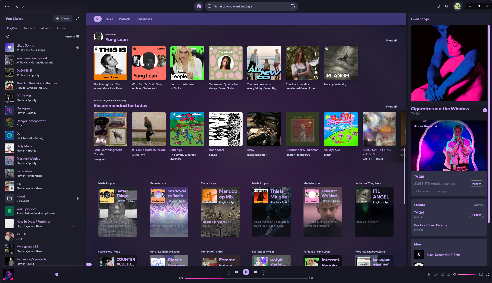
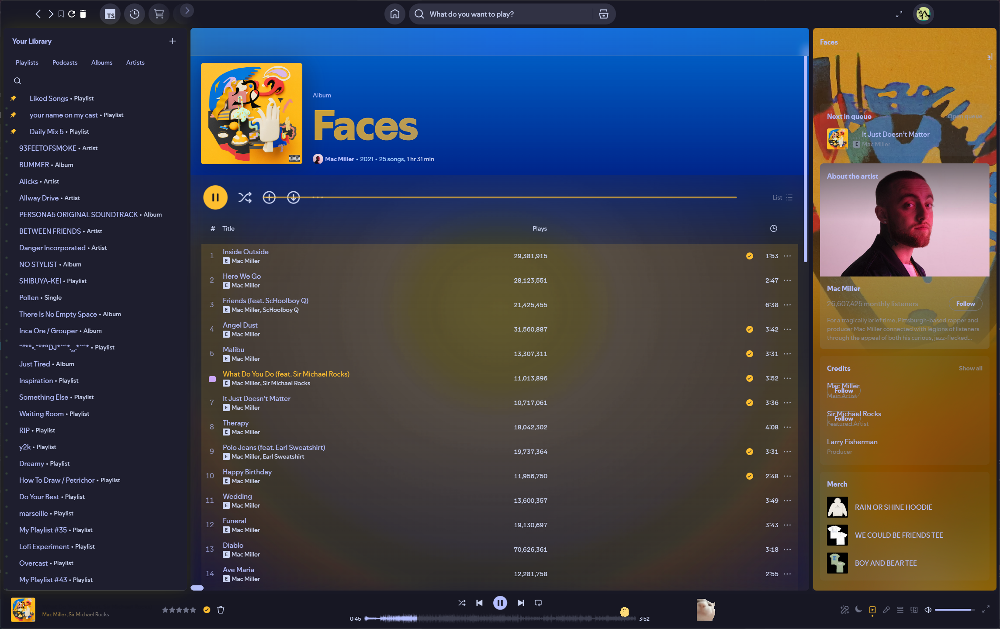
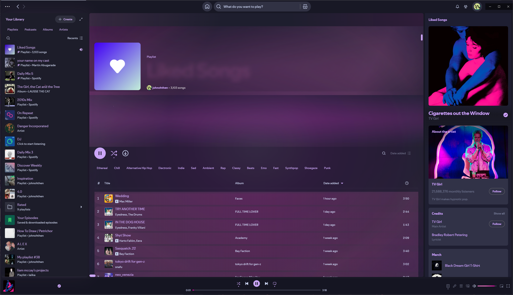

<div align="center">

# 🌙✨ Catppuccin StarryNight

**A mesmerizing Spicetify theme blending Catppuccin's elegance with dynamic gradient effects**

[](https://spicetify.app/)
[](https://github.com/catppuccin)
[](https://github.com/minipuft/catppuccin-starrynight)
[](LICENSE)

</div>

---

## 🖼️ **Visual Showcase**

<div align="center">

### 🎵 **Theme in Action**

<table>
<tr>
<td align="center" width="33%">

<br/>
<sub><b>🏠 Home Interface</b><br/>Clean, elegant navigation</sub>
</td>
<td align="center" width="33%">

<br/>
<sub><b>💿 Album View</b><br/>Dynamic color adaptation</sub>
</td>
<td align="center" width="33%">

<br/>
<sub><b>💖 Liked Songs</b><br/>Personal music haven</sub>
</td>
</tr>
</table>

</div>

_The perfect harmony of pastel perfection and cosmic wonder_

---

## 🎯 **What makes this special?**

<table>
<tr>
<td width="50%">

### 🎨 **Visual Excellence**

- 🌈 **4 Catppuccin Flavors**: Latte, Frappé, Macchiato, Mocha
- ⭐ **15 Accent Colors**: Every Catppuccin shade available
- 🖼️ **Album Art Integration**: Colors that dance with your music

</td>
<td width="50%">

### ⚡ **Smart Features**

- 🎵 **Dynamic Gradients**: Real-time color extraction
- 🔧 **Highly Customizable**: Tweak every visual aspect
- 🚀 **Performance Optimized**: Smooth as silk
- 📱 **Responsive Design**: Perfect on any screen size

</td>
</tr>
</table>

<!-- Screenshots section -->
<details>
<summary>📸 <strong>See it in action</strong></summary>

### Color Schemes


_Mocha - The signature dark theme_


_Latte - Elegant light mode_

### Dynamic Features


_Watch colors transform with your music_


_Subtle shooting stars for that cosmic touch_

</details>

---

## 🚀 **Quick Installation**

### **Method 1: PowerShell Script** _(Recommended)_

```powershell
# Run this one-liner in PowerShell (Admin not required)
iwr -useb "https://raw.githubusercontent.com/minipuft/catppuccin-starrynight/main/install.ps1" | iex
```

### **Method 2: Manual Setup**

<details>
<summary>👆 <strong>Click to expand manual instructions</strong></summary>

**Prerequisites:** [Spicetify CLI](https://spicetify.app/docs/getting-started) installed

1. **📁 Download the theme**

   ```powershell
   cd "$env:APPDATA\spicetify\Themes"
   # Copy catppuccin-starrynight folder here
   ```

2. **🔌 Install extension** _(for dynamic colors)_

   ```powershell
   copy "catppuccin-starrynight\Extensions\theme-vibrant-enhanced.js" "$env:APPDATA\spicetify\Extensions\"
   ```

3. **⚡ Apply the magic**
   ```powershell
   spicetify config current_theme catppuccin-starrynight
   spicetify config color_scheme mocha
   spicetify config extensions theme-vibrant-enhanced.js
   spicetify backup apply
   ```

</details>

---

## 🎨 **Customization**

### **🌈 Choose Your Flavor**

<div align="center">

| Flavor           | Command                                   | Best For           |
| ---------------- | ----------------------------------------- | ------------------ |
| 🌅 **Latte**     | `spicetify config color_scheme latte`     | Light theme lovers |
| 🌆 **Frappé**    | `spicetify config color_scheme frappe`    | Cozy evening vibes |
| 🌃 **Macchiato** | `spicetify config color_scheme macchiato` | Balanced contrast  |
| 🌌 **Mocha**     | `spicetify config color_scheme mocha`     | Pure dark elegance |

</div>

### **✨ Accent Colors**

Choose from **15 beautiful shades**:

```
rosewater • flamingo • pink • maroon • red • peach • yellow • green
teal • sapphire • blue • sky • mauve • lavender • none
```

### **⚙️ Smart Settings**

Access theme settings directly in Spotify preferences:

| Setting              | Options                                   | What it does                          |
| -------------------- | ----------------------------------------- | ------------------------------------- |
| **Dynamic Gradient** | `disabled` `minimal` `balanced` `intense` | Controls album art background effects |
| **Star Animation**   | `disabled` `minimal` `balanced` `intense` | Adjusts shooting star overlay         |
| **Performance Mode** | `auto` `high` `balanced` `eco`            | Optimizes for your system             |

---

## 🔧 **Advanced Tweaking**

<details>
<summary>🎛️ <strong>CSS Variable Playground</strong></summary>

Add these to your `user.css` for fine-tuning:

```css
:root {
  /* 🌈 Gradient Controls */
  --sn-gradient-opacity: 0.25; /* 0.0 - 1.0 */
  --sn-gradient-blur: 30px; /* 10px - 50px */
  --sn-gradient-transition: 1.2s; /* Animation speed */

  /* ⭐ Star Controls */
  --sn-star-count: 5; /* 0 - 10 */
  --sn-star-speed: 6s; /* 3s - 15s */
  --sn-star-opacity: 0.8; /* 0.0 - 1.0 */

  /* 🎨 Color Intensity */
  --sn-color-saturation: 1.3; /* 0.5 - 2.0 */
  --sn-color-brightness: 1.1; /* 0.8 - 1.5 */
}
```

</details>

<details>
<summary>⚡ <strong>Performance Optimization</strong></summary>

For lower-end systems:

```css
/* 🔋 Battery Saver Mode */
.sn-eco-mode {
  --sn-gradient-opacity: 0.1;
  --sn-star-count: 1;
  --sn-gradient-blur: 50px;
  --sn-animation-duration: 0.3s;
}

/* 🚫 Disable Heavy Effects */
.sn-minimal {
  --sn-gradient-opacity: 0;
  --sn-star-count: 0;
}
```

</details>

---

## 🛠️ **Troubleshooting**

<details>
<summary>🔍 <strong>Common Issues & Solutions</strong></summary>

### **Theme not showing up**

```powershell
spicetify restore backup apply
```

### **Dynamic colors not working**

1. ✅ Check extension is installed: `spicetify config extensions`
2. ✅ Restart Spotify completely
3. ✅ Verify theme-vibrant-enhanced.js is in Extensions folder

### **Performance issues**

1. 🔧 Set Dynamic Gradient to "minimal"
2. 🔧 Disable star animations
3. 🔧 Enable "eco mode" in settings

### **PowerShell execution policy error**

```powershell
Set-ExecutionPolicy -Scope CurrentUser RemoteSigned
```

### **Colors look wrong**

1. 🎨 Try a different color scheme
2. 🎨 Reset settings to default
3. 🎨 Check monitor color profile

</details>

---

## 📂 **Project Structure**

```
catppuccin-starrynight/
├── 📄 README.md              # You are here!
├── 🎨 user.css               # Compiled theme styles
├── ⚙️ color.ini              # Color definitions
├── 🔧 theme.js               # Settings & controls
├── 📦 app.scss               # Main SCSS entry
├── 📁 src/                   # Source files
│   ├── _main.scss            # Core UI styles
│   ├── _navbar.scss          # Navigation
│   ├── _now_playing.scss     # Player controls
│   ├── _sn_gradient.scss     # Dynamic gradients
│   ├── _sn_stars.scss        # Star animations
│   └── _mixins.scss          # Reusable components
├── 📁 assets/                # Visual resources
│   ├── frappe/               # Frappé assets
│   ├── latte/                # Latte assets
│   ├── macchiato/            # Macchiato assets
│   └── mocha/                # Mocha assets
└── 📁 Extensions/
    └── theme-vibrant-enhanced.js  # Color magic ✨
```

---

## 🏆 **Credits & Recognition**

<div align="center">

### Built with love, inspired by legends

| Project                                                                        | Contribution                     | License  |
| ------------------------------------------------------------------------------ | -------------------------------- | -------- |
| 🐱 [**Catppuccin**](https://github.com/catppuccin/spicetify)                   | Color palette & UI foundation    | MIT      |
| 🌟 [**StarryNight Vibrant**](https://github.com/ElPioterro/StarryNightVibrant) | Dynamic effects inspiration      | MIT      |
| 🎵 [**Spicetify**](https://github.com/spicetify/spicetify-cli)                 | The magic that makes it possible | LGPL-2.1 |

### Special Thanks

- 💜 **Catppuccin Community** - For the most beautiful color palette ever created
- ⭐ **StarryNight Contributors** - For showing us dynamic themes are possible
- 🚀 **Spicetify Team** - For making Spotify customization accessible

</div>

---

## 📜 **License**

<div align="center">

**MIT License** - Feel free to fork, modify, and share!

```
Copyright (c) 2024 Catppuccin StarryNight Contributors
```

[View full license](LICENSE)

</div>

---

## 🤝 **Contributing**

We'd love your help making this theme even better!

<div align="center">

[](https://github.com/minipuft/catppuccin-starrynight/graphs/contributors)
[](https://github.com/minipuft/catppuccin-starrynight/issues)
[](https://github.com/minipuft/catppuccin-starrynight/pulls)

</div>

**Ways to contribute:**

- 🐛 Report bugs
- 💡 Suggest features
- 🎨 Submit color scheme improvements
- 📖 Improve documentation
- ⭐ Star the repo if you love it!

---

<div align="center">

### 🌙 **Sweet dreams and happy listening!** ✨

[](https://star-history.com/#minipuft/catppuccin-starrynight&Date)

</div>
