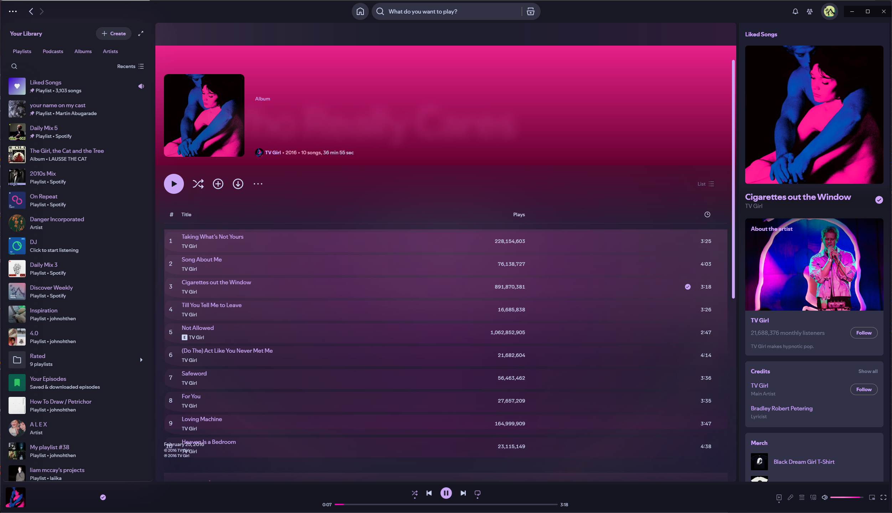

<div align="center">
  
  <h1>Catppuccin StarryNight</h1>
  <p><strong>Year 3000 Visual System for Spotify</strong></p>

  <p>
    <a href="https://github.com/minipuft/catppuccin-starrynight/stargazers"></a>
    <a href="https://github.com/minipuft/catppuccin-starrynight/releases/latest"></a>
    <a href="https://github.com/minipuft/catppuccin-starrynight/blob/main/LICENSE"></a>
    <a href="https://github.com/minipuft/catppuccin-starrynight/issues"></a>
  </p>
</div>

---

> 🚧 **Beta Notice**
> Catppuccin StarryNight is currently in **beta** while we prepare for its launch on the Spicetify Marketplace. We appreciate your feedback and bug reports!

**Catppuccin StarryNight** is more than just a theme—it's a visual system designed to transform your Spotify client into a dynamic, music-reactive experience. Built on the beloved [Catppuccin](https://github.com/catppuccin) color palette, it synchronizes UI elements with your music's rhythm and energy, while adapting its colors to every song's album art.

Engineered for performance and designed for immersion, StarryNight uses a sophisticated Visual Effects Coordination system to deliver stunning visuals at a smooth 60 FPS, even on modest hardware. This project represents a significant effort in reverse-engineering Spotify's UI and building a robust, customizable, and beautiful experience for music lovers.

## 📸 Screenshots

<div align="center">
  <table>
    <tr>
      <td align="center" width="25%">
        
        <br/><sub>🏠 Home Interface</sub>
      </td>
      <td align="center" width="25%">
        
        <br/><sub>💿 Album View</sub>
      </td>
      <td align="center" width="25%">
        
        <br/><sub>💖 Liked Songs</sub>
      </td>
      <td align="center" width="25%">
        
        <br/><sub>🔍 Search View</sub>
      </td>
    </tr>
  </table>
</div>

_The theme adapts to your music and color preferences in real time._

## ✨ Features

- **🎨 Dynamic Color Pipeline**: UI colors adapt in real-time to album art, harmonized with your chosen Catppuccin flavor.
- **🌊 Visual Effects Coordination**: Revolutionary background system with coordinated visual effects, hardware acceleration, and progressive enhancement.
- **🎵 BeatSync Visuals**: UI elements pulse, bloom, and animate in sync with the music's BPM and energy through unified state management.
- **🚀 Performance Core**: A unified animation loop and batched CSS variable updates ensure a smooth 60 FPS experience with intelligent quality scaling.
- **⚙️ Graceful Degradation**: Automatically scales visual fidelity for reduced-motion settings, low-end hardware, and fallback modes.
- **🔮 Modular Visual Systems**: Background systems coordinate through shared state for unified visual experiences, all configurable.
- **🔧 In-App Settings**: Tweak theme options directly in Spotify's preferences menu—no manual file editing required.
- **🖐️ Advanced Drag-and-Drop**: Experience enhanced drag ghosts, a quick-add radial menu, and morphing sidebar interactions.
- **♿ Accessibility**: Respects system motion/contrast preferences and provides full keyboard navigation.

For a deeper dive, explore the [**Documentation Hub**](docs/README.md) and the [**Visual Systems Reference**](docs/VISUAL_SYSTEMS_REFERENCE.md).

## 🚀 Installation

### Prerequisites

- [Spicetify CLI](https://spicetify.app/docs/getting-started) must be installed.
- You are on the latest version of Spotify.

### Method 1: Automated Install

**Windows (PowerShell):**
This one-line command automatically installs the theme, downloads the required extension, and applies the optimal configuration.

```powershell
iwr -useb "https://raw.githubusercontent.com/minipuft/catppuccin-starrynight/main/install.ps1" | iex
```

**Linux/macOS (Bash):**
This script clones the repository and sets up the theme and extension for you.

```bash
curl -fsSL "https://raw.githubusercontent.com/minipuft/catppuccin-starrynight/main/install.sh" | sh
```

### Method 2: Manual Setup

1.  **Download the Theme**:

    - Go to the [**Releases**](https://github.com/minipuft/catppuccin-starrynight/releases/latest) page.
    - Download the `Source code (zip)` and extract it.

2.  **Install Files**:

    - Move the contents of the extracted folder into a new folder named `catppuccin-starrynight` inside your Spicetify `Themes` directory.
    - Copy `Extensions/catppuccin-starrynight.js` from your theme folder to your Spicetify `Extensions` directory.

3.  **Apply the Theme**:
    Run the following commands in your terminal:
    ```bash
    spicetify config current_theme catppuccin-starrynight
    spicetify config color_scheme mocha # Or latte, frappe, macchiato
    spicetify config extensions catppuccin-starrynight.js
    spicetify backup apply
    ```

## 🎨 Customization

Fine-tune your experience directly from Spotify's **Settings > Catppuccin StarryNight** panel.

**Available Options:**

- **Flavor**: Switch between Latte, Frappé, Macchiato, and Mocha color schemes.
- **Accent Color**: Choose a static Catppuccin accent or let it adapt dynamically to album art.
- **Flow Gradient**: Control WebGL gradient intensity (minimal/balanced/intense) with automatic fallback.
- **Dynamic Gradient**: Control the intensity and blur of the background gradients.
- **Star Animation**: Set the density and speed of the animated starfield overlay.
- **Performance Mode**: Optimize visuals for your specific device capabilities.

For advanced tweaks, you can override CSS variables by creating a `user.css` file in your Spicetify config directory:

```css
/* Example user.css overrides */
:root {
  --sn-gradient-opacity: 0.25;
  --sn-gradient-blur: 30px;
  --sn-gradient-flow-x: 0%; /* WebGL flow offset X */
  --sn-gradient-flow-y: 0%; /* WebGL flow offset Y */
  --sn-gradient-flow-scale: 1; /* WebGL flow scale */
  --sn-star-count: 5;
  --sn-star-speed: 6s;
  --sn-color-saturation: 1.3;
  --sn-color-brightness: 1.1;
}

/* Disable skew transform on all viewports */
.sn-flow-gradient-wrapper {
  transform: skewY(0deg) translateZ(0) !important;
}
```

See the [**Customization Guide**](docs/README.md) for more details.

## 🎯 Token System

StarryNight uses a carefully curated system of **277 CSS custom properties (tokens)** to power its dynamic visuals and music-reactive effects. After a comprehensive Phase 5 consolidation, the system achieved a **42.77% reduction** (from 484 original tokens) while maintaining 100% backwards compatibility.

### Key Features

- **🎨 Semantic Naming**: All tokens follow `--sn-{category}-{name}` pattern for clarity
- **🎵 Music-Reactive**: Real-time token updates synchronized with beat detection and audio analysis
- **🌈 OKLAB Color Science**: Perceptually uniform color processing for natural harmonization
- **⚡ Performance-First**: Optimized for 60fps with minimal delegation chains
- **♿ Accessible**: Automatic support for `prefers-reduced-motion`

### Token Categories

| Category | Count | Examples |
|----------|-------|----------|
| **Animation** | 40 | `--sn-anim-easing-organic`, `--sn-transition-fast-duration` |
| **Color** | 35 | `--sn-color-accent-rgb`, `--sn-cosmic-base-hex` |
| **Music Sync** | 15 | `--sn-music-beat-pulse-intensity`, `--sn-music-tempo-bpm` |
| **Visual Effects** | 25 | `--sn-visual-effects-depth-field`, `--sn-visual-effects-magnetic-hover-pull` |
| **UI Components** | 25 | `--sn-ui-glass-blur`, `--sn-ui-card-beat-intensity` |
| **Layout** | 18 | `--sn-layout-space-md`, `--sn-layout-z-ui` |
| **Background** | 10 | `--sn-bg-gradient-primary-rgb`, `--sn-bg-beat-pulse` |
| **Other** | 109 | Performance, brightness, genre-specific |

### Documentation

- **[Token System Architecture](docs/token-system-architecture.md)**: Complete system overview, categories, and integration patterns
- **[Token Governance](docs/token-governance.md)**: Standards for adding, modifying, and deprecating tokens
- **[Token Usage Guide](docs/token-usage-guide.md)**: Developer guide with examples, recipes, and best practices
- **[Legacy Token Migration](docs/LEGACY_TOKEN_MIGRATION.md)**: Migration guide for deprecated tokens

### Quick Reference

**Common Token Patterns**:
```css
/* Music-reactive opacity */
.element {
  opacity: calc(1 - var(--sn-music-beat-pulse-intensity) * 0.3);
}

/* Glassmorphism effect */
.glass {
  backdrop-filter: blur(var(--sn-ui-glass-blur));
  background: rgba(var(--sn-color-accent-rgb), var(--sn-ui-glass-opacity));
}

/* Smooth transitions (automatically respects reduced motion) */
.animated {
  transition: transform var(--sn-transition-fast-duration) var(--sn-anim-easing-organic);
}
```

**Validation**:
```bash
# Validate token system integrity
npm run validate:tokens
```

## 🛠️ Troubleshooting

**Theme not applying correctly?**

- Run `spicetify restore backup apply` and then try applying the theme again.
- Ensure you have the latest version of Spotify and Spicetify.

**Dynamic colors not working?**

1.  Make sure the `catppuccin-starrynight.js` extension is enabled in your `config-xpui.ini` file.
2.  In the theme's settings, ensure the Accent Color is set to "Dynamic".
3.  Restart Spotify completely.
4.  Check the Spicetify console for errors via `Spicetify > Advanced > Developer tools`. Look for "Visual Effects Coordination System initialized".

**Performance issues?**

- Lower the gradient/star settings in the theme's options panel.
- Set Flow Gradient to "minimal" or "disabled" for older hardware.
- Enable "Eco Mode" to reduce animation intensity.

**Visual effects not working?**

- Check if WebGL2 is supported: Open browser console and run `!!document.createElement('canvas').getContext('webgl2')`
- Update your graphics drivers to the latest version.
- The theme automatically falls back to CSS-based effects if WebGL is unavailable.

**PowerShell script error?**

- You may need to change the execution policy. Run this command in PowerShell: `Set-ExecutionPolicy -Scope CurrentUser RemoteSigned`.

For more solutions, see the [**full troubleshooting guide**](docs/README.md#troubleshooting).

## 🤝 Contributing

This project is a labor of love, and contributions are welcome! Whether it's reporting a bug, suggesting a feature, or submitting a pull request, your help is appreciated.

- **Bugs & Suggestions**: Please open an [**Issue**](https://github.com/minipuft/catppuccin-starrynight/issues/new/choose) using the appropriate template.
- **Development**: If you'd like to contribute code, please see the [**Development Guide**](docs/development/PROJECT_RULES.md) to get started.

## ❤️ Credits & Thanks

- **[Catppuccin](https://github.com/catppuccin)**: For the wonderful color palette that started it all.
- **[ElPioterro](https://github.com/ElPioterro)**: For the original StarryNight theme that inspired this project's visual effects.
- **[Spicetify Community](https://github.com/spicetify/spicetify-cli)**: For building the tools that make Spotify theming possible.
- And a huge thank you to all contributors and users!

## 📜 License

This project is licensed under the MIT License. See the `LICENSE` file for details.
