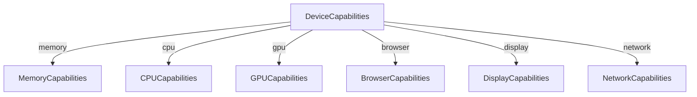

# 🖥️ Device Capability Detector

## Overview

`DeviceCapabilityDetector` provides a **comprehensive runtime profile** of the end-user's device, covering memory, CPU, GPU, browser APIs, display, and network. The resulting `deviceCapabilities` object helps visual systems pick **performance profiles** (e.g., _low_, _balanced_, _high_) without running heavyweight benchmarks on every page load.

- **File:** `src-js/core/DeviceCapabilityDetector.ts`
- **Activation:** Construct and call `initialize()` **once** early in the theme's boot sequence (see `Year3000System`).

---

## 1 ▪ Configuration

```ts
interface DetectorConfig {
  enableDebug?: boolean; // default false – verbose console output
  runStressTests?: boolean; // default true  – run GPU & memory micro-benchmarks
}
```

### Example

```ts
import { DeviceCapabilityDetector } from "@/core/DeviceCapabilityDetector";

const detector = new DeviceCapabilityDetector({ enableDebug: true });
await detector.initialize();
console.log(detector.getCapabilities());
```

---

## 2 ▪ Capability Schema



| Sub-object  | Key Fields                                                     | Level Heuristic                                    |
| ----------- | -------------------------------------------------------------- | -------------------------------------------------- |
| **memory**  | `total`, `jsHeapSizeLimit`, `estimatedAvailable`               | ≥ 8 GB → high, ≥ 4 GB → medium                     |
| **cpu**     | `cores`, synthetic `estimatedScore`                            | ≥ 8 cores → high, ≥ 4 → medium                     |
| **gpu**     | WebGL/WebGL2 support, `maxTextureSize`, `vendor`, `renderer`   | regex matches (RTX, Radeon RX, Apple M-soc) → high |
| **browser** | OffscreenCanvas, Workers, SharedArrayBuffer, WASM, CSS Houdini | count of supported APIs                            |
| **display** | `pixelRatio`, `refreshRate`, `colorGamut`, `reducedMotion`     | N/A                                                |
| **network** | `effectiveType`, `downlink`, `rtt`, `saveData`                 | N/A                                                |

The property `overall` is computed after optional stress-tests:

- **high** → score ≥ 10
- **medium** → score ≥ 7
- **low** → otherwise

---

## 3 ▪ Public API

| Method                          | Purpose                                                                |
| ------------------------------- | ---------------------------------------------------------------------- | ---------- | ---------------------------- |
| `initialize()`                  | Async detection & optional stress-tests. Returns `DeviceCapabilities`. |
| `getCapabilities()`             | Getter; warns if called before `initialize()`.                         |
| `recommendPerformanceQuality()` | Returns `'low'                                                         | 'balanced' | 'high'`mapped from`overall`. |
| `destroy()`                     | Resets internal state for hot-reloads.                                 |

---

## 4 ▪ Integration Points

- **Visual Systems** – Depth layers, Nebula, Particle systems query `recommendPerformanceQuality()` to choose shader variants.
- **PerformanceAnalyzer** – Uses `DeviceCapabilityDetector.isInitialized` as a fast gate before enabling expensive monitoring.
- **Year3000System** – Exposes capabilities via its public API (`year3000System.deviceCapabilityDetector`).

---

## 5 ▪ Best Practices

1. Call `initialize()` **once**; re-use the instance everywhere.
2. Gate expensive features behind `overall !== 'low'`.
3. Respect user's `prefers-reduced-motion` despite high hardware score.
4. For ultra-fast boot, instantiate with `{ runStressTests: false }` and defer stress-tests to idle time.

---

## 6 ▪ Roadmap

| Phase | Enhancement                                                                    |
| ----- | ------------------------------------------------------------------------------ |
| 2     | Move stress-tests to a `Worker` to avoid blocking main thread.                 |
| 3     | Persist last capability snapshot in `StorageManager` to skip repeat detection. |
| 4     | Hook into **PerformanceAnalyzer** to auto-adjust thresholds based on live FPS. |

---

## 7 ▪ Status

- **First Introduced:** v1.0 (Jan 2025)
- **API Stability:** Stable – breaking changes require minor version bump.

---

_"Detect, adapt, delight."_
