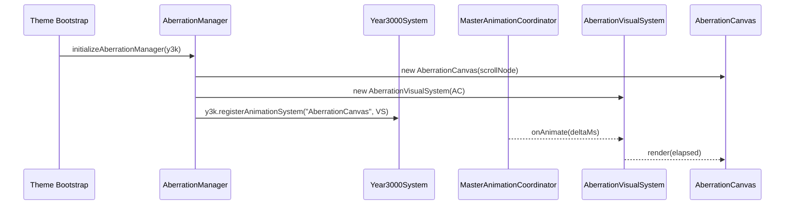

# 🌌 Aberration Effect – Chromatic RGB-Split Overlay

**Document Version:** 1.0
**Implementation Date:** June 2025
**Status:** ✅ Stable (Phase 6)

---

## 🚀 Purpose

The **Aberration Effect** is a lightweight post-processing layer that adds a subtle chromatic-aberration (RGB split) shimmer to Spotify's main scroll-node. It is entirely self-contained – no external shaders or heavy frame buffers – and is smart-gate-controlled by the global _Year 3000_ performance stack so it never compromises FPS on low-end machines or when **prefers-reduced-motion** is enabled.

---

## 🗂️ Key Source Files

| File                                                  | Role                                                                               |
| ----------------------------------------------------- | ---------------------------------------------------------------------------------- |
| `src-js/effects/Aberration/AberrationCanvas.ts`       | Owns the WebGL context, tiny RGB-shift shader and `render(time)` routine.          |
| `src-js/effects/Aberration/AberrationVisualSystem.ts` | Adaptor that lets the canvas run under **MasterAnimationCoordinator**.             |
| `src-js/effects/Aberration/AberrationManager.ts`      | Life-cycle glue – attaches/detaches, listens to SettingsManager and registers MAC. |
| `src/core/_sn_nebula_variables.scss`                  | Declares CSS tokens (e.g. `--sn-nebula-aberration-strength`) consumed by effects.  |

> There are _no_ private rAF loops – all animation is funnelled through the coordinator so the effect is automatically throttled with the rest of the theme.

---

## 🔄 Runtime Flow



1. **Bootstrap** – `initializeAberrationManager()` runs as soon as the theme fully loads (and again on every navigation). It checks the user setting `sn-enable-aberration` & device capability before instantiating.
2. **Attachment** – A `<canvas>` (`position:absolute; inset:0; mix-blend-mode:screen;`) is appended above Spotify's **scroll-node**.
3. **Frame Loop** – `MasterAnimationCoordinator` invokes `onAnimate(delta)` → `canvas.render(time)` whenever frame-budget permits.
4. **Performance Mode** – When MAC downgrades to _performance_ mode the adaptor halves the internal framebuffer (256 → 128) **and** reduces shader strength 0.4 → 0.25.
5. **Settings Change** – Listening to the global `year3000SystemSettingsChanged` custom-event allows live toggling & strength updates without page reload.
6. **Graceful Degradation** – If WebGL context-loss happens the canvas recreates its program automatically. When the user disables the effect the manager destroys canvas + unregisters the visual system → zero overhead.

---

## ⚙️ Public APIs

### AberrationCanvas

```ts
render(nowMs: number): void       // draw one frame
setPixelSize(size: 64|128|256): void // change internal resolution
setStrength(value: number): void  // 0–1 (default 0.4)
destroy(): void                   // free GL resources & remove canvas
```

### AberrationVisualSystem (internal MAC interface)

```ts
onAnimate(deltaMs: number): void
onPerformanceModeChange?("performance"|"quality"): void
destroy(): void
```

### Manager Convenience

```ts
initializeAberrationManager(y3k?: Year3000System): void // bootstrap helper
```

---

## 🎛️ Configuration

| Setting (localStorage)          | Default | Description                                        |
| ------------------------------- | ------- | -------------------------------------------------- |
| `sn-enable-aberration`          | `true`  | Master toggle                                      |
| `sn-nebula-aberration-strength` | `0.4`   | Live shader strength; propagated to CSS & uniforms |

| CSS Variable                      | Defined in                  | Purpose                                           |
| --------------------------------- | --------------------------- | ------------------------------------------------- |
| `--sn-nebula-aberration-strength` | `_sn_nebula_variables.scss` | Designers hook – mirrors JS strength value        |
| `--sn-nebula-noise-opacity`       | `_sn_nebula_variables.scss` | Noise overlay paired with aberration (see Nebula) |

---

## 🧪 Testing Checklist

- [ ] Setting **off** → No `<canvas>` in DOM, noise opacity reset to 0.
- [ ] **Performance** mode → `canvas.width === 128` and uniform `uStrength ≈ 0.25`.
- [ ] WebGL context-loss simulated → effect recovers without console errors.
- [ ] Live slider (strength) updates reflected in both CSS var and shader.

### DevTools Snippets

```js
// Trigger manual strength update
Spicetify.LocalStorage.set("sn-nebula-aberration-strength", "0.6");
document.dispatchEvent(
  new CustomEvent("year3000SystemSettingsChanged", {
    detail: { key: "sn-nebula-aberration-strength", value: "0.6" },
  })
);

// Validate canvas present
!!document.querySelector("canvas[style*='mix-blend-mode: screen']");
```

---

## 🗺️ Relevant SCSS

```scss
// src/core/_sn_nebula_variables.scss (excerpt)
:root {
  // Chromatic aberration strength – updated by JS
  --sn-nebula-aberration-strength: 0.4;

  // Optional fractal-noise overlay that complements the effect
  --sn-nebula-noise-opacity: 0.06;
}

// Example usage inside Nebula or atmospheric modules
.some-nebula-layer {
  filter: url("#snChromaticAberration") brightness(calc(1 + var(--sn-nebula-aberration-strength)));
}
```

> **Tip:** Keep gradient / glow layers underneath the canvas – the RGB split is additive (`mix-blend-mode: screen`) and will multiply if stacked incorrectly.

---

## 📅 Roadmap

1. **Beat-responsive strength** – Modulate `uStrength` with `--sn-beat-pulse-intensity`.
2. **Dynamic Resolution Scaling** – Per-device FPS heuristics → pixel size 64-256.
3. **HDR Pipeline** – Investigate WebGL2 linear-color blending for brighter splits.

---

© Catppuccin StarryNight 2025 – "Chromatic dreams in RGB."
