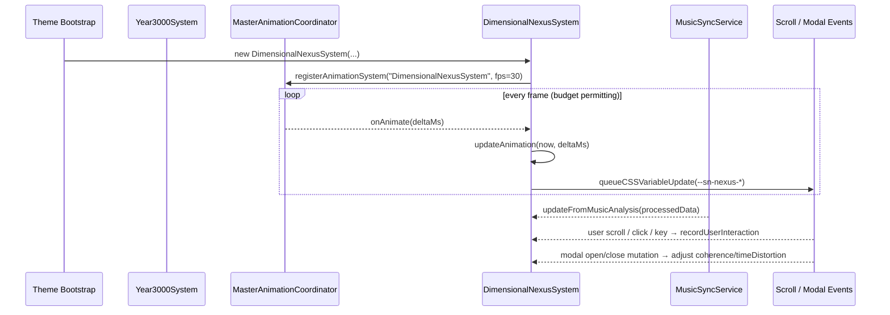

# 🌀 Dimensional Nexus System – Adaptive Navigation Field

**Document Version:** 1.0
**Implementation Date:** June 2025
**Status:** 🟢 Active (Phase 3 optimisation)

---

## 🚀 Purpose

The **Dimensional Nexus System** (DNS) is the central _navigation-field_ orchestrator that subtly warps, scales and desaturates UI regions according to musical energy, user interaction and meditation states. It lives in the _visual systems_ layer and feeds CSS variables that sidebar / navigation SCSS modules consume to create depth-shift, focus and calm-mode animations.

It reacts to four primary input streams:

1. **Music analysis** via `MusicSyncService` (energy / valence / intensity).
2. **User interaction cadence** (click, pointer, keydown, scroll velocity).
3. **Modal state** (e.g. playlist-edit dialog) via DOM MutationObserver.
4. **Performance mode** signals from `MasterAnimationCoordinator`.

---

## 🗂️ Key Source Files

| File                                              | Role                                                                                                   |
| ------------------------------------------------- | ------------------------------------------------------------------------------------------------------ |
| `src-js/systems/visual/DimensionalNexusSystem.ts` | Core TypeScript class implementing logic, state-machines and CSS variable output.                      |
| SCSS consumers (after consolidation)              | `_sidebar_*` modules & `_sn_context_zones.scss` read the exported variables for actual visual effects. |

> Note: The legacy `_sn_dimensional_nexus.scss` was removed in the June 2025 consolidation; SCSS now references **sidebar** enhancement layers.

---

## 🔄 Runtime Flow



Key timing layers:

- **Light tick** – every animation frame (≈ 30 fps) lerps towards _target_ state.
- **Heavy tick** – every 100 ms (performance mode) or 100 ms (quality) recalculates meditation & integration metrics.
- **Biometric check** – once per 1000 ms determines whether UI enters _meditation_ state.

---

## 🏷️ CSS Variable Contract

| Variable                               | Range / Example | Consumer(s)                  | Meaning                                             |
| -------------------------------------- | --------------- | ---------------------------- | --------------------------------------------------- |
| `--sn-nexus-complexity`                | `0 – 1`         | Sidebar background shaders   | Visual pattern complexity                           |
| `--sn-nexus-coherence`                 | `0 – 1`         | Sidebar / cards opacity      | Spatial unity – lower → more randomness             |
| `--sn-nexus-volatility`                | `0 – 1`         | Hover & gravity wells        | Micro-jitter intensity                              |
| `--sn-nexus-time-distortion`           | `0.2 – 1`       | Animation durations          | Slow-motion factor when modals or meditation active |
| `--sn-nav-item-transform-scale`        | `1 – 1.05`      | Nav-item `transform:scale()` | Enlarges nav items under high intensity             |
| `--sn-sidebar-meditation-desaturation` | `0 – 0.6`       | Sidebar SCSS                 | Greyscale overlay during meditation                 |
| `--sn-sidebar-meditation-slowdown`     | `0.5 – 1`       | Transition timing functions  | Additional slowdown multiplier                      |

All writes are funnelled through **CSSVariableBatcher** for optimal batching.

---

## 📑 Public API Surface

DNS is primarily registered automatically – developers usually do _not_ instantiate it directly – but understanding its hooks helps when extending:

```ts
constructor(
  config: Year3000Config,
  utils: typeof Year3000Utilities,
  perf: PerformanceAnalyzer,
  musicSync: MusicSyncService,
  settings: SettingsManager,
  y3k?: Year3000System
)
```

### Animation hooks

```ts
onAnimate(deltaMs: number): void       // called by MAC
onPerformanceModeChange(mode): void    // performance | quality
override updateAnimation(ts, dt): void // internal heavy+light ticks
```

### Reports & Debug

```ts
getNavigationScalingReport(): { target: number; current: number; ... }
getMeditationReport(): { isMeditating: boolean; desaturation: number; ... }
```

### EventBus messages

- Publishes `user:scroll` with `{ velocity, direction }`
- Future phases may expose `nexus:state` snapshots for the debug overlay.

---

## 🎛️ Configuration Knobs

Most tunables live in **SettingsManager** or **Year3000Config** constants. Developers can adjust these without touching the class:

| Setting Key                     | Default | Influence                                       |
| ------------------------------- | ------- | ----------------------------------------------- |
| `sn-dimnexus-performance-mode`  | `auto`  | Forces DNS to run in _performance_ or _quality_ |
| `sn-dimnexus-max-frame-skip`    | `2`     | Frames skipped between updates (quality)        |
| `sn-dimnexus-heavy-interval-ms` | `100`   | Heavy-tick cadence                              |

> **Tip:** Use `Year3000Debug.overlay()` panel (Phase 3) to change these live and watch CSS variables in DevTools.

---

## 🧪 Testing Checklist

- [ ] Verify CSS vars update while scrolling & playing high-energy track.
- [ ] Open a Spotify modal – `--sn-nexus-time-distortion` drops to ≈ 0.2.
- [ ] Leave the UI idle on a chill track → meditation activates (`--sn-sidebar-meditation-desaturation` > 0).
- [ ] Toggle MAC performance mode via dev overlay – heavy interval & frame skip change.

### Force meditation quickly

```js
GlobalEventBus.publish("beat/frame", { energy: 0.1, valence: 0.8 });
```

---

## 🗺️ Sample SCSS Snippet

```scss
.sidebar-background {
  filter: saturate(calc(1 - var(--sn-sidebar-meditation-desaturation, 0))) blur(
      calc(var(--sn-nexus-volatility, 0) * 8px)
    );
  transform: scale(var(--sn-nav-item-transform-scale, 1));
  transition: transform 0.3s ease, filter 0.6s ease;
}
```

---

## 📅 Roadmap

1. **Cross-system coupling** – feed volatility into _ParticleFieldSystem_ for gravity ripples.
2. **AI mood detection** – leverage _Emergent Choreography Engine_ mood window to bias complexity.
3. **Performance Telemetry** – expose per-frame cost to _PerformanceAnalyzer_ history.

---

© Catppuccin StarryNight 2025 – "Bend the UI, feel the vibe."
