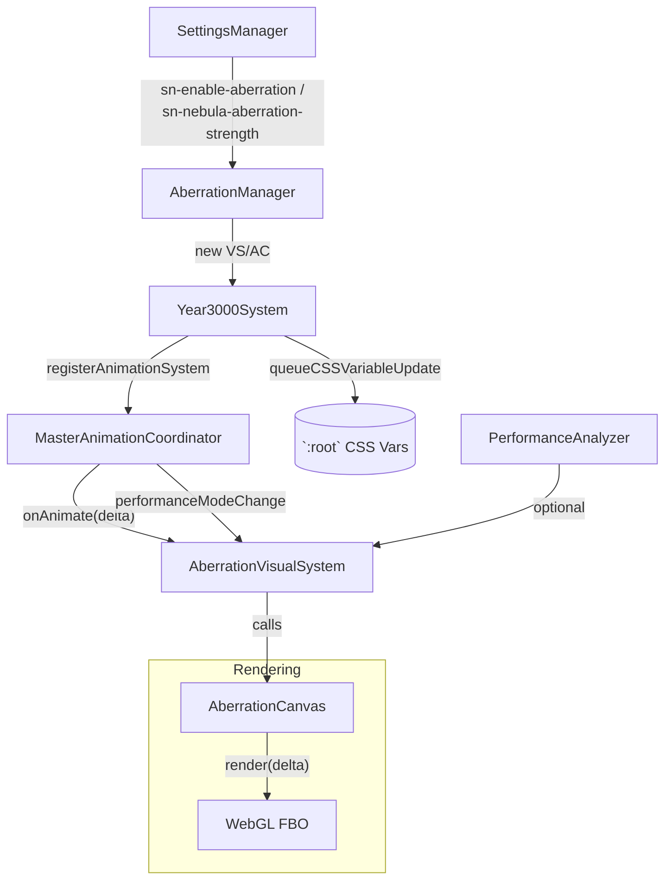

# 🌌 Aberration Visual System

**Document Version:** 1.0
**Implementation Date:** June 2025
**Status:** ✅ Current – Phase 6 complete

---

## 🚀 Overview

The **Aberration Visual System** adds a subtle chromatic-aberration post-processing layer to Catppuccin StarryNight. It creates a low-cost WebGL canvas that is composited on top of the main UI and is driven by the global _Year 3000_ animation stack.

Key characteristics:

- **Shader-based** RGB-split effect rendered in an off-screen framebuffer (`AberrationCanvas`).
- **Coordinated** by `MasterAnimationCoordinator` via a thin adaptor (`AberrationVisualSystem`) – _no private_ `requestAnimationFrame` loops.
- **Toggle & runtime settings** handled by `AberrationManager`, respecting user preferences and performance mode.
- **Telemetry ready** – per-frame duration is sampled through `PerformanceAnalyzer` when available.
- **Zero layout thrash** – any CSS custom-property writes go through `CSSVariableBatcher`.

---

## 🗂️ Module Anatomy

| File                                                  | Responsibility                                                                                                                                                                                                  |
| ----------------------------------------------------- | --------------------------------------------------------------------------------------------------------------------------------------------------------------------------------------------------------------- |
| `src-js/effects/Aberration/AberrationCanvas.ts`       | Owns WebGL context, shader compilation, texture upload, and `render(time)` routine. Exposes `setPixelSize(size)` and `setStrength(value)` helpers. Handles WebGL context-loss gracefully.                       |
| `src-js/effects/Aberration/AberrationVisualSystem.ts` | Implements the internal **AnimationSystem** interface (`onAnimate`, `onPerformanceModeChange`). Bridges the canvas to _MasterAnimationCoordinator_, applies performance-mode scaling, and routes telemetry.     |
| `src-js/effects/Aberration/AberrationManager.ts`      | Orchestrates enable/disable lifecycle, listens to `SettingsManager` events, queues CSS-variable updates (`--sn-nebula-aberration-strength`), and registers/unregisters the visual system with `year3000System`. |

---

## 🛠️ Architecture Diagram



---

## 🔄 Lifecycle

1. **Startup** – `AberrationManager.attach()` is invoked from the theme bootstrap (or when user enables the setting). It:
   - Instantiates `AberrationCanvas` (default 256×256 internal res).
   - Wraps it in `AberrationVisualSystem` and registers with `year3000System.registerAnimationSystem()`.
   - Queues initial CSS variable `--sn-nebula-aberration-strength`.
2. **Per-frame** – `MasterAnimationCoordinator` executes `VS.onAnimate(deltaMs)` if budget allows.
   - Visual system forwards elapsed time to `canvas.render(t)`.
   - Telemetry block wraps the call (`PerformanceAnalyzer.startTiming/endTiming`).
3. **Performance mode toggle** – Coordinator calls `onPerformanceModeChange("performance"|"quality")` which adjusts:
   - Internal pixel size (`128 → 256`).
   - Shader strength (`0.25 → 0.4`).
4. **Settings change** – `SettingsManager` dispatches `year3000SystemSettingsChanged`. Manager listens and:
   - Enables/disables full system (`sn-enable-aberration`).
   - Updates live strength (`sn-nebula-aberration-strength`):
     - Calls `canvas.setStrength(value)`.
     - Batches CSS update via `year3000System.queueCSSVariableUpdate()`.
5. **Context loss / destroy** – `AberrationCanvas` listens for `webglcontextlost` and recreates resources on `webglcontextrestored`. `AberrationManager.detach()` destroys both VisualSystem & Canvas and emits trace events.

---

## ⚙️ Public API (summary)

```ts
class AberrationCanvas {
  render(timeMs: number): void;
  setPixelSize(size: 64 | 128 | 256): void; // powers-of-two recommended
  setStrength(amount: number): void;        // 0 – 1 range (default 0.4)
  destroy(): void;
}

class AberrationVisualSystem {
  systemName = "AberrationCanvas";
  onAnimate(deltaMs: number): void;
  onPerformanceModeChange?(mode: "performance" | "quality");
  destroy(): void;
}

// Manager exposes convenience helpers
AberrationManager.attach(parentElement?: HTMLElement): void;
AberrationManager.detach(): void;
```

---

## 🧩 Configuration & CSS Variables

| Setting Key                     | Type             | Default | Description                         |
| ------------------------------- | ---------------- | ------- | ----------------------------------- |
| `sn-enable-aberration`          | "true"\|"false"  | "true"  | Master toggle for the entire effect |
| `sn-nebula-aberration-strength` | string (numeric) | "0.4"   | Live shader strength (0 – 1)        |

| CSS Variable                      | Runtime Source                   | Purpose                                                        |
| --------------------------------- | -------------------------------- | -------------------------------------------------------------- |
| `--sn-nebula-aberration-strength` | Updated via `CSSVariableBatcher` | Drives SCSS hover/transition variants & gives designers a hook |

---

## 📊 Telemetry Channels

- **Trace events** (string keys): `"AberrationCanvasAttached"`, `"AberrationCanvasDetached"`.
- **PerformanceAnalyzer category**: `"AberrationVisualSystem"` – average ms per frame accessible via `perf.getAverageTime()`.

---

## 🧪 Testing Matrix

| Scenario           | Expected Behaviour                          | Validation Tip                                          |
| ------------------ | ------------------------------------------- | ------------------------------------------------------- |
| Setting disabled   | Canvas & RAF removed; no GL context present | `document.querySelector('#aberration-canvas') === null` |
| Performance mode   | Pixel size shrinks to 128, strength 0.25    | Inspect `canvas.width` & custom uniform                 |
| WebGL context-loss | Error suppressed, resources recreated       | Simulate with dev-tool _Simulate context loss_          |

---

## 🗺️ Future Roadmap / TODO

- **BeatSync coupling** – modulate `strength` with beat pulse.
- **Adaptive resolution** – dynamic pixel scaling based on GPU frame budget.
- **HDR pass** – investigate blending in linear colour space.

---

© Catppuccin StarryNight — Chromatic dreams in RGB.
