# 🃏 Card 3D Manager – Interactive Tilt & Glow

**Document Version:** 1.0
**Implementation Date:** June 2025
**Status:** ✅ Production Ready

---

## 🚀 Purpose

`Card3DManager` brings interactive, depth-aware _tilt_ and _glow_ effects to playlist / album cards. When the cursor hovers a card, it

- rotates up to **±5 deg** around X/Y (configurable)
- scales slightly (`1 → 1.02`) for lift
- projects a radial glow that follows the pointer

The implementation relies only on CSS `transform` & `radial-gradient` so GPU acceleration is guaranteed and the effect can be disabled on low-end devices or via **Settings**.

---

## 🗂️ Key Source Files

| File                               | Role                                                                                    |
| ---------------------------------- | --------------------------------------------------------------------------------------- |
| `src-js/managers/Card3DManager.ts` | Registers mouse events, calculates rotations & glow, listens to Settings + Performance. |
| `src-js/config/settingKeys.ts`     | Defines `sn-3d-effects-level` constant + legacy aliases.                                |
| SCSS 3D helpers                    | `_sn_3d_morphing.scss`, `_sn_enhanced_cards.scss` consume the transforms/glow.          |

---

## 🔄 Runtime Flow

```mermaid
sequenceDiagram
    participant Boot as Theme Bootstrap
    participant PERF as PerformanceAnalyzer
    participant SET  as SettingsManager
    participant C3D as Card3DManager

    Boot->>C3D: Card3DManager.getInstance(PERF, SET)
    Boot->>C3D: initialize()
    alt quality OK & setting ≠ disabled
        C3D->>DOM: addEventListener mousemove / mouseleave on cards
    else low quality or disabled
        C3D-->>Boot: skips listeners
    end

    note over C3D: On each mousemove the card's<br/>transform + glow are updated directly via style.
```



---

## 📐 Configuration

`Card3DManager` exposes a private `config` object – tweak values here or via future Settings:

| Property          | Default              | Meaning                                         |
| ----------------- | -------------------- | ----------------------------------------------- |
| `perspective`     | `1000`               | CSS perspective (px) applied to each transform. |
| `maxRotation`     | `5`                  | Maximum ° rotation around each axis.            |
| `scale`           | `1.02`               | Lift-up scaling factor on hover.                |
| `transitionSpeed` | `200ms`              | Transition for transform updates.               |
| `glowOpacity`     | `0.8`                | Alpha used in radial-gradient glow.             |
| `selector`        | `.main-card-card, …` | Query selector for card elements.               |

### Settings Integration

- **Key:** `sn-3d-effects-level`
- **Values:** `full` | `minimal` | `disabled`
- **Listener:** global `year3000SystemSettingsChanged` → `apply3DMode()`

`PerformanceAnalyzer.shouldReduceQuality()` is also consulted – on _critical_ quality the manager auto-disables even if the setting is `full`.

---

## 🎛️ CSS Variables / Classes

The manager writes _inline styles_ rather than CSS variables; SCSS only needs to guarantee cards have `will-change: transform` for GPU promotion.

Glow element markup:

```html
<div class="main-card-card">
  …
  <div class="card-glow"></div>
</div>
```

SCSS should set:

```scss
.card-glow {
  pointer-events: none;
  position: absolute;
  inset: 0;
  border-radius: inherit;
  transition: background 120ms ease-out;
}
```

---

## 🧪 Testing Checklist

- [ ] Hover card – tilt & glow follow cursor smoothly, reset on leave.
- [ ] Set **3D Effects** to _disabled_ in Settings – listeners removed & transform resets.
- [ ] Simulate low-end device (force `shouldReduceQuality()` → `true`) – effect auto-disables.

---

## 🗺️ Roadmap

1. **Minimal mode** – reduce rotation and glow intensity for subtle flavour.
2. **Touch support** – translate touchmove into tilt on mobile WebViews.
3. **Geometry caching** – pre-compute bounding boxes to avoid `.getBoundingClientRect()` each move.

---

© Catppuccin StarryNight 2025 – "Cards that lean with the music."
