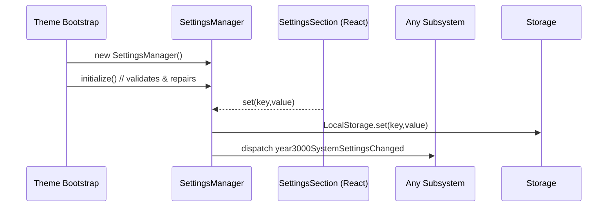

# ⚙️ Settings Manager – Persistent Preferences Hub

**Document Version:** 1.0
**Implementation Date:** June 2025
**Status:** ✅ Stable

---

## 🚀 Purpose

`SettingsManager` is the single source of truth for **all** user-configurable StarryNight options. It handles:

1. **Validation & Defaults** – every key has an allowed-value list and fallback.
2. **Persistence** – stores values in `Spicetify.LocalStorage`.
3. **Live Broadcast** – dispatches `year3000SystemSettingsChanged` so subsystems can react instantly.
4. **Legacy Migration** – automatically repairs or migrates outdated keys on startup.

Although not a visual effect on its own, virtually every _manager_ / _system_ depends on SettingsManager to expose runtime controls.

---

## 🗂️ Key Source Files

| File                                       | Role                                                         |
| ------------------------------------------ | ------------------------------------------------------------ |
| `src-js/managers/SettingsManager.ts`       | Core implementation                                          |
| `src-js/config/settingKeys.ts`             | Constant string keys used across code/SCSS                   |
| `src-js/components/StarryNightSettings.ts` | UI layer that surfaces controls inside Spotify Settings page |

---

## 🔄 Runtime Flow



---

## 📑 Validation Schema

Each setting has:

```ts
{  default: <value>,  allowedValues?: <array> }
```

During `validateAndRepair()` the manager:

- Reads the stored value
- If missing/invalid → writes `default`
- Counts repairs and logs summary.

---

## 🛠️ Public API

```ts
get<K>(key): value                          // validated read
set<K>(key,value): boolean                  // validated write + dispatch
getAllowedValues(key): string[] | undefined
getAllSettings(): ThemeSettings             // snapshot object
resetAllToDefaults(): void                  // mass revert
validateAndRepair(): void                   // manual repair pass
```

### Event Broadcast

```ts
CustomEvent("year3000SystemSettingsChanged", { detail: { key, value } });
```

Systems subscribe to this to enable _live_ theme changes.

---

## 🎛️ Notable Keys (excerpt)

| Key                             | Default         | Notes                               |
| ------------------------------- | --------------- | ----------------------------------- |
| `sn-artistic-mode`              | `artist-vision` | influences Color Harmony thresholds |
| `sn-glassmorphism-level`        | `moderate`      | Glass effect intensity              |
| `sn-3d-effects-level`           | `full`          | Card3DManager modes                 |
| `sn-enable-aberration`          | `true`          | Toggles Chromatic Aberration canvas |
| `sn-nebula-aberration-strength` | `0.4`           | Shader strength (0-1)               |
| `catppuccin-flavor`             | `mocha`         | Core palette variant                |

Full list lives inside constructor `defaults` array.

---

## 🧪 Testing Checklist

- [ ] Toggle a setting in UI → CSS / effects respond instantly.
- [ ] Corrupt a key in LocalStorage → on reload manager repairs it & logs.
- [ ] Write an invalid value via console → `set()` returns `false`.

---

## 📅 Roadmap

1. **Cloud Sync** – Phase 2 will move persistence into `StorageManager` enabling cross-device sync.
2. **Import / Export** – JSON preset buttons in `StarryNightSettings.ts`.
3. **Telemetry** – optional opt-in logging of setting changes for UX research.

---

© Catppuccin StarryNight 2025 – "Configure once, experience everywhere."
