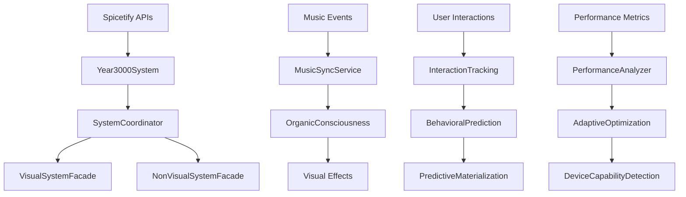

# 🏛️ Master Architecture Overview
**Catppuccin StarryNight - Complete System Architecture**

---

## 🌟 Introduction

Catppuccin StarryNight is not just a Spicetify theme—it's a sophisticated **consciousness-aware visual application framework** that creates living interfaces that experience music alongside users. This document provides a comprehensive overview of the entire system architecture, from the foundational patterns to the advanced consciousness systems.

---

## 🎯 Architectural Philosophy

### Year 3000 System Vision
> *"In the Year 3000, interfaces are not built—they are grown. Every pixel breathes with cellular life, every interaction morphs like liquid consciousness, and every visual element dances to the emotional temperature of the moment."*

### Core Principles
1. **🧬 Organic Consciousness** - Biological-inspired systems that grow and breathe with music
2. **⚡ Performance-First** - 60fps animations with intelligent degradation
3. **🔄 Facade Coordination** - Clean separation of concerns through advanced facade patterns
4. **🎨 OKLAB Color Science** - Perceptually uniform color processing for natural transitions
5. **🐙 Multi-Agent Coordination** - Multiple AI agents working simultaneously with central coordination

---

## 🏗️ System Architecture Layers

### Layer 1: Central Orchestration
```
┌─────────────────────────────────────────────────────────────────┐
│                        Year3000System                           │
│                   (Central Orchestrator)                       │
│  ┌─────────────────────────────────────────────────────────┐   │
│  │                SystemCoordinator                        │   │
│  │           (Facade Coordination Hub)                     │   │
│  │  ┌─────────────────────┐  ┌─────────────────────────┐   │   │
│  │  │  VisualSystemFacade │  │ NonVisualSystemFacade  │   │   │
│  │  │   (Factory Pattern) │  │   (Factory Pattern)    │   │   │
│  │  └─────────────────────┘  └─────────────────────────┘   │   │
│  └─────────────────────────────────────────────────────────┘   │
└─────────────────────────────────────────────────────────────────┘
```

### Layer 2: System Facades
```
┌──── VisualSystemFacade ─────┐  ┌─── NonVisualSystemFacade ────┐
│ • Particle Systems          │  │ • Performance Analyzers      │
│ • Organic Consciousness     │  │ • CSS Variable Batchers      │
│ • Beat Sync Systems         │  │ • Settings Managers          │
│ • Interactive Effects       │  │ • Music Sync Services        │
│ • UI Enhancement Systems    │  │ • Device Capability Detection│
└─────────────────────────────┘  └───────────────────────────────┘
```

### Layer 3: Shared Dependencies
```
┌─────────────────── Shared Core Systems ──────────────────────┐
│ PerformanceAnalyzer • CSSVariableBatcher • MusicSyncService │
│ SettingsManager • ColorHarmonyEngine • DeviceCapabilityDet │
└───────────────────────────────────────────────────────────────┘
```

### Layer 4: Foundation Systems
```
┌──────── TypeScript Core ────────┐  ┌────── SCSS Styling ──────┐
│ • IManagedSystem Interface      │  │ • Modular Architecture    │
│ • UnifiedSystemBase Pattern     │  │ • CSS Variable System     │
│ • Factory Pattern Implementation│  │ • Catppuccin Integration  │
│ • Dependency Injection          │  │ • Organic Consciousness   │
└─────────────────────────────────┘  └───────────────────────────┘
```

---

## 🔄 Data Flow Architecture

### Primary Data Flow


### Organic Consciousness Flow
```
🎵 Music Input → 🧠 Emotional Analysis → 🌡️ Temperature Mapping → 🎨 OKLAB Processing
     ↓                    ↓                      ↓                    ↓
🔊 Beat Detection → 💓 Breathing Rhythm → 🌱 Cellular Growth → ✨ Visual Expression
```

---

## 🧠 Multi-Agent Octopus Workbench System

### Central Brain Coordination
The **Central Brain** (`plans/CENTRAL-BRAIN.md`) coordinates multiple AI agents (tentacles) working simultaneously on different aspects of the theme:

#### Tentacle Categories
1. **🎨 Visual Systems** (30% brain cycles)
   - Organic consciousness effects
   - Beat synchronization
   - Color harmony processing

2. **🏗️ Architecture Systems** (25% brain cycles)
   - Facade pattern management
   - Performance optimization
   - System coordination

3. **⚙️ Build Systems** (20% brain cycles)
   - TypeScript compilation
   - SCSS processing
   - CI/CD pipeline

4. **🎵 Music Integration** (15% brain cycles)
   - Spicetify API integration
   - Audio analysis
   - Emotional temperature mapping

5. **🎭 Theme Customization** (10% brain cycles)
   - Catppuccin compliance
   - User preferences
   - Accessibility features

### Coordination Protocols
- **Real-time Status Monitoring** - Live coordination dashboard
- **Resource Allocation** - Dynamic brain cycle distribution
- **Cross-Tentacle Communication** - Standardized communication templates
- **Conflict Detection** - Automatic resource conflict resolution
- **Performance Monitoring** - <0.5% CPU overhead for coordination

---

## 🎨 Organic Consciousness Architecture

### Biological Systems
```
┌─── BiologicalConsciousnessManager ───┐
│ ┌─ CellularMembrane ─┐ ┌─ Breathing ─┐│
│ │ • Growth Patterns  │ │ • Rhythm     ││
│ │ • Membrane Fluidity│ │ • Sync       ││
│ │ • Living Boundaries│ │ • Meditation ││
│ └───────────────────┘ └─────────────┘│
│ ┌─ EmotionalTemperature ─┐            │
│ │ • 1000K-20000K Range   │            │
│ │ • OKLAB Processing     │            │
│ │ • Catppuccin Harmony   │            │
│ └───────────────────────┘            │
└─────────────────────────────────────┘
```

### Consciousness Principles
- **🌱 Cellular Growth** - Interface elements expand/contract like living tissue
- **💧 Membrane Fluidity** - Boundaries flow like liquid consciousness
- **💓 Breathing Rhythms** - Gentle pulsing synchronized with music tempo
- **🌡️ Emotional Temperature** - Colors shift based on music mood (1000K-20000K)
- **🤝 Symbiotic Listening** - System experiences music *with* you, not just for you

---

## ⚡ Performance Architecture

### Performance Budget
```yaml
targets:
  fps: 60fps (never below 45fps)
  memory: <50MB heap size
  cpu_idle: <10% increase
  cpu_transitions: <30% during animations
  gpu: <25% on mid-range hardware
  responsiveness: <100ms UI interactions
  color_transitions: <500ms
  compilation: <30ms TypeScript build
```

### Optimization Systems
1. **DeviceCapabilityDetector** - Automatic hardware assessment
2. **PerformanceAnalyzer** - Real-time performance monitoring
3. **AdaptivePerformanceSystem** - Dynamic quality scaling
4. **CSSVariableBatcher** - Batched DOM updates
5. **TimerConsolidationSystem** - Consolidated animation timing

### Progressive Degradation
- **High-end devices** - Full consciousness effects, WebGL backgrounds
- **Mid-range devices** - Reduced particle counts, CSS-only animations
- **Low-end devices** - Essential effects only, static backgrounds
- **Battery mode** - Minimal animations, aggressive optimization

---

## 🎨 OKLAB Color Science

### Perceptually Uniform Processing
```typescript
interface ColorValue {
  rgb: RGB;           // Standard RGB values
  oklab: OKLAB;       // Perceptually uniform color space
  temperature: number; // Emotional temperature (1000K-20000K)
  consciousness: number; // Organic consciousness level (0-1)
}
```

### Color Harmony Integration
- **Catppuccin Preservation** - Maintains beloved Catppuccin aesthetics
- **Dynamic Enhancement** - Album art colors blended with Catppuccin base
- **Emotional Mapping** - Music emotion → color temperature → OKLAB processing
- **Perceptual Uniformity** - Smooth, natural color transitions

---

## 🔧 Build System Architecture

### TypeScript Processing
```yaml
build_chain:
  entry: src-js/theme.entry.ts
  bundler: ESBuild
  target: ES2020
  format: IIFE
  externals: [react, react-dom]
  features:
    - tree_shaking: true
    - source_maps: true
    - hot_reload: development
    - minification: production
```

### SCSS Processing
```yaml
scss_architecture:
  entry: app.scss
  compiler: Sass (Dart Sass)
  structure:
    - core/: Foundational systems
    - features/: Visual effects
    - components/: UI components
    - layout/: Layout systems
    - visual/organic-consciousness/: Organic systems
```

### Testing Strategy
- **Jest + ts-jest** - TypeScript testing with 90%+ coverage
- **Visual System Tests** - Automated testing for visual systems
- **Performance Tests** - Benchmarking and regression testing
- **Integration Tests** - Cross-system integration validation

---

## 🔌 Integration Points

### Spicetify API Integration
```typescript
interface SpicetifyIntegration {
  Player: {
    data: TrackInfo;
    addEventListener: EventListener;
    // Music sync and beat detection
  };
  Platform: {
    History: NavigationHistory;
    // UI navigation and state
  };
  React: ComponentLibrary;
  colorExtractor: AlbumArtAnalysis;
  // Color harmony and consciousness
}
```

### External Dependencies
- **idb** - IndexedDB wrapper for persistent storage
- **spcr-settings** - Spicetify settings integration
- **React ecosystem** - UI components and state management

---

## 📁 Directory Structure

### Source Code Organization
```
src-js/
├── core/                    # Core system architecture
│   ├── lifecycle/           # Year3000System orchestration
│   ├── integration/         # Facade patterns and coordination
│   ├── performance/         # Performance optimization systems
│   └── interfaces/          # System interfaces and contracts
├── visual/                  # Visual system implementations
│   ├── organic-consciousness/  # Biological-inspired systems
│   ├── backgrounds/         # Background visual effects
│   └── ui-effects/          # UI enhancement systems
├── audio/                   # Music integration and analysis
├── utils/                   # Shared utilities and helpers
└── types/                   # TypeScript type definitions

src/                         # SCSS styling architecture
├── core/                    # Foundational styling systems
├── visual/organic-consciousness/  # Organic consciousness styles
├── features/                # Visual effect implementations
└── components/              # UI component styles
```

---

## 🚀 Development Workflow

### Getting Started
1. **Environment Setup** - Node.js, TypeScript, Sass
2. **Build System** - `npm run build:dev` for development
3. **Testing** - `npm test` for validation
4. **Installation** - `npm run install` for Spicetify integration

### Development Modes
- **Development** - Hot reload, source maps, expanded CSS
- **Production** - Minified, optimized, compressed
- **Testing** - Jest with coverage reporting
- **CI/CD** - Automated validation and deployment

### Multi-Agent Coordination
1. **Check Central Brain** - Review `plans/CENTRAL-BRAIN.md`
2. **Tentacle Selection** - Choose appropriate tentacle category
3. **Status Updates** - Regular coordination communication
4. **Resource Management** - Monitor brain cycle allocation
5. **Conflict Resolution** - Handle cross-tentacle dependencies

---

## 🎯 Key Design Patterns

### 1. Facade Pattern
**SystemCoordinator** provides unified access to complex subsystems through **VisualSystemFacade** and **NonVisualSystemFacade**.

### 2. Factory Pattern
Dynamic system creation with dependency injection for both visual and non-visual systems.

### 3. IManagedSystem Interface
Unified lifecycle management across all systems:
```typescript
interface IManagedSystem {
  initialized: boolean;
  initialize(): Promise<void>;
  updateAnimation(deltaTime: number): void;
  healthCheck(): Promise<HealthCheckResult>;
  destroy(): void;
}
```

### 4. Observer Pattern
Event-driven communication through **EventBus** and cross-facade coordination.

### 5. Strategy Pattern
**AdaptivePerformanceSystem** selects optimization strategies based on device capabilities.

---

## 🔮 Future Evolution

### Planned Enhancements
- **WebGL Consciousness** - Advanced GPU-accelerated visual effects
- **Machine Learning Integration** - Predictive behavior and adaptive consciousness
- **Extended OKLAB Processing** - Advanced color science features
- **Cross-Platform Support** - Beyond Spotify integration
- **Community Consciousness** - Shared visual experiences

### Architectural Roadmap
- **Phase 5** - Advanced consciousness systems
- **Phase 6** - Machine learning integration
- **Phase 7** - Extended platform support
- **Phase 8** - Community features

---

## 📚 Related Documentation

- **[Year 3000 System Guide](./YEAR3000_SYSTEM_GUIDE.md)** - Central orchestrator details
- **[Facade Pattern Documentation](./FACADE_PATTERN_GUIDE.md)** - Facade architecture deep-dive
- **[Organic Consciousness Guide](./ORGANIC_CONSCIOUSNESS_GUIDE.md)** - Biological systems overview
- **[Performance Architecture](./PERFORMANCE_ARCHITECTURE.md)** - Optimization systems
- **[Multi-Agent Workbench](./MULTI_AGENT_WORKBENCH.md)** - Tentacle coordination
- **[Development Workflow](./DEVELOPMENT_WORKFLOW.md)** - Developer guide
- **[API Reference](./API_REFERENCE.md)** - Complete API documentation

---

**Last Updated**: 2025-07-19  
**Architecture Version**: 4.0 (Facade Coordination)  
**Documentation Status**: Master Overview Complete  
**Next Review**: Phase 5 Implementation