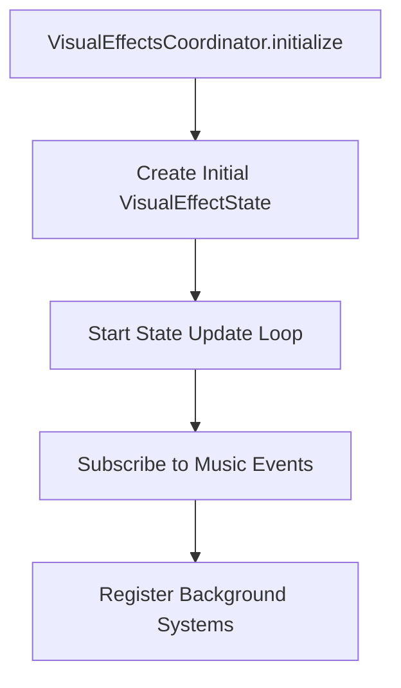
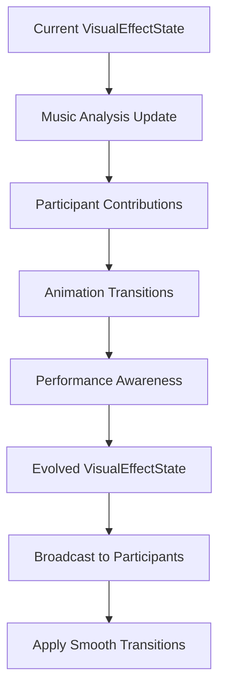

# 🎭 Visual Effects Coordination Architecture

> **"A unified state management system that coordinates background visual effects through shared state, enabling synchronized, music-responsive animations across all visual systems."**

---

## 🌟 Overview

The **Visual Effects Coordination Architecture** represents a major architectural evolution from legacy metaphorical systems to a modern, performance-focused approach. The `VisualEffectsCoordinator` serves as the central hub that manages shared visual state and coordinates background systems through the `VisualEffectState` interface.

---

## 🏗️ Core Architecture

### VisualEffectsCoordinator
**Location**: `src-js/visual/effects/VisualEffectsCoordinator.ts`

The singleton coordinator that manages visual effect state evolution and participant coordination.

```typescript
class VisualEffectsCoordinator implements IManagedSystem {
  private currentVisualState: VisualEffectState | null = null;
  private registeredParticipants: Map<string, BackgroundSystemParticipant>;
  
  // Core lifecycle methods
  public async initialize(): Promise<void>
  public updateAnimation(deltaTime: number): void
  public destroy(): void
}
```

### VisualEffectState Interface
**Location**: `src-js/visual/effects/VisualEffectsCoordinator.ts`

The shared state interface that all background systems use for coordination.

```typescript
interface VisualEffectState {
  // === MUSIC INTEGRATION ===
  musicIntensity: number;        // 0-1 beat intensity from music analysis
  flowDirection: Vector2D;       // Flow direction derived from music characteristics
  energyLevel: number;           // 0-1 overall music energy level
  colorTemperature: number;      // Color temperature (1000K-20000K) from music emotion
  tempoModulation: number;       // 0-2 tempo-driven scaling factor
  harmonicComplexity: number;    // 0-1 musical complexity for system sophistication

  // === VISUAL PARAMETERS ===
  fluidIntensity: number;        // 0-2 fluid dynamics intensity
  depthPerception: number;       // 0-1 3D space illusion strength
  luminosity: number;            // 0-2 hardware acceleration intensity
  colorHarmony: number;          // 0-1 color harmony synchronization
  visualCoherence: number;       // 0-1 how unified the visual systems appear

  // === ANIMATION PARAMETERS ===
  pulseRate: number;             // 0.5-4.0 seconds - synchronized pulse rhythm
  transitionFluidity: number;    // 0-1 transition smoothness between systems
  scalingFactor: number;         // 0.1-2.0 animation scaling factor
  effectDepth: number;           // 0-1 depth of effect integration
  systemHarmony: number;         // 0-1 how well systems coordinate together

  // === PERFORMANCE AWARENESS ===
  deviceCapabilities: DeviceCapabilities;
  performanceMode: PerformanceMode;
  adaptiveQuality: number;       // 0-1 current quality level
  thermalState: number;          // 0-1 thermal throttling level
  batteryConservation: number;   // 0-1 battery optimization level

  // === TEMPORAL TRACKING ===
  timestamp: number;             // When this state was created
  evolutionPhase: number;        // 0-1 how the visual state has evolved
  continuityIndex: number;       // 0-1 temporal continuity with previous state
}
```

### BackgroundSystemParticipant Interface
**Location**: `src-js/visual/effects/VisualEffectsCoordinator.ts`

The interface that background systems must implement to participate in coordination.

```typescript
interface BackgroundSystemParticipant {
  systemName: string;
  onVisualStateUpdate(state: VisualEffectState): void;
  onVisualEffectEvent(eventType: string, payload: any): void;
  getVisualContribution(): Partial<VisualEffectState>;
}
```

---

## 🔄 System Coordination Flow

### 1. Initialization


### 2. State Evolution Cycle


### 3. Participant Registration
```typescript
// Systems register with the coordinator
const participant: BackgroundSystemParticipant = {
  systemName: "WebGLRenderer",
  
  onVisualStateUpdate(state: VisualEffectState): void {
    // Update system based on shared state
    this.updateFromVisualState(state);
  },
  
  onVisualEffectEvent(eventType: string, payload: any): void {
    // Handle coordination events
    switch (eventType) {
      case "visual:rhythm-shift":
        this.handleRhythmShift(payload);
        break;
    }
  },
  
  getVisualContribution(): Partial<VisualEffectState> {
    // Contribute back to shared state
    return {
      luminosity: this.getCurrentLuminosity(),
      fluidIntensity: this.getFluidIntensity(),
      effectDepth: this.getDepthContribution()
    };
  }
};

coordinator.registerVisualParticipant(participant);
```

---

## 🎵 Music Integration

### Emotional Gradient Mapping
The coordinator integrates with the `EmotionalGradientMapper` to convert music analysis into visual state:

```typescript
private updateFromMusicAnalysis(state: VisualEffectState): void {
  if (this.emotionalGradientMapper) {
    const emotionalProfile = this.emotionalGradientMapper.getCurrentEmotionalProfile();
    if (emotionalProfile) {
      state.musicIntensity = emotionalProfile.energy;
      state.energyLevel = emotionalProfile.arousal;
      state.colorTemperature = 3000 + emotionalProfile.valence * 10000;
      state.harmonicComplexity = emotionalProfile.complexity;
      
      // Map mood to flow direction
      state.flowDirection = this.mapMoodToFlow(emotionalProfile.mood);
      state.tempoModulation = 0.5 + emotionalProfile.energy * 1.5;
    }
  }
}
```

### Supported Music Moods
- **euphoric**: `{ x: 1, y: 1 }` - Upward, forward flow
- **aggressive**: `{ x: -1, y: 1 }` - Backward, upward flow
- **peaceful**: `{ x: 0, y: -0.5 }` - Smooth downward flow
- **melancholic**: `{ x: -0.5, y: -1 }` - Backward, downward flow
- **mysterious**: `{ x: 0.7, y: 0 }` - Forward, neutral flow
- **contemplative**: `{ x: 0, y: 0.3 }` - Smooth upward flow

---

## ⚡ Performance Management

### Adaptive Quality Scaling
The coordinator automatically adapts visual quality based on device capabilities and performance metrics:

```typescript
private updatePerformanceAwareness(state: VisualEffectState): void {
  if (this.performanceCoordinator) {
    state.deviceCapabilities = this.performanceCoordinator.getDeviceCapabilities();
    state.performanceMode = this.performanceCoordinator.getCurrentPerformanceMode();
    state.adaptiveQuality = state.performanceMode.qualityLevel;
    
    // Update thermal and battery state
    const thermalState = this.performanceCoordinator.getThermalState();
    const batteryState = this.performanceCoordinator.getBatteryState();
    
    state.thermalState = thermalState.throttleLevel || 0;
    state.batteryConservation = batteryState && !batteryState.charging 
      ? (1 - batteryState.level) * 0.5 : 0;
  }
}
```

### Performance Budgets
- **Update Frequency**: 60fps (16ms intervals)
- **Memory Usage**: <50MB heap allocation
- **CPU Impact**: <10% idle, <25% during transitions
- **Frame Time**: Target <16ms for 60fps

---

## 🎨 Transition System

### Smooth Transition Configuration
```typescript
interface SmoothTransitionConfig {
  enabled: boolean;
  transitionDuration: number;        // milliseconds
  easingFunction: "smooth" | "harmonic" | "exponential" | "cubic";
  intensityFactor: number;           // 0-2 transition intensity
  coherenceThreshold: number;        // 0-1 minimum coherence for transitions
}
```

### Supported Easing Functions
- **smooth**: Cubic bezier for natural transitions
- **harmonic**: Sine wave for musical synchronization
- **exponential**: Exponential curves for dramatic effects
- **cubic**: Cubic easing for pronounced acceleration

---

## 🔧 Implementation Examples

### Basic System Integration
```typescript
class MyBackgroundSystem implements IManagedSystem, BackgroundSystemParticipant {
  public systemName = "MyBackgroundSystem";
  private currentState: VisualEffectState | null = null;
  
  async initialize(): Promise<void> {
    // Register with visual effects coordinator
    const coordinator = VisualEffectsCoordinator.getInstance();
    coordinator.registerVisualParticipant(this);
  }
  
  onVisualStateUpdate(state: VisualEffectState): void {
    this.currentState = state;
    
    // Apply state changes to your system
    this.applyMusicIntensity(state.musicIntensity);
    this.updateFlowDirection(state.flowDirection);
    this.adjustForPerformance(state.adaptiveQuality);
  }
  
  onVisualEffectEvent(eventType: string, payload: any): void {
    switch (eventType) {
      case "visual:rhythm-shift":
        this.handleRhythmChange(payload);
        break;
      case "visual:color-shift":
        this.updateColorScheme(payload);
        break;
    }
  }
  
  getVisualContribution(): Partial<VisualEffectState> {
    return {
      effectDepth: this.getCurrentDepth(),
      visualCoherence: this.isSystemStable() ? 1.0 : 0.5
    };
  }
}
```

---

## 📊 Monitoring & Debugging

### Performance Metrics
The coordinator tracks comprehensive performance metrics:

```typescript
interface CoordinationMetrics {
  stateUpdates: number;           // Total state updates
  coordinationEvents: number;     // Events processed
  animationTransitions: number;   // Transitions applied
  lastUpdate: number;            // Last update timestamp
  averageUpdateTime: number;     // Average processing time
}
```

### Debug Access
When debug mode is enabled, the coordinator provides detailed logging:

```typescript
// Enable debug logging
ADVANCED_SYSTEM_CONFIG.enableDebug = true;

// Access performance metrics
const coordinator = VisualEffectsCoordinator.getInstance();
const metrics = coordinator.getPerformanceMetrics();
console.log('Coordination Performance:', metrics);
```

---

## 🚀 Migration Guide

### From Legacy Systems
Systems previously using legacy metaphorical interfaces should migrate to the new architecture:

**Before** (Legacy-based):
```typescript
onLegacyFieldUpdate(field: LegacyField): void {
  this.updateFromField(field.rhythmicPulse, field.musicalFlow);
}
```

**After** (Visual Effects-based):
```typescript
onVisualStateUpdate(state: VisualEffectState): void {
  this.updateFromState(state.musicIntensity, state.flowDirection);
}
```

### Property Mapping Reference
| Old LegacyField | New VisualEffectState |
|------------------------|----------------------|
| `rhythmicPulse` | `musicIntensity` |
| `musicalFlow` | `flowDirection` |
| `energyResonance` | `energyLevel` |
| `emotionalTemperature` | `colorTemperature` |
| `liquidDensity` | `fluidIntensity` |
| `webglLuminosity` | `luminosity` |
| `smoothCycle` | `pulseRate` |

---

## 🔍 Best Practices

### Performance Optimization
1. **Minimal State Access**: Only access required state properties
2. **Efficient Updates**: Batch visual updates where possible
3. **Quality Scaling**: Respect `adaptiveQuality` for performance
4. **Memory Management**: Clean up resources in `destroy()`

### Integration Guidelines
1. **Interface Compliance**: Always implement `BackgroundSystemParticipant`
2. **State Contributions**: Provide meaningful contributions via `getVisualContribution()`
3. **Event Handling**: Handle all relevant visual effect events
4. **Error Resilience**: Wrap coordinator calls in try-catch blocks

### Debugging Tips
1. **Enable Debug Mode**: Set `ADVANCED_SYSTEM_CONFIG.enableDebug = true`
2. **Monitor Metrics**: Regularly check `getPerformanceMetrics()`
3. **State Inspection**: Log state changes in `onVisualStateUpdate()`
4. **Contribution Analysis**: Verify contributions are being applied

---

**Last Updated**: 2025-01-12  
**Architecture Version**: v3.0.0 - Visual Effects Coordination  
**Compatibility**: All background systems implementing BackgroundSystemParticipant