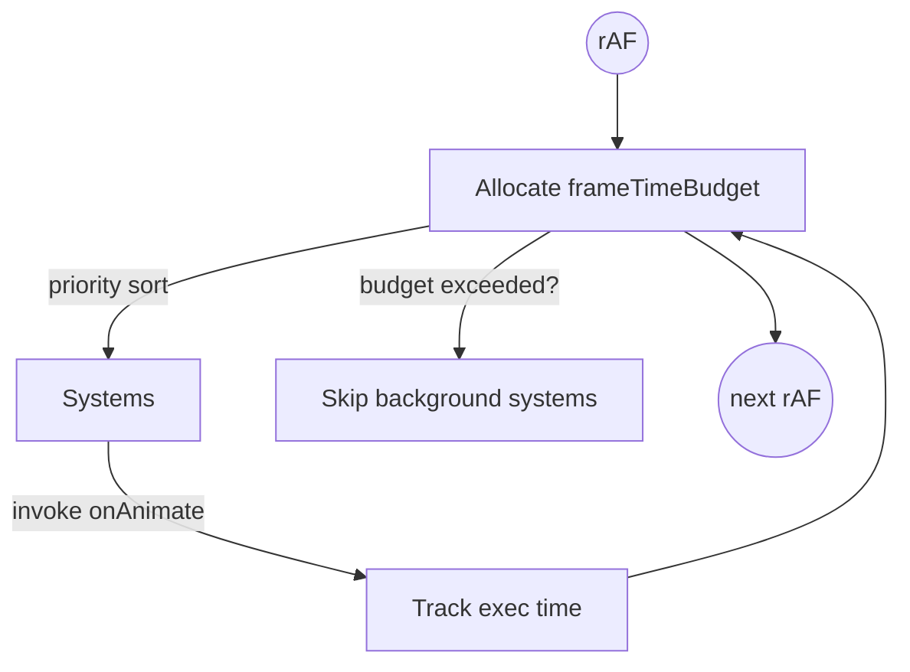

# 🎬 Animation Conductor

**Document Version:** 2.0  
**Implementation Date:** June 2025  
**Status:** 🟢 Active (Renamed from MasterAnimationCoordinator)

## Overview

`AnimationConductor` replaces ad-hoc `requestAnimationFrame` loops with a **single orchestrated timeline** that budgets frame time, prioritises systems, and auto-switches between _performance_ and _quality_ modes.

**Previously known as:** `MasterAnimationCoordinator` (renamed for clarity)

- **File:** `src-js/core/animation/AnimationConductor.ts`
- **Primary goal:** Maintain 60 FPS by distributing frame budget across registered _Animation Systems_.

---

## 1 ▪ Configuration

```ts
interface CoordinatorConfig {
  frameTimeBudget?: number; // ms, default 16 (≈60 FPS)
  maxBatchSize?: number; // legacy – reserved for future batching API
  enableDebug?: boolean; // verbose console traces
}
```

### Quick-start

```ts
import { AnimationConductor } from "@/core/animation/AnimationConductor";

const conductor = new AnimationConductor({ enableDebug: true });
conductor.initialize();
```

---

## 2 ▪ System Registration

Animation subsystems implement a lightweight interface:

```ts
interface AnimationSystem {
  onAnimate(deltaMs: number): void;
  updateAnimation?(ts: number, dt: number): void; // legacy fallback
  onPerformanceModeChange?(mode: "performance" | "quality"): void;
}
```

Register the system:

```ts
conductor.registerAnimationSystem("AudioVisual", audioVisualSystem, "normal", 60);
```

| Param        | Meaning                                                           |
| ------------ | ----------------------------------------------------------------- | -------- | -------------------------------------------- |
| `systemName` | Unique identifier used in debug stats.                            |
| `system`     | Object implementing `AnimationSystem`.                            |
| `priority`   | `"critical"                                                       | "normal" | "background"` (influences scheduling order). |
| `targetFPS`  | Desired rate; Conductor stretches/compresses `frameInterval` as needed. |

> Unregister with `conductor.unregisterAnimationSystem("AudioVisual")`.

---

## 3 ▪ Internal Flow



Adaptive optimisation kicks in every 2 s per system:

- **Expand** `frameInterval` when over-budget ≥ 3×.
- **Contract** when sustained head-room > 40 %.

Global modes:

| Mode        | Trigger                              | Effect                                                           |
| ----------- | ------------------------------------ | ---------------------------------------------------------------- |
| performance | Dropped frames > 10 % or avg > 20 ms | `frameTimeBudget` → 12 ms; raise background `frameInterval` ×1.5 |
| quality     | Healthy (< 2 % drops & avg < 10 ms)  | Restore default budget (16 ms) & `targetFPS` values              |

Registered systems receive `onPerformanceModeChange` notifications.

---

## 4 ▪ Public API

| Method                                                     | Purpose                                                 |
| ---------------------------------------------------------- | ------------------------------------------------------- |
| `initialize()`                                             | Optional convenience setter-up call.                    |
| `registerAnimationSystem(name, sys, priority?, fps?)`      | Attach subsystem. Starts master loop on first call.     |
| `unregisterAnimationSystem(name)`                          | Detach subsystem; stops loop when last removed.         |
| `startMasterAnimationLoop()` / `stopMasterAnimationLoop()` | Manually control the rAF loop if needed.                |
| `destroy()`                                                | Stops loop & clears registry (for hot-reload).          |
| `getPerformanceReport()`                                   | Returns shallow-cloned metrics snapshot.                |

---

## 5 ▪ Best Practices

1. Keep `onAnimate` _pure_ & constant-time; off-thread heavy work.
2. Prefer **critical** priority only for user-visible elements (cursor, UI).
3. Combine multiple tiny effects into a single system to avoid registry bloat.
4. Use `shouldUpdate()` from `PerformanceAnalyzer` inside systems for extra throttling.

---

## 6 ▪ Integration Points

- **TimerConsolidationSystem** shares the same philosophy for `setInterval` consolidation.
- **PerformanceAnalyzer** invokes `calculateHealthScore()` → Conductor listens via EventBus to force perf mode.
- **Year3000 Debug Overlay** visualises `systemStats` for each registered system.

---

## 7 ▪ Migration from MasterAnimationCoordinator

### Automatic Migration
- All existing registrations continue to work
- API methods remain identical
- Performance characteristics unchanged

### Recommended Updates
```ts
// Old (still works due to backward compatibility)
import { MasterAnimationCoordinator } from "@/core/MasterAnimationCoordinator";

// New (recommended)
import { AnimationConductor } from "@/core/animation/AnimationConductor";
```

### Registration Updates
```ts
// Old system name format
conductor.registerAnimationSystem("DimensionalNexusSystem", system, "normal", 30);

// New system name format (recommended)
conductor.registerAnimationSystem("InteractionTrackingSystem", system, "normal", 30);
```

---

## 8 ▪ Roadmap

| Phase | Enhancement                                                               |
| ----- | ------------------------------------------------------------------------- |
| 2     | Expose `conductor.on("modeChange", cb)` via EventBus.                     |
| 3     | Dynamic frameTimeBudget based on DeviceCapabilityDetector results.        |
| 4     | Web-Worker based fall-back for background systems on supporting browsers. |

---

## 9 ▪ Status

- **Introduced:** v1.0 (Jan 2025)
- **Renamed:** v2.0 (June 2025) - MasterAnimationCoordinator → AnimationConductor
- **API Stability:** Stable – backward compatibility maintained.

---

_"One conductor to orchestrate them all."_