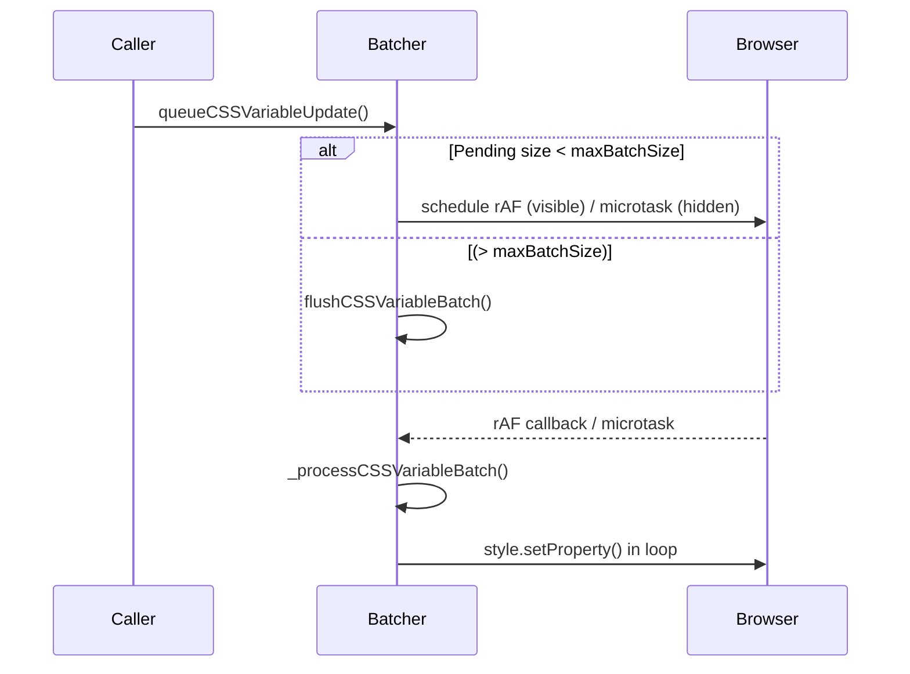

# ⚡ CSS Variable Batching System Documentation

## Overview

The **CSS Variable Batcher** is a micro-utility that coalesces multiple `style.setProperty()` calls into **single batched writes**, dramatically reducing layout / style-recalc churn. It is automatically instantiated by several Year 3000 systems (NebulaController, BeatSyncVisualSystem, DepthLayerSystem, etc.) and can also be used ad-hoc in custom extensions.

- **File:** `src-js/core/CSSVariableBatcher.ts`
- **Bundle size:** ≈ 3.4 kB min+gzip
- **Runtime cost:** » negligible – < 0.05 ms per queued update (batch processed)

---

## 1 ▪ Design Goals

1. **Performance** – group updates so the browser resolves style recalculations once per frame rather than per call.
2. **Safety** – automatically flush when batch size exceeds a threshold, when the tab is backgrounded, or when batching is temporarily disabled.
3. **Adaptability** – falls back to immediate writes when `requestAnimationFrame` is unavailable (very old browsers / tests).
4. **Observability **– exposes a rich performance report for debug overlays & automated benchmarks.

---

## 2 ▪ Configuration API

```ts
interface CSSVariableBatcherConfig {
  batchIntervalMs: number; // ≥ 0  (0 = coalesce until rAF)
  maxBatchSize: number; // flush immediately when exceeded
  enableDebug: boolean; // verbose console logging
  useCssTextFastPath?: boolean; // legacy cssText mutation path
}
```

| Field                | Default | Notes                                                                                                                                                                                                                                      |
| -------------------- | ------- | ------------------------------------------------------------------------------------------------------------------------------------------------------------------------------------------------------------------------------------------ |
| `batchIntervalMs`    | `0`     | `0` means the Batcher schedules a `queueMicrotask` when the tab is hidden or a `requestAnimationFrame` when visible; any positive number inserts an additional timeout before the flush.                                                   |
| `maxBatchSize`       | `50`    | If the number of pending updates ≥ this value, `flushCSSVariableBatch()` is invoked immediately to prevent unbounded memory growth.                                                                                                        |
| `enableDebug`        | `false` | When `true`, the Batcher prints periodic summaries and warnings for batches that overshoot the 8 ms soft budget.                                                                                                                           |
| `useCssTextFastPath` | `false` | Setting this to `true` rewrites the _entire_ `style.cssText` when > 3 updates target the same element – a micro-optimisation that can be faster on obsolete engines but **slower** on modern Blink / Gecko due to full style invalidation. |

### Runtime Tweaks

```ts
batcher.updateConfig({ maxBatchSize: 80, enableDebug: true });
```

---

## 3 ▪ Public Methods

| Method                                              | Purpose                                                                                   |
| --------------------------------------------------- | ----------------------------------------------------------------------------------------- |
| `queueCSSVariableUpdate(property, value, element?)` | Enqueue a `--css-variable: value` pair. `element` defaults to `document.documentElement`. |
| `flushCSSVariableBatch()`                           | Manually flush pending updates (e.g., before a screenshot test).                          |
| `flushNow()`                                        | Alias for unit-tests – synchronous flush.                                                 |
| `setBatchingEnabled(enabled)`                       | Toggle batching globally. When disabled, all writes are immediate.                        |
| `getPerformanceReport()`                            | Returns aggregated metrics (see § 4).                                                     |
| `resetMetrics()`                                    | Clear counters & timers.                                                                  |
| `destroy()`                                         | Flush & remove internal timers – call when hot-reloading.                                 |

---

## 4 ▪ Performance Metrics

`getPerformanceReport()` →

```jsonc
{
  "enabled": true,
  "pendingUpdates": 0,
  "totalUpdates": 1240,
  "totalBatches": 74,
  "averageBatchSize": 16.8,
  "averageBatchTime": 0.42, // ms
  "maxBatchTime": 1.93,
  "overBudgetBatches": 2,
  "batchInterval": 0,
  "maxBatchSize": 50,
  "performance": {
    "estimatedDomManipulationReduction": "93%",
    "efficiency": "excellent"
  },
  "recommendations": []
}
```

If a batch takes > 8 ms the Batcher logs a **warning** and increments `overBudgetBatches`. Batches > 16 ms temporarily disable batching for 5 s to avoid jank.

---

## 5 ▪ Internal Scheduling Flow



**Hidden-tab optimisation:** when `document.visibilityState === 'hidden'` the flush is scheduled in a micro-task, preventing needless frame callbacks.

---

## 6 ▪ Integration Examples

### 6.1 Basic Use

```ts
import { CSSVariableBatcher } from "@/core/CSSVariableBatcher";

const batcher = new CSSVariableBatcher();

// Animate a pulse – call on every beat
GlobalEventBus.subscribe("music:beat", ({ energy }) => {
  const intensity = (0.8 + energy * 0.6).toFixed(3);
  batcher.queueCSSVariableUpdate("--sn-beat-pulse-intensity", intensity);
});
```

### 6.2 Disabling During Critical Animations

```ts
batcher.setBatchingEnabled(false);
// write immediate style updates that must be synchronous …
performCriticalFlipAnimation();
// re-enable after
batcher.setBatchingEnabled(true);
```

---

## 7 ▪ Best Practices & Gotchas

- **Avoid hex values** – keep variables RGB-based for gradient friendliness.
- **Don't mix `style.cssText` & individual setters** on the same element within the same frame; the fast-path may overwrite pending individual updates.
- **Keep `maxBatchSize` reasonable**; excessively large batches risk blocking the main thread for multiple milliseconds.
- When hot-reloading modules in development remember to call `destroy()` on old instances to prevent orphaned rAF handles.

---

## 8 ▪ Roadmap

| Phase | Feature                                                                          |
| ----- | -------------------------------------------------------------------------------- |
| 2     | Auto-tune `maxBatchSize` based on device CPU tier.                               |
| 3     | Off-load batch processing to a `MutationObserver` / IdleCallback when supported. |
| 4     | Expose a DevTools panel via the Year 3000 debug overlay.                         |

---

**Status:** Stable • Production-ready • Used by multiple visual systems

— _January 2025_ | **Version 1.0** | _Catppuccin StarryNight_
