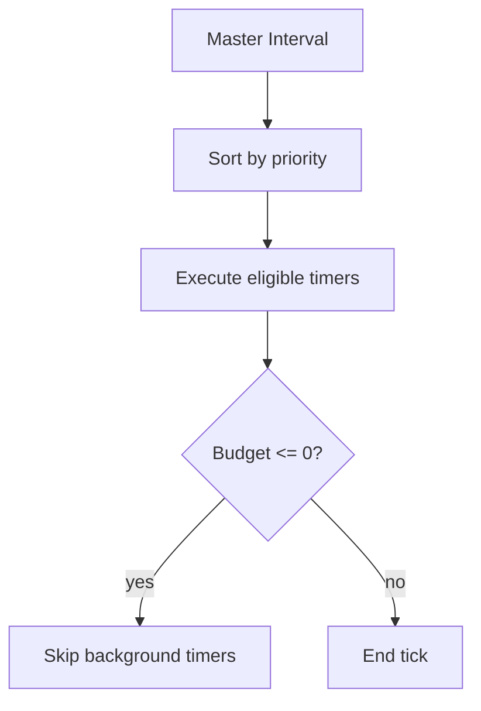

# ⏱️ Timer Consolidation System

## Overview

`TimerConsolidationSystem` (TCS) funnels many `setInterval`/`setTimeout` sources into a **single master interval**, applying priority-aware scheduling and execution budgeting. This avoids the "timer storm" that can cripple low-end devices.

- **File:** `src-js/core/TimerConsolidationSystem.ts`
- **Default master tick:** 50 ms (adjustable via config).

---

## 1 ▪ Configuration

```ts
interface TimerConfig {
  timerIntervalMs?: number; // default 50
  maxTimerBudget?: number; // ms per master tick, default 10
  enableDebug?: boolean; // verbose console traces
}
```

### Example

```ts
import { TimerConsolidationSystem } from "@/core/TimerConsolidationSystem";

const tcs = new TimerConsolidationSystem({ enableDebug: true });

tcs.registerConsolidatedTimer(
  "lyricsPoller",
  () => fetchLyricsDelta(),
  1000,
  "background"
);
```

---

## 2 ▪ Timer Registration

```ts
registerConsolidatedTimer(
  timerId: string,
  callback: () => void,
  intervalMs: number,
  priority?: "critical" | "normal" | "background"
): void
```

| Priority       | Characteristics                                          |
| -------------- | -------------------------------------------------------- |
| **critical**   | Executes ahead of others regardless of remaining budget. |
| **normal**     | Standard tasks; skipped only when budget ≤ 0.            |
| **background** | Lowest priority; skipped early when over budget.         |

> Unregister via `unregisterConsolidatedTimer("lyricsPoller")`.

---

## 3 ▪ Internal Execution Flow



Performance metrics sampled per tick:

- Total / average / max execution time.
- Skipped timers count.
- Per-timer call statistics (`timerCallbacks` map).

---

## 4 ▪ Public API

| Method                                                   | Purpose                                                     |
| -------------------------------------------------------- | ----------------------------------------------------------- |
| `registerConsolidatedTimer(id, cb, interval, priority?)` | Add timer. Starts master interval on first call.            |
| `unregisterConsolidatedTimer(id)`                        | Remove timer; stops interval when last removed.             |
| `destroy()`                                              | Clears registry and stops master interval (for hot-reload). |

---

## 5 ▪ Best Practices

1. Use **critical** sparingly (e.g., live audio beat polling).
2. Keep callbacks ≤ `maxTimerBudget / activeTimers` to avoid frame drops.
3. Combine related background tasks into a single callback when possible.

---

## 6 ▪ Integration Points

- **MasterAnimationCoordinator** – Shares similar priority taxonomy; both can be visualised in the debug overlay.
- **PerformanceAnalyzer** – Future roadmap: auto-adjust `timerIntervalMs` when health score degrades.

---

## 7 ▪ Roadmap

| Phase | Plan                                                         |
| ----- | ------------------------------------------------------------ |
| 2     | Move master tick to `requestIdleCallback` when available.    |
| 3     | Persist per-timer stats to aid remote telemetry diagnostics. |

---

## 8 ▪ Status

- **Introduced:** v1.0 (Jan 2025)
- **API Stability:** Beta – API may evolve until v1.1.

---

_"One tick to serve them all."_
