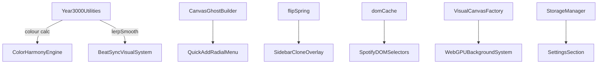

# 🧰 Utilities & Tooling Overview

## Purpose

The `/src-js/utils` directory contains **framework-agnostic helper modules** that power many Year 3000 systems. They are designed to be:

- **Lightweight** – tree-shake friendly, no 3rd-party deps.
- **Composable** – can be imported individually without pulling the entire toolkit.
- **Stable** – public APIs rarely change; internal tweaks maintain backwards compatibility.

---

## 1 ▪ Utility Index

| File                         | Key Exports                                                | What it Does                                                                                                |
| ---------------------------- | ---------------------------------------------------------- | ----------------------------------------------------------------------------------------------------------- |
| `animationUtils.ts`          | `restartCssAnimation(el)`                                  | Safely restarts a CSS animation via Web Animations API (falls back to style toggle).                        |
| `CanvasGhostBuilder.ts`      | `buildDragGhostCanvas()`                                   | Renders a cover-art + label composite `<canvas>` for `setDragImage` during drag-and-drop. Caches per image. |
| `domCache.ts`                | `$$`, `invalidateSelector`, `clearDomCache`                | WeakRef-powered memoised `querySelectorAll` wrapper. Auto-purges cache when elements are GC'd.              |
| `flipSpring.ts`              | `spring(config)`                                           | Tiny FLIP spring interpolator (<1 KB) used by drag morph animations.                                        |
| `getScrollNode.ts`           | `getScrollNode()`                                          | Returns Spotify's main scroll node handling multiple class variants.                                        |
| `NoiseField.ts`              | `sample(u,v)`                                              | 2-D value-noise generator (64×64 grid) for subtle vector offsets.                                           |
| `PaletteExtensionManager.ts` | `PaletteExtensionManager` class                            | Generates & caches Catppuccin-compatible palettes, with genre hints and fallback generation.                |
| `settings-field.ts`          | Type defs (`ISettingsField*`)                              | Internal replica of `spcr-settings` typings for self-contained settings.                                    |
| `SettingsSection.tsx`        | `SettingsSection` class                                    | Lightweight React wrapper for building Spotify settings panels w/o external libs.                           |
| `sidebarDetector.ts`         | `querySidebar`, `isSidebarCloneCapable`                    | Centralises sidebar selector + capability checks for Quick-Add clone overlay.                               |
| `SpicetifyCompat.ts`         | `SpicetifyCompat` static class                             | Safe wrappers around Spicetify APIs with retries & availability checks.                                     |
| `spicetifyReady.ts`          | `waitForSpicetifyReady()`                                  | Promise that resolves when the Spicetify global is fully initialised.                                       |
| `StorageManager.ts`          | `StorageManager` static class                              | Unified persistence layer with migration from `localStorage` to `Spicetify.LocalStorage`.                   |
| `VisualCanvasFactory.ts`     | `createOptimizedCanvas()`, `detectRenderingCapabilities()` | Creates canvases with best available context (WebGPU → WebGL2 → 2D).                                        |
| `visualPerformance.ts`       | `selectPerformanceProfile()`                               | Chooses perf-profile objects based on device/quality hints.                                                 |
| `Year3000Utilities.ts`       | ~60 utility functions                                      | Colour conversions, rhythm helpers, lerpSmooth, Oklab helpers, throttling, etc.                             |

---

## 2 ▪ Coding Conventions

- **No DOM reads in hot paths** unless memoised via `domCache.$$`.
- **RGB > Hex** – most colour helpers accept and return hex, but gradients should use the `rgb` variant for SCSS.
- **Zero runtime deps** – keep utils vanilla TypeScript. If a polyfill is required add it behind capability checks.
- **Debug Gates** – heavy console logging guarded behind `YEAR3000_CONFIG.enableDebug`.

---

## 3 ▪ Inter-Module Relationships



---

## 4 ▪ Typical Import Patterns

```ts
import { $$ } from "@/utils/domCache";
import { lerpSmooth, hexToRgb } from "@/utils/Year3000Utilities";
import { createOptimizedCanvas } from "@/utils/VisualCanvasFactory";
```

Tree-shaking ensures that only the referenced helpers are bundled.

---

## 5 ▪ Versioning & Stability

| Utility                 | API Stability                                                       |
| ----------------------- | ------------------------------------------------------------------- |
| animationUtils          | Stable since v1.0                                                   |
| CanvasGhostBuilder      | Beta – internal API may change (Phase 2)                            |
| domCache                | Stable                                                              |
| flipSpring              | Stable                                                              |
| PaletteExtensionManager | Experimental (Phase 3 roadmap)                                      |
| StorageManager          | Stable after migration patch v1.1                                   |
| Year3000Utilities       | Stable core; new helpers may appear but existing signatures remain. |

---

## 6 ▪ Roadmap Highlights

1. **domCache** – add selector hit-rate analytics (Phase 3).
2. **PaletteExtensionManager** – load user-supplied JSON palettes & genre AI suggestions (Phase 3).
3. **VisualCanvasFactory** – add `WebGL1` fallback for very old Electron shells.
4. **Year3000Utilities** – move Oklab + colour-difference helpers into a dedicated colour-math sub-module.

---

## 7 ▪ Status

- **Bundle Impact:** entire utils folder < 28 KB gzip.
- **Last Audit:** January 2025
- **Version:** 1.0

---

> _"Small tools, big impact" – StarryNight Core Team_
