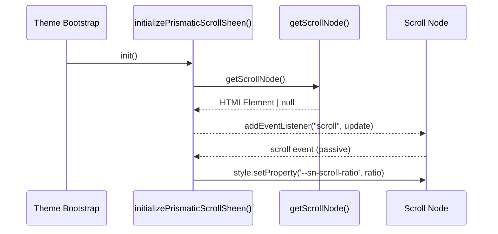

# 🌈 Prismatic Scroll Sheen – Rainbow-Shift Gradient

**Document Version:** 1.0
**Implementation Date:** June 2025
**Status:** ✅ Stable (Phase 2)

---

## 🚀 Purpose

The **Prismatic Scroll Sheen** adds a faint, iridescent gradient overlay that gradually shifts hue in response to the user's _vertical_ scroll distance. It costs almost nothing (one passive scroll-handler and a single CSS variable write) and automatically disables on low-end devices, keeping performance predictable across hardware tiers and honouring **prefers-reduced-motion**.

---

## 🗂️ Key Source Files

| File                                         | Role                                                                                                           |
| -------------------------------------------- | -------------------------------------------------------------------------------------------------------------- |
| `src-js/effects/prismaticScrollSheen.ts`     | Registers the scroll listener, calculates a repeating 0-1 ratio, and updates `--sn-scroll-ratio` in real time. |
| `src-js/utils/getScrollNode.ts`              | Centralised helper that resolves Spotify's ever-changing scroll-node selector.                                 |
| (SCSS) Modules consuming `--sn-scroll-ratio` | E.g. `_sn_gradient.scss`, atmospheric layers – they read the ratio to rotate hue / adjust opacity.             |

> **Zero timers** – listener is passive and only fires when the user scrolls; no rAF loops or polling.

---

## 🔄 Runtime Flow



1. **Boot** – The theme (typically inside `theme.entry.ts`) calls `initializePrismaticScrollSheen()` once after Spicetify is ready.
2. **Capability gate** – If `DeviceCapabilityDetector.deviceCapabilities.overall === "low"` the effect is disabled via `--sn-scroll-sheen-enabled: 0`.
3. **Attachment** – The helper queries the scroll node (defaults to `getScrollNode()` constants) and binds a _passive_ scroll listener.
4. **Update** – On every scroll event the handler:
   • Measures added scroll distance.
   • Calculates a _cumulative_ pixel value that wraps at `cyclePx` (default **6000 px** or the value of `--sn-scroll-cycle-px`).
   • Writes the repeating ratio `0-1` to `--sn-scroll-ratio` (4-decimal precision).
5. **Consumption** – SCSS gradients read `--sn-scroll-ratio` to drive `hue-rotate()`, alpha ramps, or stop-positions.

---

## ⚙️ Public API

```ts
initializePrismaticScrollSheen(selector?: string): void;
```

- `selector` (optional) – Custom CSS selector for the scroll container if the default Spotify one changes.

> The function is **idempotent** – repeated calls are ignored after the listener is attached.

---

## 🎛️ Configuration & CSS Variables

| Variable (CSS)              | Default | Purpose / Notes                                             |
| --------------------------- | ------- | ----------------------------------------------------------- |
| `--sn-scroll-sheen-enabled` | `1`     | Set to `0` when device tier = _low_ to hide sheen entirely. |
| `--sn-scroll-cycle-px`      | `6000`  | Pixels required for the hue cycle to complete one loop.     |
| `--sn-scroll-ratio`         | `0`     | _Runtime_ 0-1 value updated on scroll; read by SCSS.        |

Designers can override `--sn-scroll-cycle-px` in a root selector or via SettingsManager to make the colour loop faster/slower.

---

## 🧪 Testing Checklist

- [ ] Scroll a long playlist – verify `--sn-scroll-ratio` updates in the _Styles_ panel.
- [ ] Toggle _Low Device Performance_ flag (simulate) – sheen should disable (`--sn-scroll-sheen-enabled: 0`).
- [ ] Override `--sn-scroll-cycle-px: 2000` in DevTools – observe faster colour cycling.

### DevTools Snippet

```js
// Force a quick colour cycle (2 km instead of 6 km)
document.documentElement.style.setProperty("--sn-scroll-cycle-px", "2000");

// Inspect live ratio
getComputedStyle(document.documentElement).getPropertyValue(
  "--sn-scroll-ratio"
);
```

---

## 🗺️ Sample SCSS Usage

```scss
// Example: rainbow hue-rotate overlay
.scroll-sheen-layer {
  pointer-events: none;
  mix-blend-mode: screen;
  opacity: calc(0.15 * var(--sn-scroll-sheen-enabled, 0));
  filter: hue-rotate(calc(var(--sn-scroll-ratio, 0) * 360deg));
}
```

---

## 📅 Roadmap

1. **Horizontal Scroll Support** – extend to carousels / grids.
2. **Inertia Compensation** – use `requestAnimationFrame` to smooth large wheel jumps.
3. **Accessibility Toggle** – surface a SettingsManager option for user control.

---

© Catppuccin StarryNight 2025 – "Scroll the spectrum."
