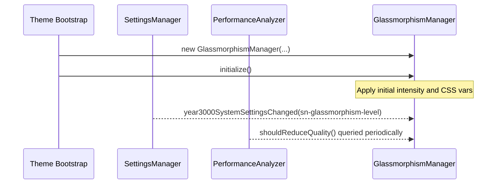

# 💎 Glassmorphism Manager – Frosted Panels & Blur Layers

**Document Version:** 1.0
**Implementation Date:** June 2025
**Status:** ✅ Stable

---

## 🚀 Purpose

`GlassmorphismManager` centralises all _frosted-glass_ effects in the StarryNight theme. It applies and tunes CSS variables that control **blur**, **opacity**, **saturation**, and **noise** of translucent backgrounds (e.g., navigation bar, cards, modals).

Key goals:

1. Honour user preference (`sn-glassmorphism-level`).
2. Detect browser capability (`backdrop-filter` support).
3. Downgrade intensity when `PerformanceAnalyzer` reports poor health.
4. Expose a concise CSS-var API so designers can iterate without touching TS.

---

## 🗂️ Key Source Files

| File                                       | Role                                                         |
| ------------------------------------------ | ------------------------------------------------------------ |
| `src-js/managers/GlassmorphismManager.ts`  | Calculates & sets CSS variables, listens to settings + perf. |
| `src-js/core/CSSVariableBatcher.ts`        | (Optional) batching utility used when `applyGlassmorphism()` |
| `_sn_glassmorphism.scss` + related modules | Consume variables (`--glass-*`) for visual styling.          |

---

## 🔄 Runtime Flow



If `backdrop-filter` is **unsupported** the manager forces the level to `disabled` and logs a warning (`console.warn`).

When performance drops `checkPerformanceAndAdjust()` is called (external systems) → intensity is stepped down one tier to avoid FPS loss.

---

## 📐 Intensity Levels & Variables

| Level      | Blur (px) | Opacity | Saturation | Notes                        |
| ---------- | --------- | ------- | ---------- | ---------------------------- |
| `disabled` | –         | –       | –          | Removes all variables        |
| `minimal`  | `8-10`    | `0.05`  | `1.05`     | Light frosting               |
| `moderate` | `15-20`   | `0.10`  | `1.2`      | Default for desktops         |
| `intense`  | `20-30`   | `0.15`  | `1.4`      | High-blur, bright highlights |

Variables written:

```css
--glass-blur            /* px */
--glass-opacity         /* 0-1 */
--glass-saturation      /* 1+  */
--glass-background      /* rgba */
--glass-border          /* rgba */
```

> Colour variables are set via `updateGlassColors(primary, secondary)` when the Color Harmony Engine publishes new palette info.

---

## 🎛️ Settings Integration

- **Key:** `sn-glassmorphism-level` (legacy alias `sn-glassmorphismIntensity`)
- **Values:** `disabled` | `minimal` | `moderate` | `intense`
- **Listener:** global `year3000SystemSettingsChanged` → `applyGlassmorphismSettings()`

---

## ⚙️ Public Methods

```ts
initialize(): Promise<void>                 // called automatically by ctor
applyGlassmorphismSettings(level): void     // internal helper, can be reused
updateGlassColors(primaryHex, secondaryHex) // adjust tinted glass colours
checkPerformanceAndAdjust(): void           // downgrade when FPS low
applyGlassmorphism(level): void             // low-level var writer via batcher
destroy(): void                             // remove listeners & observers
```

---

## 🧪 Testing Checklist

- [ ] Switch levels in **Settings** panel – CSS variables update & body classes swap.
- [ ] Force `performanceAnalyzer.shouldReduceQuality()` → intense/balanced drop to lower tier.
- [ ] Toggle browser support (DevTools emulate no ⬅︎backdrop-filter): manager warns & disables.
- [ ] Verify noise / border vars present in computed styles.

---

## 🗺️ Sample SCSS

```scss
.sidebar-frost {
  backdrop-filter: blur(var(--glass-blur, 0)) saturate(
      var(--glass-saturation, 1)
    );
  background: rgba(255, 255, 255, var(--glass-opacity, 0));
  transition: backdrop-filter 200ms ease, background 200ms ease;
}
```

---

## 📅 Roadmap

1. **Dynamic blur radius** based on scroll velocity (possible Phase 4).
2. **WebGL fallback** for browsers lacking backdrop-filter but with GPU.
3. **Automatic darken/lighten** tint when album art palette is applied.

---

© Catppuccin StarryNight 2025 – "Frost the cosmos."
