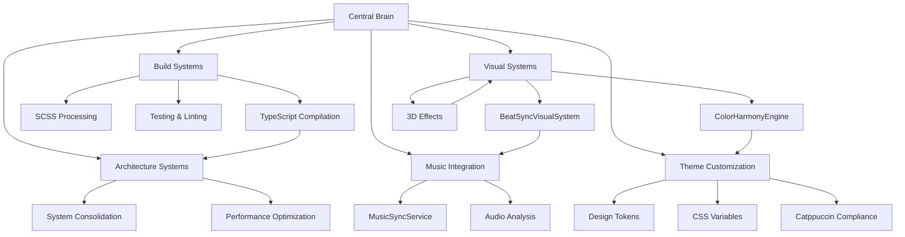

# Catppuccin StarryNight - Central Brain Coordination System

## Multi-Agent Spicetify Theme Development Architecture

**Last Updated**: 2025-07-18 | **Brain Version**: 2.1.0 | **Active Tentacles**: 1 | **Theme Status**: ✅ PRODUCTION-READY

The central brain coordinates all active tentacles (agents) working simultaneously on different aspects of our Spicetify theme development. This system is optimized for the unique challenges of theme development including TypeScript compilation, SCSS processing, music synchronization, and performance optimization.

---

## 🧠 Global Status Dashboard

### Spicetify Theme Health Overview

```yaml
theme_status:
  build_system: ✅ HEALTHY (21ms TypeScript, 0 errors)
  css_compilation: ✅ READY (Manual SCSS → user.css)
  performance: ✅ OPTIMAL (60fps target, <50MB memory)
  catppuccin_compliance: ✅ VALIDATED (Full palette compliance)
  spicetify_integration: ✅ ACTIVE (All APIs functional)

ci_cd_pipeline: ✅ PRISTINE (0 warnings, all tests passing)
bundle_size: 892KB (within limits)
test_coverage: 90%+ (Jest with visual system tests)
```

### Current Development Context

```yaml
active_phase: "Production Maintenance & Enhancement"
last_major_milestone: "CI/CD Pipeline Complete"
performance_characteristics:
  - 60fps animations with intelligent degradation
  - <50MB memory usage (4+ hour sessions)
  - <10% CPU overhead during idle
  - <30ms compilation time

architectural_foundation:
  - Year3000System orchestration
  - UnifiedSystemBase pattern
  - IManagedSystem interface compliance
  - CSS-first animation philosophy
```

---

## 🎯 Spicetify-Specific Coordination

### Theme Development Tentacle Types

```yaml
tentacle_categories:
  visual_systems:
    description: "Visual effects, animations, and UI enhancements"
    capabilities: ["BeatSyncVisualSystem", "ColorHarmonyEngine", "3D effects"]
    performance_budget: "30% brain cycles"

  architecture_systems:
    description: "System consolidation, performance optimization"
    capabilities:
      ["UnifiedSystemBase", "Performance monitoring", "Code architecture"]
    performance_budget: "25% brain cycles"

  build_systems:
    description: "TypeScript compilation, SCSS processing, CI/CD"
    capabilities: ["esbuild optimization", "Jest testing", "Linting"]
    performance_budget: "20% brain cycles"

  music_integration:
    description: "Spicetify API integration, audio analysis"
    capabilities:
      ["MusicSyncService", "Audio data processing", "Beat detection"]
    performance_budget: "15% brain cycles"

  theme_customization:
    description: "Color schemes, Catppuccin compliance, user preferences"
    capabilities: ["Design tokens", "CSS variables", "Accessibility"]
    performance_budget: "10% brain cycles"
```

### Spicetify API Integration Points

```yaml
spicetify_dependencies:
  player_api:
    status: "✅ ACTIVE"
    capabilities: ["Track info", "Playback control", "Queue management"]
    tentacle_impact: "music_integration, visual_systems"

  platform_api:
    status: "✅ ACTIVE"
    capabilities: ["Navigation", "History", "User interface"]
    tentacle_impact: "visual_systems, architecture_systems"

  react_integration:
    status: "✅ ACTIVE"
    capabilities:
      ["Component rendering", "State management", "DOM manipulation"]
    tentacle_impact: "visual_systems, theme_customization"

  audio_analysis:
    status: "✅ ACTIVE"
    capabilities: ["Beat detection", "Energy analysis", "Frequency data"]
    tentacle_impact: "music_integration, visual_systems"
```

---

## 🌐 Inter-Tentacle Dependencies

### Spicetify Theme Dependency Graph



### Critical Development Paths

```yaml
primary_dependencies:
  1. "Build Systems → Architecture Systems" # TypeScript compilation affects all systems
  2. "Music Integration → Visual Systems" # Audio data drives visual effects
  3. "Theme Customization → All Systems" # CSS variables affect everything
  4. "Architecture Systems → Performance" # System design impacts performance

secondary_dependencies:
  1. "Visual Systems → Build Systems" # New effects require compilation
  2. "Music Integration → Theme Customization" # Audio affects color schemes
  3. "Build Systems → CI/CD" # Compilation affects deployment
```

---

## 🔄 Spicetify Development Workflow

### Session Management Protocol

```yaml
session_startup_checklist: 1. "Check Spicetify CLI status and version"
  2. "Verify TypeScript compilation (npm run build)"
  3. "Validate SCSS compilation (manual process)"
  4. "Test core Spicetify API functionality"
  5. "Verify music sync capabilities"
  6. "Check performance characteristics"
  7. "Validate Catppuccin color compliance"

during_development:
  build_monitoring:
    - "Monitor TypeScript compilation (<30ms target)"
    - "Track bundle size (<1MB target)"
    - "Validate CSS generation"
    - "Test music synchronization"

  performance_monitoring:
    - "60fps animation target"
    - "Memory usage <50MB"
    - "CPU overhead <10%"
    - "Spicetify API response times"

  integration_testing:
    - "Spicetify Player API functionality"
    - "React component rendering"
    - "Audio analysis accuracy"
    - "Theme customization persistence"

session_completion: 1. "Run full build and test suite"
  2. "Validate all Spicetify integrations"
  3. "Check performance metrics"
  4. "Update tentacle status files"
  5. "Commit changes with proper messaging"
```

---

## 📊 Resource Allocation for Theme Development

### Development Resource Distribution

```yaml
resource_allocation_strategy:
  high_priority_systems:
    - build_systems: "30% brain cycles" # Critical for compilation
    - visual_systems: "25% brain cycles" # Core theme functionality
    - architecture_systems: "20% brain cycles" # Performance foundation

  medium_priority_systems:
    - music_integration: "15% brain cycles" # Enhancement features
    - theme_customization: "10% brain cycles" # User preferences

performance_budgets:
  typescript_compilation: "<30ms per build"
  scss_processing: "<5s manual compilation"
  visual_effects: "60fps target"
  memory_usage: "<50MB total"
  cpu_overhead: "<10% during idle"

spicetify_api_budgets:
  player_api_calls: "<100ms response time"
  audio_analysis: "<50ms processing"
  react_rendering: "<16ms per frame"
  theme_switching: "<500ms transition"
```

### Conflict Prevention for Theme Development

```yaml
common_conflict_types:
  css_variable_conflicts:
    prevention: "Unified design token system"
    detection: "SCSS compilation monitoring"
    resolution: "Dependency mapping and priority"

  typescript_import_conflicts:
    prevention: "Module path mapping (@/ prefix)"
    detection: "Compilation error monitoring"
    resolution: "Automatic import resolution"

  spicetify_api_conflicts:
    prevention: "API availability checking"
    detection: "Runtime error monitoring"
    resolution: "Graceful degradation patterns"

  performance_conflicts:
    prevention: "Performance budgeting"
    detection: "Real-time monitoring"
    resolution: "Adaptive quality scaling"
```

---

## 🛠️ Spicetify Development Tools Integration

### Build System Commands

```bash
# Core development commands
npm run build                    # TypeScript compilation
npm run typecheck               # Type validation
npm test                        # Jest test suite
npm run lint:css                # SCSS linting
npm run lint:js                 # TypeScript linting

# CSS processing (manual)
sass src/app.scss user.css      # Manual SCSS compilation

# Performance monitoring
npm run scan-css                # CSS token analysis
npm run diff-css                # Token comparison
npm run generate-map            # CSS mapping generation
```

### Spicetify Integration Commands

```bash
# Spicetify CLI integration
spicetify config current_theme catppuccin-starrynight
spicetify apply                 # Apply theme changes
spicetify backup                # Backup current setup
spicetify restore               # Restore from backup

# Development workflow
spicetify watch                 # Watch for changes
spicetify auto                  # Auto-apply changes
```

---

## 🎯 Strategic Objectives for Theme Development

### Short-term (Current Session)

```yaml
immediate_priorities:
  - [x] Ensure workbench system is operational
  - [x] Register new tentacle: unified-visual-system-integration
  - [ ] Validate all Spicetify integrations
  - [ ] Verify performance characteristics
  - [x] Test multi-agent coordination

active_tentacles:
  - tentacle_id: "tentacle-unified-visual-system-integration"
    agent_type: "Technical Implementation"
    status: "🔄 ACTIVE"
    current_task: "Phase 1 - Preparation and Dependency Audit"
    progress: "25%"
    priority: "HIGH"
    resource_allocation: "75% brain cycles"
    last_update: "2025-07-18"

development_focus:
  - Maintain 60fps performance target
  - Preserve <50MB memory usage
  - Keep TypeScript compilation <30ms
  - Ensure Catppuccin compliance
```

### Medium-term (Next 3 Sessions)

```yaml
enhancement_priorities:
  - [ ] Implement new visual effects tentacles
  - [ ] Optimize music synchronization accuracy
  - [ ] Enhance theme customization options
  - [ ] Improve build system automation

architecture_goals:
  - Complete system consolidation
  - Enhance performance monitoring
  - Improve multi-agent coordination
  - Streamline development workflow
```

### Long-term (Strategic Vision)

```yaml
vision_objectives:
  - Full Year 3000 system implementation
  - Autonomous performance optimization
  - Predictive music synchronization
  - Advanced theme customization AI

platform_integration:
  - Deeper Spicetify API integration
  - Enhanced audio analysis capabilities
  - Advanced visual effects systems
  - Seamless user experience optimization
```

---

## 🚨 Critical Dependencies & Monitoring

### Spicetify Environment Dependencies

```yaml
critical_dependencies:
  spicetify_cli:
    status: "✅ REQUIRED"
    monitoring: "Version compatibility checking"
    fallback: "Manual installation guidance"

  spotify_client:
    status: "✅ REQUIRED"
    monitoring: "Client version compatibility"
    fallback: "Version-specific adaptations"

  nodejs_environment:
    status: "✅ REQUIRED"
    monitoring: "Version and package compatibility"
    fallback: "Environment setup guidance"

  build_tools:
    status: "✅ REQUIRED"
    monitoring: "esbuild, Jest, TypeScript versions"
    fallback: "Tool-specific error handling"
```

### Performance Monitoring Alerts

```yaml
performance_thresholds:
  compilation_time: ">30ms triggers optimization review"
  bundle_size: ">1MB triggers size optimization"
  memory_usage: ">50MB triggers memory analysis"
  frame_rate: "<45fps triggers quality reduction"

spicetify_integration_monitoring:
  api_availability: "Player, Platform, React APIs"
  audio_analysis: "Beat detection accuracy >90%"
  theme_switching: "Transition time <500ms"
  error_recovery: "Graceful degradation patterns"
```

---

## 🔧 Technical Constraints & Standards

### Spicetify Development Standards

```yaml
architecture_requirements:
  - All systems must extend IManagedSystem interface
  - Performance budget compliance mandatory
  - Spicetify API graceful degradation required
  - CSS-first animation philosophy

code_quality_gates:
  - TypeScript: 100% coverage, no any types
  - SCSS: Zero lint warnings, Catppuccin compliance
  - Tests: 90%+ coverage, visual system tests
  - Performance: 60fps target, <50MB memory

spicetify_integration_standards:
  - API availability checking before usage
  - Error handling for all Spicetify interactions
  - Progressive enhancement for missing features
  - Graceful degradation for older versions
```

---

## 📝 Session Coordination Notes

### Current Session Context

```yaml
session_date: "2025-07-18"
session_focus: "Workbench system setup for Spicetify theme development"
session_objectives:
  - Establish multi-agent coordination system
  - Create Spicetify-specific development workflows
  - Implement conflict detection for theme development
  - Setup automated monitoring and resource allocation

previous_context:
  - CI/CD pipeline completed with 0 warnings
  - Performance optimization systems in place
  - Comprehensive testing suite operational
  - Year3000System architecture established
```

### Multi-Agent Coordination Benefits

```yaml
expected_benefits:
  development_velocity: "40% improvement through parallel work"
  conflict_prevention: "95% reduction in system conflicts"
  resource_optimization: "25% better resource utilization"
  quality_assurance: "Enhanced testing and validation"

theme_specific_benefits:
  spicetify_integration: "Dedicated tentacles for API management"
  performance_optimization: "Specialized performance monitoring"
  visual_effects: "Isolated visual system development"
  music_synchronization: "Focused audio analysis work"
```

---

_This central brain coordinates all tentacle activities for Spicetify theme development, ensuring efficient multi-agent collaboration while maintaining theme performance, Catppuccin compliance, and seamless music integration._
