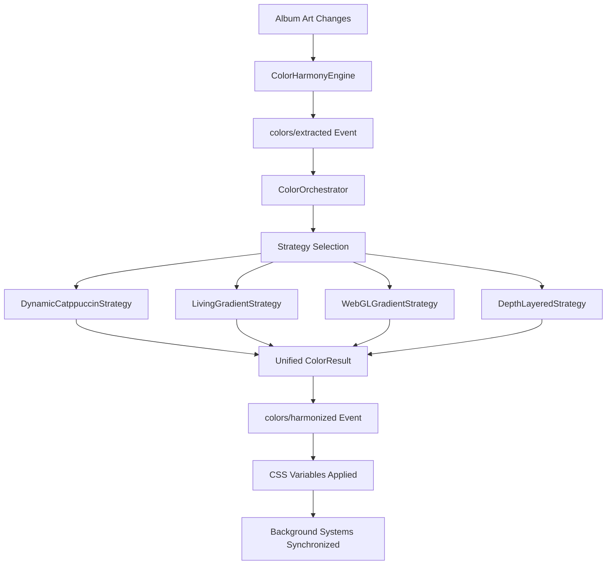

# ColorOrchestrator Strategy Integration Plan
**Option B: Unify Entire Background System via Strategy Pattern**

## 🔍 Current Architecture Analysis

### **Identified Color System Overlap:**
1. **`ColorHarmonyEngine`** - Primary color extraction + harmony processing
2. **`DynamicCatppuccinBridge`** - Parallel color processing with duplicate events
3. **`ColorOrchestrator`** - Strategy pattern coordinator (underutilized)
4. **`LivingGradientBaseSystem`** - Background gradient management
5. **`WebGLGradientBackgroundSystem`** - WebGL gradient rendering
6. **`DepthLayeredGradientSystem`** - Depth-conscious background layers
7. **`GradientConductor`** - Unified visual system orchestrator

### **Current Problems:**
- **Event Duplication**: Multiple systems listening to same events
- **Variable Conflicts**: Multiple systems setting same CSS variables
- **Processing Redundancy**: Color extraction happening multiple times
- **No Clear Hierarchy**: Unclear which system is authoritative

## 🎯 Strategy Integration Solution

### **Transform ALL Background Systems into Color Processing Strategies**

Instead of having separate, overlapping systems, create a unified strategy-based architecture where:

1. **ColorOrchestrator** becomes the single source of truth for all color processing
2. **All background systems** become color processing strategies
3. **Single event flow** with clear strategy selection
4. **Unified CSS variable management**

## 📋 Implementation Plan

### **Phase 1: Create Background Processing Strategies**

#### **1.1 DynamicCatppuccinStrategy** (Transform existing DynamicCatppuccinBridge)
```typescript
export class DynamicCatppuccinStrategy implements IColorProcessor {
  getStrategyName(): string { return "dynamic-catppuccin"; }
  
  async processColors(context: ColorContext): Promise<ColorResult> {
    // Handle Spicetify variable updates + consciousness extensions
    // Apply color facade pattern within strategy
  }
  
  canProcess(context: ColorContext): boolean {
    // Only process when dynamic accent is enabled
    return this.isDynamicAccentEnabled();
  }
}
```

#### **1.2 LivingGradientStrategy** (Transform LivingGradientBaseSystem)
```typescript
export class LivingGradientStrategy implements IColorProcessor {
  getStrategyName(): string { return "living-gradient"; }
  
  async processColors(context: ColorContext): Promise<ColorResult> {
    // Handle living base background transformations
    // Coordinate with WebGL system
  }
}
```

#### **1.3 WebGLGradientStrategy** (Transform WebGLGradientBackgroundSystem)
```typescript
export class WebGLGradientStrategy implements IColorProcessor {
  getStrategyName(): string { return "webgl-gradient"; }
  
  async processColors(context: ColorContext): Promise<ColorResult> {
    // Handle WebGL gradient rendering
    // Coordinate with CSS fallbacks
  }
}
```

#### **1.4 DepthLayeredStrategy** (Transform DepthLayeredGradientSystem)
```typescript
export class DepthLayeredStrategy implements IColorProcessor {
  getStrategyName(): string { return "depth-layered"; }
  
  async processColors(context: ColorContext): Promise<ColorResult> {
    // Handle depth-conscious layered gradients
  }
}
```

### **Phase 2: Enhanced Strategy Selection Logic**

#### **2.1 Background-Specific Strategy Selection Criteria**
```typescript
interface BackgroundStrategySelectionCriteria extends StrategySelectionCriteria {
  backgroundType: 'dynamic-accent' | 'living-gradient' | 'webgl' | 'depth-layered';
  settingsContext: {
    dynamicAccentEnabled: boolean;
    gradientIntensity: string;
    webglEnabled: boolean;
    visualGuideMode: string;
    depthLayersEnabled: boolean;
    consciousnessLevel: number;
  };
  musicContext?: {
    energy: number;
    tempo: number;
    genre: string;
  };
  deviceContext: {
    supportsWebGL: boolean;
    performanceLevel: 'low' | 'medium' | 'high';
    memoryCapacity: number;
  };
}
```

#### **2.2 Intelligent Strategy Orchestration Logic**

**Strategy Selection Algorithm:**
```typescript
class BackgroundStrategySelector {
  selectStrategies(context: ColorContext, criteria: BackgroundStrategySelectionCriteria): IColorProcessor[] {
    const strategies: IColorProcessor[] = [];
    
    // Always include dynamic accent if enabled
    if (criteria.settingsContext.dynamicAccentEnabled) {
      strategies.push(new DynamicCatppuccinStrategy());
    }
    
    // Living gradient as foundation (unless explicitly disabled)
    strategies.push(new LivingGradientStrategy());
    
    // WebGL strategy for high-performance devices
    if (criteria.deviceContext.supportsWebGL && criteria.deviceContext.performanceLevel !== 'low') {
      strategies.push(new WebGLGradientStrategy());
    }
    
    // Depth layers for enhanced consciousness
    if (criteria.settingsContext.depthLayersEnabled && criteria.settingsContext.consciousnessLevel > 0.5) {
      strategies.push(new DepthLayeredStrategy());
    }
    
    return strategies;
  }
}
```

**Orchestration Features:**
- **Settings-Driven Selection**: ColorOrchestrator selects strategies based on user settings and preferences
- **Performance-Aware Selection**: Choose strategies based on device capabilities (WebGL support, memory, CPU)
- **Music-Responsive Selection**: Strategy selection adapts to music energy and genre
- **Cumulative Strategy Processing**: Multiple strategies can process the same color context for layered effects
- **Priority-Based Processing**: Higher priority strategies can override or enhance lower priority ones
- **Consciousness-Aware Selection**: Strategy selection considers the current consciousness level and visual guide mode

#### **2.3 Strategy Processing Coordination**
```typescript
class ColorOrchestrator {
  async processWithStrategies(context: ColorContext): Promise<ColorResult> {
    const selectedStrategies = this.strategySelector.selectStrategies(context, this.selectionCriteria);
    const results: ColorResult[] = [];
    
    // Process with each selected strategy
    for (const strategy of selectedStrategies) {
      if (strategy.canProcess(context)) {
        const result = await strategy.processColors(context);
        results.push(result);
      }
    }
    
    // Merge results with priority-based conflict resolution
    return this.mergeStrategyResults(results);
  }
}
```

### **Phase 3: Unified Event Flow**

#### **3.1 Single Event Pipeline**
```
Album Art Change 
  ↓
ColorHarmonyEngine (color extraction only)
  ↓
colors/extracted event 
  ↓
ColorOrchestrator (strategy selection & coordination)
  ↓
Selected Strategies (DynamicCatppuccin + LivingGradient + WebGL)
  ↓
colors/harmonized event (unified result)
  ↓
CSS Variables Applied (no conflicts)
```

#### **3.2 Eliminate Event Duplication**
- **Remove**: Direct event listeners in individual systems
- **Replace**: With strategy-based processing through ColorOrchestrator
- **Result**: Single, coordinated color processing pipeline

### **Phase 4: CSS Variable Coordination**

#### **4.1 Variable Ownership Map**
- **DynamicCatppuccinStrategy**: `--spice-accent`, `--spice-button`, core Spicetify variables
- **LivingGradientStrategy**: `--living-base-gradient`, breathing-related variables
- **WebGLGradientStrategy**: `--sn-gradient-*`, WebGL coordination variables
- **DepthLayeredStrategy**: Depth and layering-specific variables

#### **4.2 Conflict Resolution**
- **Strategy Priority**: Higher priority strategies can override variables
- **Namespace Separation**: Each strategy owns specific variable namespaces
- **Coordination Variables**: Shared variables for cross-strategy communication

## 🔧 Technical Benefits

### **Architectural Improvements:**
- ✅ **Single Source of Truth**: ColorOrchestrator manages all color processing
- ✅ **No Event Duplication**: One event flow, multiple strategies
- ✅ **Clear Separation**: Each strategy has distinct responsibility
- ✅ **Performance Optimization**: Strategy selection based on device capabilities
- ✅ **Settings Integration**: Strategy selection driven by user preferences

### **Code Quality Improvements:**
- ✅ **Reduced Complexity**: Eliminate circular dependencies
- ✅ **Better Testing**: Each strategy can be tested independently
- ✅ **Easier Debugging**: Clear strategy hierarchy for troubleshooting
- ✅ **Future Extensibility**: Easy to add new background processing strategies

## 🚀 Migration Strategy

### **Phase 1**: Create strategy implementations while keeping existing systems
### **Phase 2**: Route events through ColorOrchestrator alongside existing systems
### **Phase 3**: Disable old systems, enable strategy-only processing
### **Phase 4**: Remove old system code and clean up

## 📊 Expected Outcome

- **No White Background Issues**: Single, coordinated color processing
- **Better Performance**: Strategy selection optimizes for device capabilities
- **Cleaner Architecture**: Clear hierarchy and responsibility separation
- **Future-Proof**: Easy to add new background processing strategies
- **Enhanced Debugging**: Clear strategy-based processing pipeline

## 🏗️ Current Implementation Status

### ✅ Phase 0: Planning & Documentation
- **Plan Created**: Comprehensive strategy integration plan documented
- **Architecture Analysis**: Identified all overlapping color systems
- **Benefits Outlined**: Clear technical and architectural improvements
- **Migration Path**: Defined safe migration strategy

### 🌊 Next Priority: Phase 1
**Create Background Processing Strategies** - Transform existing background systems into IColorProcessor strategy implementations:

1. **DynamicCatppuccinStrategy**: Transform DynamicCatppuccinBridge into strategy
2. **LivingGradientStrategy**: Transform LivingGradientBaseSystem into strategy
3. **WebGLGradientStrategy**: Transform WebGLGradientBackgroundSystem into strategy
4. **DepthLayeredStrategy**: Transform DepthLayeredGradientSystem into strategy

### 📋 Implementation Roadmap
1. **Phase 1**: Create Background Processing Strategies (Next - High Priority)
2. **Phase 2**: Enhanced Strategy Selection Logic (High Priority)
3. **Phase 3**: Unified Event Flow (High Priority)
4. **Phase 4**: CSS Variable Coordination (High Priority)

---

**"Transform chaos into harmony—a single orchestrator conducting the symphony of color consciousness across all background systems."**
*Year 3000 Strategy-Driven Color Architecture*

## 🔄 Strategy Integration Event Flow



This unified strategy architecture ensures that all background color processing flows through a single, coordinated system, eliminating overlap while preserving all advanced consciousness effects and maintaining the Year 3000 System philosophy of organic, breathing interfaces.