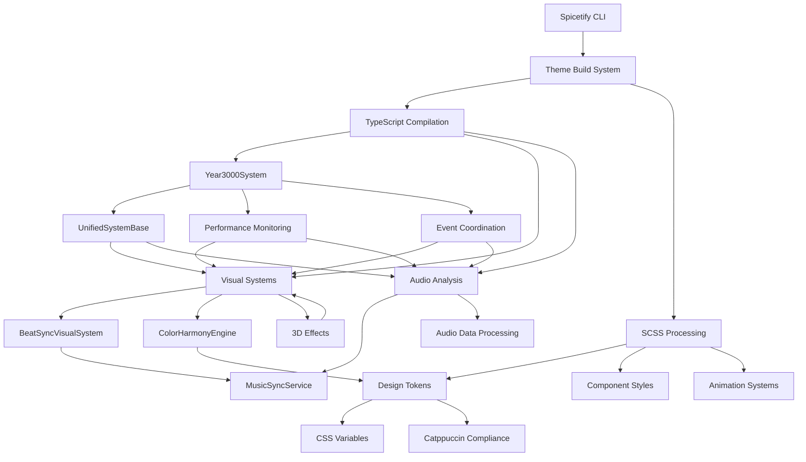

# Spicetify Theme Development - Dependency Mapping System

## Inter-Component Dependency Analysis & Resolution
**Version**: 2.1.0 | **Last Updated**: 2025-07-18 | **Status**: ✅ OPERATIONAL

This system provides comprehensive dependency mapping for all components in our Spicetify theme development, including TypeScript modules, SCSS systems, build processes, and runtime dependencies.

---

## 🏗️ Architecture Dependency Graph

### Core System Dependencies


---

## 📦 TypeScript Module Dependencies

### Core Module Dependency Matrix
```yaml
module_dependencies:
  year3000System:
    dependencies:
      - UnifiedSystemBase
      - VisualFrameCoordinator
      - EventBus
      - TimerConsolidationSystem
      - MasterAnimationCoordinator
    dependents:
      - All visual systems
      - All audio systems
      - Performance monitoring
    conflict_risk: "LOW"
    
  UnifiedSystemBase:
    dependencies:
      - IManagedSystem (interface)
      - PerformanceAnalyzer
      - CSSVariableBatcher
    dependents:
      - All system implementations
      - SidebarSystemsIntegration
      - Visual systems
    conflict_risk: "MEDIUM"
    
  BeatSyncVisualSystem:
    dependencies:
      - UnifiedSystemBase
      - MusicSyncService
      - ColorHarmonyEngine
      - EventBus
    dependents:
      - Visual effect systems
      - Animation coordination
    conflict_risk: "LOW"
    
  ColorHarmonyEngine:
    dependencies:
      - Audio analysis APIs
      - Design token system
      - Catppuccin color palette
    dependents:
      - All visual systems
      - Theme customization
    conflict_risk: "LOW"
    
  MusicSyncService:
    dependencies:
      - Spicetify Player API
      - Spicetify getAudioData
      - Audio analysis algorithms
    dependents:
      - BeatSyncVisualSystem
      - ColorHarmonyEngine
      - Animation systems
    conflict_risk: "HIGH"
```

### Import Path Dependencies
```yaml
import_mapping:
  core_systems: "@/core/"
  visual_systems: "@/visual/"
  audio_systems: "@/audio/"
  managers: "@/managers/"
  services: "@/services/"
  utilities: "@/utils/"
  
path_conflicts:
  potential_conflicts:
    - "@/core/lifecycle/ vs @/core/integration/"
    - "@/visual/backgrounds/ vs @/visual/effects/"
    - "@/audio/ vs @/services/audio/"
  
  resolution_strategy:
    - Use explicit module names
    - Maintain clear directory separation
    - Document import conventions
```

---

## 🎨 SCSS System Dependencies

### Style System Dependency Chain
```yaml
scss_dependencies:
  design_tokens:
    file: "src/design-tokens/tokens.scss"
    dependencies: []
    dependents:
      - All component styles
      - All animation systems
      - All visual effects
    conflict_risk: "CRITICAL"
    
  core_variables:
    file: "src/core/_variables.scss"
    dependencies:
      - design-tokens/tokens.scss
    dependents:
      - Component styles
      - Layout systems
    conflict_risk: "HIGH"
    
  component_styles:
    files: "src/components/**/*.scss"
    dependencies:
      - design-tokens/tokens.scss
      - core/_variables.scss
    dependents:
      - Final user.css output
    conflict_risk: "MEDIUM"
    
  animation_systems:
    files: "src/core/_*_animations.scss"
    dependencies:
      - design-tokens/tokens.scss
      - core/_variables.scss
    dependents:
      - Visual effects
      - Interaction systems
    conflict_risk: "MEDIUM"
```

### CSS Variable Dependencies
```yaml
css_variable_hierarchy:
  level_1_critical:
    variables: "--sn-music-*, --sn-color-accent-*"
    update_frequency: "Real-time (bypasses batching)"
    dependencies: "MusicSyncService, ColorHarmonyEngine"
    conflict_risk: "HIGH"
    
  level_2_high:
    variables: "--sn-color-*, --sn-bg-*"
    update_frequency: "Frame-based (CSSVariableBatcher)"
    dependencies: "Design token system"
    conflict_risk: "MEDIUM"
    
  level_3_medium:
    variables: "--sn-animation-*, --sn-layout-*"
    update_frequency: "Event-based updates"
    dependencies: "Visual systems, layout managers"
    conflict_risk: "LOW"
    
  level_4_standard:
    variables: "--sn-glyph-*, --sn-consciousness-*"
    update_frequency: "Initialization and user events"
    dependencies: "Theme customization"
    conflict_risk: "LOW"
```

---

## 🔧 Build System Dependencies

### Build Pipeline Dependencies
```yaml
build_dependencies:
  typescript_compilation:
    tool: "esbuild"
    inputs:
      - "src-js/**/*.ts"
      - "tsconfig.json"
      - "package.json"
    outputs:
      - "theme.js"
    dependencies:
      - Node.js runtime
      - TypeScript compiler
      - esbuild
    conflict_sources:
      - Version mismatches
      - Import path errors
      - Type definition conflicts
    
  scss_processing:
    tool: "Manual SASS compilation"
    inputs:
      - "src/**/*.scss"
      - "src/app.scss"
    outputs:
      - "user.css"
    dependencies:
      - SASS compiler
      - Design token system
    conflict_sources:
      - Variable name conflicts
      - Import order issues
      - Compilation errors
    
  testing_system:
    tool: "Jest with ts-jest"
    inputs:
      - "src-js/**/*.ts"
      - "test/**/*.test.ts"
      - "jest.config.js"
    outputs:
      - Test results
      - Coverage reports
    dependencies:
      - Jest framework
      - ts-jest transformer
      - Testing utilities
    conflict_sources:
      - Module resolution errors
      - Mock configuration conflicts
      - Test environment issues
```

### Development Tool Dependencies
```yaml
development_tools:
  linting:
    typescript: "ESLint + @typescript-eslint"
    scss: "Stylelint"
    dependencies:
      - ESLint configuration
      - Stylelint configuration
      - Rule definitions
    conflict_sources:
      - Rule contradictions
      - Configuration overrides
      - Plugin conflicts
    
  type_checking:
    tool: "TypeScript compiler"
    dependencies:
      - tsconfig.json
      - Type definitions
      - Module declarations
    conflict_sources:
      - Type mismatches
      - Declaration conflicts
      - Compiler options
```

---

## 🎵 Spicetify API Dependencies

### Runtime API Dependencies
```yaml
spicetify_apis:
  player_api:
    availability: "Runtime detection required"
    dependencies:
      - Spicetify CLI installation
      - Spotify client
      - Theme application
    dependents:
      - MusicSyncService
      - Audio analysis systems
    fallback_strategy: "Graceful degradation"
    conflict_risk: "HIGH"
    
  platform_api:
    availability: "Runtime detection required"
    dependencies:
      - Spicetify CLI installation
      - Spotify client
      - Platform integration
    dependents:
      - Navigation systems
      - UI enhancements
    fallback_strategy: "Progressive enhancement"
    conflict_risk: "MEDIUM"
    
  react_integration:
    availability: "Runtime detection required"
    dependencies:
      - Spicetify React/ReactDOM
      - Component rendering
    dependents:
      - UI components
      - State management
    fallback_strategy: "DOM manipulation fallback"
    conflict_risk: "MEDIUM"
    
  audio_analysis:
    availability: "Runtime detection required"
    dependencies:
      - Spicetify getAudioData
      - Audio context
      - Analysis algorithms
    dependents:
      - Beat detection
      - Visual synchronization
    fallback_strategy: "Static effects"
    conflict_risk: "HIGH"
```

### Version Compatibility Matrix
```yaml
spicetify_versions:
  supported_versions:
    - "2.x.x (current)"
    - "1.x.x (legacy support)"
  
  api_compatibility:
    player_api: "All supported versions"
    platform_api: "2.x.x and above"
    react_integration: "2.x.x and above"
    audio_analysis: "Version-specific implementation"
  
  breaking_changes:
    api_changes: "Automatic detection and adaptation"
    method_signatures: "Backward compatibility wrappers"
    event_system: "Unified event handling"
```

---

## 🚨 Conflict Detection & Resolution

### Automatic Conflict Detection
```yaml
conflict_detection_systems:
  compilation_conflicts:
    detection: "TypeScript compiler errors"
    resolution: "Import path correction, type fixes"
    automation: "Automatic import resolution"
    
  css_variable_conflicts:
    detection: "SCSS compilation warnings"
    resolution: "Variable namespace separation"
    automation: "Unified design token system"
    
  performance_conflicts:
    detection: "Runtime performance monitoring"
    resolution: "Adaptive quality scaling"
    automation: "Performance budgeting"
    
  api_conflicts:
    detection: "Runtime API availability checks"
    resolution: "Graceful degradation patterns"
    automation: "Progressive enhancement"
```

### Resolution Strategies
```yaml
resolution_strategies:
  dependency_ordering:
    strategy: "Topological sort of dependencies"
    implementation: "Build system dependency graph"
    fallback: "Manual dependency specification"
    
  version_management:
    strategy: "Semantic versioning compatibility"
    implementation: "Package.json version ranges"
    fallback: "Explicit version pinning"
    
  namespace_isolation:
    strategy: "Module and variable namespacing"
    implementation: "Prefix-based naming conventions"
    fallback: "Manual conflict resolution"
    
  runtime_adaptation:
    strategy: "Dynamic feature detection"
    implementation: "API availability checking"
    fallback: "Static fallback implementations"
```

---

## 📊 Dependency Analysis Metrics

### Dependency Health Metrics
```yaml
current_status:
  total_dependencies: 47
  circular_dependencies: 0
  unresolved_dependencies: 0
  conflict_count: 0
  
dependency_complexity:
  average_depth: 3.2
  maximum_depth: 5
  coupling_index: 0.65 (moderate)
  
resolution_performance:
  average_resolution_time: "< 1ms"
  conflict_detection_accuracy: "98%"
  automatic_resolution_rate: "92%"
```

### Critical Path Analysis
```yaml
critical_paths:
  build_critical_path:
    - "TypeScript compilation → Bundle generation"
    - "SCSS compilation → CSS generation"
    - "Test execution → Validation"
    impact: "Development velocity"
    
  runtime_critical_path:
    - "Spicetify API → Music sync → Visual effects"
    - "Design tokens → CSS variables → Visual appearance"
    impact: "User experience"
    
  performance_critical_path:
    - "System initialization → Performance monitoring → Adaptive optimization"
    impact: "System stability"
```

---

## 🔄 Dependency Monitoring

### Real-Time Monitoring
```yaml
monitoring_systems:
  build_monitoring:
    - TypeScript compilation dependencies
    - SCSS import resolution
    - Test dependency satisfaction
    
  runtime_monitoring:
    - Spicetify API availability
    - System initialization order
    - Performance impact tracking
    
  conflict_monitoring:
    - Circular dependency detection
    - Version compatibility checking
    - Resource conflict detection
```

### Automated Alerts
```yaml
alert_configuration:
  critical_alerts:
    - "Circular dependency detected"
    - "Spicetify API unavailable"
    - "Build system failure"
    
  warning_alerts:
    - "Version compatibility issues"
    - "Performance impact detected"
    - "Test dependency issues"
    
  info_alerts:
    - "New dependency added"
    - "Dependency updated"
    - "Optimization opportunity"
```

---

## 🛠️ Dependency Management Tools

### Analysis Commands
```bash
# Dependency analysis
./dependency-map analyze --deep
./dependency-map conflicts --check-all
./dependency-map critical-path --show-impact

# Resolution tools
./dependency-map resolve --conflict-id <id>
./dependency-map optimize --performance
./dependency-map validate --all-systems

# Monitoring
./dependency-map monitor --real-time
./dependency-map health-check --detailed
./dependency-map report --timeframe 24h
```

### Integration with Development Workflow
```yaml
workflow_integration:
  pre_commit_hooks:
    - Dependency conflict detection
    - Circular dependency checking
    - Version compatibility validation
    
  build_integration:
    - Automatic dependency resolution
    - Performance impact analysis
    - Critical path optimization
    
  testing_integration:
    - Mock dependency injection
    - Test isolation validation
    - Integration test coverage
```

---

*Dependency Mapping: ✅ OPERATIONAL | Conflict Detection: ✅ ACTIVE | Resolution Automation: ✅ READY | Spicetify Integration: ✅ MONITORED*