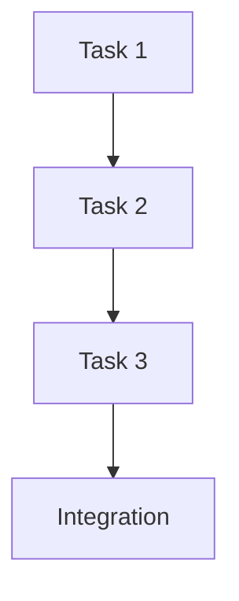

# Plan-to-Task Workflow

**Version**: 1.0.0 | **Created**: 2025-07-23 | **Purpose**: Systematic transition from high-level plans to actionable tasks

## Overview

This document establishes a clear workflow for breaking down master plans into actionable tasks that can be efficiently executed by development agents. This process ensures that high-level strategic plans are properly decomposed into manageable, trackable work items.

## Workflow Stages

### Stage 1: Plan Analysis
**Input**: Master plan (e.g., `PHASE-2-MASTER-PLAN.md`)  
**Output**: Task decomposition analysis  
**Owner**: Planning agent or lead developer

### Stage 2: Task Creation
**Input**: Task decomposition analysis  
**Output**: Individual task folders with structured templates  
**Owner**: Assigned development agent

### Stage 3: Task Execution
**Input**: Well-defined task with clear success criteria  
**Output**: Completed implementation with documentation  
**Owner**: Development agent

### Stage 4: Integration
**Input**: Completed tasks  
**Output**: Integrated system with plan completion  
**Owner**: Integration agent or lead developer

## Detailed Workflow Process

### Stage 1: Plan Analysis

#### 1.1 Identify Decomposable Plans
Look for plans that contain multiple distinct work items:
- ✅ Complex multi-phase implementations
- ✅ Plans with multiple technical systems involved
- ✅ Plans requiring sequential dependencies
- ❌ Simple single-system changes
- ❌ Documentation-only updates

#### 1.2 Extract Task Components
For each decomposable plan, identify:

```markdown
## Task Decomposition Analysis

### Plan: [Plan Name]
**Estimated Total Effort**: [Time estimate]
**Dependencies**: [External dependencies]
**Success Criteria**: [High-level success metrics]

### Identified Tasks:

#### Task 1: [Task Name]
- **Type**: [CSS/WebGL/Architecture/Effects/Integration]
- **Complexity**: [Low/Medium/High]
- **Prerequisites**: [What must be done first]
- **Success Criteria**: [Specific completion criteria]
- **Estimated Effort**: [Time estimate]
- **Agent Specialization**: [Required skills]

#### Task 2: [Task Name]
[Same structure as Task 1]

### Task Dependencies:


### Resource Requirements:
- **Concurrent Tasks**: [How many can run in parallel]
- **Shared Resources**: [Systems that multiple tasks will modify]
- **Critical Path**: [Tasks that block other work]
```

#### 1.3 Validate Decomposition
Ensure the task breakdown is:
- ✅ **Complete**: All plan objectives covered by tasks
- ✅ **Non-overlapping**: No duplicate work between tasks
- ✅ **Properly sequenced**: Dependencies clearly defined
- ✅ **Appropriately sized**: Each task is 1-5 days of work
- ✅ **Testable**: Each task has measurable completion criteria

### Stage 2: Task Creation

#### 2.1 Create Task Workspace
For each identified task:

```bash
# Create task directory
export TASK_NAME="css-consciousness-integration"
mkdir -p plans/tasks/$TASK_NAME

# Create task files from templates
cp plans/task-templates/status-template.md plans/tasks/$TASK_NAME/status.md
cp plans/task-templates/notes-template.md plans/tasks/$TASK_NAME/notes.md
cp plans/task-templates/implementation-plan-template.md plans/tasks/$TASK_NAME/implementation-plan.md
```

#### 2.2 Populate Task Details
Update each task file with specific information:

**status.md**:
```markdown
# Task: CSS Consciousness Integration

**Agent**: [To be assigned]
**Started**: [Date when work begins]
**Priority**: High
**Status**: Ready
**Parent Plan**: PHASE-2-MASTER-PLAN.md
**Dependencies**: None

## Task Overview
Consolidate CSS variable management systems into a unified consciousness-driven controller.

## Success Criteria
- [ ] UnifiedCSSConsciousnessController created and tested
- [ ] CSSVariableBatcher functionality integrated
- [ ] Performance optimization features working
- [ ] All dependent systems migrated
- [ ] Bundle size reduced by 15-25KB
- [ ] npm run build passes with no errors
- [ ] Test coverage remains above 90%

## Current Focus
[Updated by assigned agent when work begins]

## Blockers
None currently identified

## Next Actions
1. Review existing CSS variable systems
2. Design unified controller architecture
3. Begin implementation with performance monitoring
```

**implementation-plan.md**:
```markdown
# Implementation Plan: CSS Consciousness Integration

## Technical Overview
This task implements a unified CSS consciousness controller by consolidating:
- CSSVariableBatcher (batched DOM updates)
- UnifiedCSSVariableManager (high-level CSS management)
- PerformanceCSSIntegration (performance-aware coordination)

## Architecture Design

### Current Systems
```typescript
// Systems to be consolidated
CSSVariableBatcher -> DOM updates
UnifiedCSSVariableManager -> CSS logic
PerformanceCSSIntegration -> Performance coordination
```

### Target Architecture
```typescript
// New unified system
UnifiedCSSConsciousnessController {
  - Batched variable updates (from CSSVariableBatcher)
  - High-level CSS management (from UnifiedCSSVariableManager)
  - Performance-aware optimization (from PerformanceCSSIntegration)
  - Consciousness-driven updates (new feature)
  - Device capability integration (enhanced)
}
```

## Implementation Phases

### Phase 1: Architecture Setup (Day 1)
- [ ] Create UnifiedCSSConsciousnessController class
- [ ] Define interfaces and types
- [ ] Set up basic structure with IManagedSystem compliance

### Phase 2: Core Integration (Days 2-3)
- [ ] Migrate CSSVariableBatcher functionality
- [ ] Integrate UnifiedCSSVariableManager capabilities
- [ ] Add PerformanceCSSIntegration performance awareness
- [ ] Implement consciousness-driven updates

### Phase 3: System Migration (Day 4)
- [ ] Update all dependent systems to use new controller
- [ ] Remove redundant systems
- [ ] Update imports and dependencies

### Phase 4: Testing & Optimization (Day 5)
- [ ] Add comprehensive tests
- [ ] Performance validation
- [ ] Bundle size verification
- [ ] Integration testing

## Performance Targets
- **Bundle Reduction**: 15-25KB
- **Memory Usage**: No increase
- **CPU Overhead**: <1% additional
- **Build Time**: No degradation

## Integration Points
- **Visual Systems**: All systems using CSS variables
- **Performance Systems**: PerformanceAnalyzer integration
- **Facade Pattern**: Registration with SystemCoordinator

## Testing Strategy
- Unit tests for core functionality
- Integration tests for system migration
- Performance regression testing
- Bundle size verification

## Rollback Plan
- Preserve original systems during transition
- Feature flags for gradual rollout
- Performance monitoring with automatic rollback triggers
```

#### 2.3 Update Coordination Systems
Register the new task in coordination systems:

```bash
# Update agent coordination
echo "| **New Task** | CSS Specialist | $TASK_NAME | 15-25KB | 🟢 READY | None |" >> plans/agent-coordination.md

# Update project status if it's a major task
echo "## Active Task Development" >> plans/project-status.md
echo "- **$TASK_NAME**: Ready for agent assignment" >> plans/project-status.md
```

### Stage 3: Task Execution

#### 3.1 Agent Assignment
When an agent takes on a task:

```bash
# Update task status
sed -i 's/Agent**: \[To be assigned\]/Agent**: Agent-Alpha/' plans/tasks/$TASK_NAME/status.md
sed -i 's/Started**: \[Date when work begins\]/Started**: $(date)/' plans/tasks/$TASK_NAME/status.md
sed -i 's/Status**: Ready/Status**: In Progress/' plans/tasks/$TASK_NAME/status.md

# Update coordination dashboard
sed -i 's/🟢 READY/🔄 IN PROGRESS/' plans/agent-coordination.md
```

#### 3.2 Implementation Tracking
Throughout implementation, the agent updates:

**status.md** - Regular status updates:
```markdown
## Current Focus
Implementing Phase 2: Core Integration
- ✅ CSSVariableBatcher functionality migrated
- 🔄 Working on UnifiedCSSVariableManager integration
- ⏳ PerformanceCSSIntegration next

## Progress
- [x] Phase 1: Architecture Setup (Day 1) - COMPLETE
- [x] Phase 2: Core Integration (Days 2-3) - 60% COMPLETE  
- [ ] Phase 3: System Migration (Day 4)
- [ ] Phase 4: Testing & Optimization (Day 5)
```

**notes.md** - Implementation discoveries:
```markdown
## Key Discoveries
- CSSVariableBatcher performance impact was greater than expected
- UnifiedCSSVariableManager had circular dependencies with ColorHarmonyEngine
- Found opportunity for additional 5KB savings through shared utilities

## Code Patterns Used
```typescript
// Unified consciousness-driven CSS updates
class UnifiedCSSConsciousnessController {
  private batchUpdates(variables: CSSVariableUpdate[]): void {
    // Optimized batching with consciousness awareness
  }
}
```

## Performance Considerations
- Bundle size reduction: Currently at 18KB (target: 15-25KB) ✅
- Memory usage: No increase detected ✅  
- Build time: Improved by 2ms ✅
```

#### 3.3 Integration Testing
Before marking complete, verify integration:

```bash
# Build verification
npm run build
npm test
npm run lint:js
npm run lint:css

# Performance verification
npm run test:performance
npm run analyze:bundle
```

### Stage 4: Task Completion & Integration

#### 4.1 Task Completion
When a task is complete:

```bash
# Update task status
sed -i 's/Status**: In Progress/Status**: Complete/' plans/tasks/$TASK_NAME/status.md
echo "**Completed**: $(date)" >> plans/tasks/$TASK_NAME/status.md

# Update coordination dashboard
sed -i 's/🔄 IN PROGRESS/✅ COMPLETE/' plans/agent-coordination.md
```

#### 4.2 Plan Progress Update
Update the parent plan's progress:

```markdown
## Phase 2.1 Progress Update
- ✅ **CSS Consciousness Integration** - Completed $(date)
  - Bundle reduction achieved: 18KB
  - Performance targets met
  - All tests passing
- 🔄 **Background Consolidation** - Ready to begin (depends on CSS integration)
```

#### 4.3 Integration Verification
Verify that completed tasks integrate properly:

```bash
# System integration tests
npm run test:integration

# End-to-end functionality tests  
npm run test:e2e

# Performance regression testing
npm run test:performance
```

## Task Templates

### Quick Task Creation Script
```bash
#!/bin/bash
# scripts/create-task.sh

TASK_NAME=$1
TASK_TYPE=${2:-"implementation"}
PARENT_PLAN=${3:-""}

if [ -z "$TASK_NAME" ]; then
    echo "Usage: $0 <task-name> [implementation|research|integration] [parent-plan]"
    exit 1
fi

mkdir -p "plans/tasks/$TASK_NAME"

# Create status.md
cat > "plans/tasks/$TASK_NAME/status.md" << EOF
# Task: $TASK_NAME

**Agent**: [To be assigned]
**Started**: [Date when work begins]  
**Priority**: Medium
**Status**: Ready
**Parent Plan**: $PARENT_PLAN
**Dependencies**: [List dependencies]

## Task Overview
[Brief description of what this task accomplishes]

## Success Criteria
- [ ] Success criterion 1
- [ ] Success criterion 2
- [ ] npm run build passes
- [ ] Tests pass

## Current Focus
[Updated by assigned agent]

## Blockers
None currently identified

## Next Actions
1. [First action]
2. [Second action]
EOF

# Create notes.md  
cat > "plans/tasks/$TASK_NAME/notes.md" << EOF
# Implementation Notes: $TASK_NAME

## Key Discoveries
[Important findings during implementation]

## Code Patterns Used
\`\`\`typescript
// Example code patterns or solutions
\`\`\`

## Performance Considerations
[Memory usage, build time, or runtime performance notes]

## Integration Points
[How this connects to other systems]

## Gotchas and Pitfalls
[Things to watch out for]

## Testing Approach
[How this was tested or should be tested]
EOF

echo "✅ Task '$TASK_NAME' created successfully"
echo "📁 Location: plans/tasks/$TASK_NAME/"
echo "📝 Next: Update agent-coordination.md to assign this task"
```

## Workflow Integration with Development Process

### Pre-Development
1. **Plan Review**: Identify plans ready for task decomposition
2. **Task Analysis**: Break down into actionable work items
3. **Resource Planning**: Estimate effort and identify skill requirements
4. **Dependency Mapping**: Establish task execution order

### During Development
1. **Regular Updates**: Agents update task status and progress
2. **Coordination**: Cross-agent communication through coordination files
3. **Integration Testing**: Continuous verification of task integration
4. **Performance Monitoring**: Track against plan performance targets

### Post-Development
1. **Task Completion**: Mark tasks complete with success verification
2. **Plan Progress**: Update parent plan completion status
3. **Integration Verification**: Ensure all tasks work together
4. **Archive Preparation**: Prepare plans for archival when complete

## Quality Gates

### Task Creation Quality
- [ ] Success criteria are specific and measurable
- [ ] Dependencies are clearly identified
- [ ] Effort estimates are realistic (1-5 days)
- [ ] Integration points are documented
- [ ] Performance targets are defined

### Task Execution Quality
- [ ] Regular status updates (every 1-2 days)
- [ ] Build passes at each major milestone
- [ ] Performance targets are tracked
- [ ] Integration is tested continuously
- [ ] Documentation is updated as needed

### Task Completion Quality
- [ ] All success criteria met
- [ ] Tests pass with adequate coverage
- [ ] Performance targets achieved
- [ ] Integration verified
- [ ] Documentation updated

---

**Workflow Version**: 1.0.0  
**Last Updated**: 2025-07-23  
**Purpose**: Systematic plan-to-task decomposition and execution