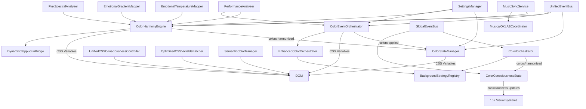

# Color System Dependency Analysis

**Phase**: color-system-consolidation | **Section**: Analysis | **Document**: Dependency Analysis

## **Complete System Dependency Map**



## **Critical Integration Points**

| From System | To System | Integration Type | Data Flow | Risk Level |
|-------------|-----------|------------------|-----------|------------|
| ColorHarmonyEngine | ColorStateManager | UnifiedEventBus: `colors:harmonized` | Processed colors, accent hex/rgb | **HIGH** |
| ColorEventOrchestrator | ColorStateManager | UnifiedEventBus: `colors:applied` | Final CSS variables | **HIGH** |
| ColorOrchestrator | ColorConsciousnessState | GlobalEventBus: `colors/harmonized` | Color palette, consciousness data | **MEDIUM** |
| MusicSyncService | ColorHarmonyEngine | Direct method calls | Music analysis, beat data | **HIGH** |
| SettingsManager | All Color Systems | Event subscriptions | Theme settings, user preferences | **HIGH** |
| Multiple Systems | DOM | Direct `setProperty()` calls | CSS variable values | **CRITICAL** |

## **Event Flow Analysis**

### **Primary Event Chain (UnifiedEventBus)**
1. **Album Art Extraction** → `colors:extracted` event
2. **ColorEventOrchestrator** receives and processes
3. **ColorHarmonyEngine** processes via strategy pattern
4. **ColorHarmonyEngine** emits `colors:harmonized` 
5. **ColorStateManager** receives and applies CSS variables
6. **ColorStateManager** emits `colors:applied`

### **Secondary Event Chain (GlobalEventBus)** 
1. **ColorOrchestrator** receives `colors/extracted`
2. **ColorOrchestrator** processes via strategies
3. **ColorOrchestrator** emits `colors/harmonized`
4. **ColorConsciousnessState** receives and updates consciousness

### **Event System Fragmentation**
- **UnifiedEventBus**: Modern system used by newer components
- **GlobalEventBus**: Legacy system used by older consciousness components
- **Direct Method Calls**: Some systems bypass events entirely

## **Resource Conflict Analysis**

### **CSS Variable Ownership Conflicts**
```typescript
// CRITICAL CONFLICTS - Multiple systems setting same variables
const conflictingVariables = {
  '--sn-accent-hex': [
    'ColorStateManager',
    'ColorHarmonyEngine', 
    'ColorEventOrchestrator',
    'DynamicCatppuccinBridge'
  ],
  '--spice-accent': [
    'ColorStateManager',
    'ColorHarmonyEngine',
    'SemanticColorManager',
    '20+ other files'
  ],
  '--sn-gradient-*': [
    'ColorHarmonyEngine',
    'Multiple background systems',
    'Strategy implementations'
  ]
};
```

### **Memory & Performance Conflicts**
- **Redundant Processing**: Same album art processed by 3+ systems
- **Event Loop Saturation**: Multiple systems emitting same events
- **CSS Thrashing**: Race conditions between CSS appliers
- **Memory Leaks**: Event listeners not properly cleaned up

### **Circular Dependency Risks**
- **ColorHarmonyEngine** ↔ **ColorEventOrchestrator** (both process colors)
- **ColorStateManager** ↔ **ColorHarmonyEngine** (both apply CSS)
- **ColorOrchestrator** ↔ **EnhancedColorOrchestrator** (duplicate functionality)

## **Integration Complexity Matrix**

| System | External Dependencies | Internal Integrations | CSS Variables Set | Event Subscriptions |
|--------|----------------------|----------------------|-------------------|-------------------|
| ColorStateManager | SettingsManager, UnifiedEventBus | 2 events | 270+ variables | 2 subscriptions |
| ColorHarmonyEngine | BaseVisualSystem, OKLAB utils | 4+ systems | 150+ variables | 1 subscription |
| ColorEventOrchestrator | Strategies, MOLC, Settings | 5+ systems | 50+ variables | 5 subscriptions |
| ColorOrchestrator | GlobalEventBus, Strategies | 3+ systems | Via strategies | 2 subscriptions |
| ColorConsciousnessState | GlobalEventBus, RGB types | Visual systems | Via events | 1 subscription |

## **Migration Risk Assessment**

### **High Risk Migrations**
1. **Event System Unification** (GlobalEventBus → UnifiedEventBus)
   - **Risk**: Breaking consciousness effects that depend on GlobalEventBus
   - **Mitigation**: Gradual migration with bridge adapters
   - **Testing**: Comprehensive consciousness effect validation

2. **CSS Variable Authority** (Multiple → Single)
   - **Risk**: Race conditions during transition causing visual glitches
   - **Mitigation**: Atomic cutover with rollback capability
   - **Testing**: Visual regression testing across all themes

3. **Color Processing Consolidation** (3 orchestrators → 1)
   - **Risk**: Loss of specialized processing logic
   - **Mitigation**: Preserve all algorithms in unified system
   - **Testing**: Color accuracy validation with known inputs

### **Medium Risk Migrations**
1. **Music Integration Consolidation**
   - **Risk**: Timing issues in music-to-color synchronization
   - **Mitigation**: Preserve all music processing pipelines
   - **Testing**: Real-time music sync validation

2. **Strategy Pattern Simplification**
   - **Risk**: Loss of pluggable color processing flexibility
   - **Mitigation**: Maintain strategy interface with unified selection
   - **Testing**: All strategy implementations must pass existing tests

### **Low Risk Migrations**
1. **Consciousness Effects Integration**
   - **Risk**: Visual effect changes
   - **Mitigation**: Preserve all consciousness calculation logic
   - **Testing**: Consciousness behavior validation

## **Critical Dependencies for Preservation**

### **Must Preserve Exactly**
- **ColorStateManager.updateColorState()** - Core color state logic
- **ColorHarmonyEngine.processColors()** - OKLAB processing algorithm
- **MusicSyncService integration** - Music-to-color synchronization
- **All CSS variable names** - SCSS files depend on exact naming
- **Event data structures** - Consumer systems expect specific formats

### **Can Be Refactored**
- **Event subscription patterns** - Can unify to single event system
- **CSS application timing** - Can optimize with batching
- **Strategy selection logic** - Can simplify while preserving functionality
- **Performance monitoring** - Can consolidate metrics collection

## **Consolidation Sequence Planning**

### **Phase 1: Event System Unification** (Low Risk Start)
1. Create event adapters for gradual migration
2. Migrate ColorConsciousnessState to UnifiedEventBus
3. Remove GlobalEventBus dependencies gradually

### **Phase 2: CSS Authority Consolidation** (High Impact)
1. Make ColorStateManager the single CSS applier
2. Remove CSS application from ColorHarmonyEngine
3. Remove CSS application from ColorEventOrchestrator
4. Create batched update system for performance

### **Phase 3: Processing Logic Merger** (Complex but High Value)
1. Merge ColorEventOrchestrator + ColorHarmonyEngine
2. Preserve all OKLAB processing logic
3. Maintain all music integration capabilities
4. Unify strategy pattern implementation

---
**Analysis Status**: Complete - Ready for Consolidation Planning  
**Last Updated**: 2025-07-27  
**Next Step**: Implementation section with unified architecture design
