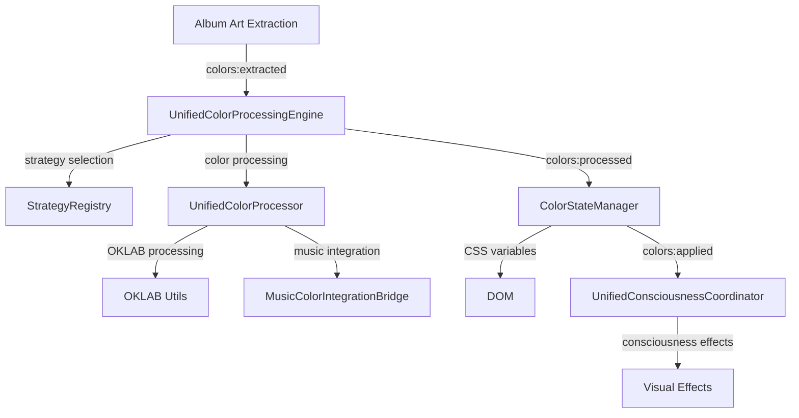

# Unified Color System Architecture Design

**Phase**: color-system-consolidation | **Section**: Implementation | **Document**: Controller Design

## **Target Architecture: 4 Core Systems**

### **System 1: UnifiedColorProcessingEngine**
**File**: `src-js/core/color/UnifiedColorProcessingEngine.ts`
**Base Class**: `BaseVisualSystem`
**Interfaces**: `IManagedSystem`, `IColorProcessor`, `IColorOrchestrator`

**Consolidated Systems**:
- **ColorEventOrchestrator**: Event pipeline coordination, queue management
- **ColorOrchestrator**: Strategy pattern implementation, GlobalEventBus coordination  
- **EnhancedColorOrchestrator**: Lightweight coordination, UnifiedEventBus integration
- **ColorHarmonyEngine**: OKLAB processing logic, music integration, strategy processing

### **System 2: Enhanced ColorStateManager**
**File**: `src-js/core/css/ColorStateManager.ts` (enhanced)
**Role**: **ONLY** system that applies CSS variables to DOM
**Base Class**: `BaseSystemService`
**Interfaces**: `IManagedSystem`

**Enhanced Responsibilities**:
- Central state coordination (existing)
- **Single CSS authority** (consolidated from 6+ systems)
- Batched CSS variable updates for performance
- Event coordination with UnifiedColorProcessingEngine

### **System 3: UnifiedConsciousnessCoordinator**
**File**: `src-js/visual/consciousness/UnifiedConsciousnessCoordinator.ts`
**Base Class**: `BaseVisualSystem`
**Interfaces**: `IManagedSystem`

**Consolidated Systems**:
- **ColorConsciousnessState**: Transcendent consciousness effects
- **DynamicCatppuccinBridge**: Album art to Catppuccin integration
- **Multiple consciousness engines**: CinematicDramaEngine, EtherealBeautyEngine, etc.

### **System 4: MusicColorIntegrationBridge**
**File**: `src-js/audio/MusicColorIntegrationBridge.ts`
**Base Class**: `BaseVisualSystem`
**Interfaces**: `IManagedSystem`

**Consolidated Systems**:
- **MusicalOKLABCoordinator**: Musical OKLAB coordination
- **EmotionalTemperatureMapper**: Music to emotional temperature
- **EmotionalGradientMapper**: Audio to gradient mapping
- **FluxSpectralAnalyzer**: Spectral music analysis (coordination)

## **Detailed Architecture Design**

### **UnifiedColorProcessingEngine Design**
```typescript
/**
 * Single entry point for all color processing in the Year 3000 System
 * Consolidates 3 orchestrators + ColorHarmonyEngine processing logic
 */
export class UnifiedColorProcessingEngine extends BaseVisualSystem 
  implements IManagedSystem, IColorProcessor, IColorOrchestrator {
  
  // === CORE STATE MANAGEMENT ===
  private processingState: ProcessingState = {
    isProcessing: false,
    currentTrackUri: null,
    processingQueue: [],
    lastProcessingTime: 0
  };
  
  // === SHARED INFRASTRUCTURE ===
  private strategyRegistry: BackgroundStrategyRegistry;
  private strategySelector: BackgroundStrategySelector;
  private performanceAnalyzer: PerformanceAnalyzer;
  private musicalOKLABCoordinator: MusicalOKLABCoordinator;
  
  // === CONSOLIDATED FUNCTIONALITY ===
  private colorProcessor: UnifiedColorProcessor;     // From ColorHarmonyEngine
  private eventCoordinator: UnifiedEventCoordinator; // From orchestrators
  private queueManager: ProcessingQueueManager;      // From orchestrators
  
  // === MAIN PROCESSING PIPELINE ===
  public async processColors(context: ColorContext): Promise<ColorResult> {
    // Unified processing combining best of all orchestrators
    const startTime = performance.now();
    
    // Strategy selection (from orchestrators)
    const strategy = await this.strategySelector.selectStrategy(context);
    
    // Color processing (from ColorHarmonyEngine) 
    const result = await this.colorProcessor.processWithOKLAB(context, strategy);
    
    // Performance tracking (from orchestrators)
    this.updateMetrics(performance.now() - startTime);
    
    // Emit to ColorStateManager (single responsibility)
    unifiedEventBus.emit('colors:processed', result);
    
    return result;
  }
  
  // === EVENT COORDINATION ===
  public async handleColorExtraction(data: ColorExtractedEvent): Promise<void> {
    // Queue management from orchestrators
    if (this.processingState.isProcessing) {
      this.processingState.processingQueue.push(this.createContext(data));
      return;
    }
    
    // Process with timeout and error recovery
    await this.processWithFallback(data);
  }
  
  // === STRATEGY PATTERN UNIFICATION ===
  public selectStrategy(criteria: StrategySelectionCriteria): IColorProcessor {
    // Unified strategy selection from all orchestrators
    return this.strategySelector.selectOptimalStrategy(criteria);
  }
  
  // === API COMPATIBILITY ===
  // Preserve existing API surface for dependent systems
  public get currentTheme(): CatppuccinFlavor { 
    return this.colorProcessor.currentTheme; 
  }
  
  public validateColorHarmony(color: RGBColor, context: string): ValidationResult {
    return this.colorProcessor.validateColorHarmony(color, context);
  }
}
```

### **Enhanced ColorStateManager Design**
```typescript
/**
 * Enhanced ColorStateManager - Single CSS Variable Authority
 * ONLY system allowed to apply CSS variables to DOM
 */
export class ColorStateManager implements IManagedSystem {
  // === EXISTING FUNCTIONALITY (preserved) ===
  private currentState: ColorStateResult | null = null;
  private settingsManager: SettingsManager;
  
  // === NEW: UNIFIED CSS AUTHORITY ===
  private cssVariableBatcher: UnifiedCSSVariableBatcher;
  private cssVariableValidator: CSSVariableValidator;
  
  // === MAIN CSS APPLICATION (only place CSS variables are set) ===
  public async applyProcessedColors(result: ColorResult): Promise<void> {
    // Combine processed colors with current state
    const newState = this.calculateColorState(result);
    
    // Generate comprehensive CSS variables 
    const cssVariables = this.generateComprehensiveCSSVariables(newState);
    
    // Apply with batched updates (performance optimization)
    await this.cssVariableBatcher.batchApplyVariables(cssVariables);
    
    // Validate application (catch issues early)
    const isValid = await this.cssVariableValidator.validateApplication(cssVariables);
    
    if (!isValid) {
      console.warn('CSS variable application validation failed');
      await this.applyFallbackColors();
    }
    
    // Update state and emit completion
    this.currentState = newState;
    unifiedEventBus.emit('colors:applied', { 
      cssVariables, 
      state: newState,
      appliedAt: Date.now() 
    });
  }
  
  // === SETTINGS INTEGRATION (enhanced) ===
  private async handleSettingsChange(event: SettingsChangedEvent): Promise<void> {
    // Enhanced settings processing with validation
    if (this.isColorAffectingSetting(event.settingKey)) {
      await this.updateColorState(this.determineUpdateTrigger(event));
    }
  }
  
  // === CSS VARIABLE GENERATION (consolidated) ===
  private generateComprehensiveCSSVariables(state: ColorStateResult): Record<string, string> {
    const variables: Record<string, string> = {};
    
    // Core color variables (existing functionality)
    this.addCoreColorVariables(variables, state);
    
    // Spicetify compatibility (from SemanticColorManager)
    this.addSpicetifyVariables(variables, state);
    
    // Gradient system (from ColorHarmonyEngine)
    this.addGradientVariables(variables, state);
    
    // OKLAB processing (from ColorHarmonyEngine)
    this.addOKLABVariables(variables, state);
    
    // UI component mapping (from ColorHarmonyEngine)
    this.addUIComponentVariables(variables, state);
    
    return variables;
  }
}
```

## **Shared Infrastructure Design**

### **UnifiedCSSVariableBatcher** 
**Purpose**: Performance-optimized CSS variable application
**Consolidates**: OptimizedCSSVariableBatcher + CSSVariableCoordinator + direct setProperty() calls
```typescript
class UnifiedCSSVariableBatcher {
  public async batchApplyVariables(variables: Record<string, string>): Promise<void> {
    // Batch DOM updates for performance
    // Validate variables before application
    // Handle timing and coordination
  }
}
```

### **UnifiedEventCoordinator**
**Purpose**: Event coordination across all color systems  
**Consolidates**: Event handling from all 3 orchestrators
```typescript
class UnifiedEventCoordinator {
  public coordinateColorProcessing(data: ColorExtractedEvent): Promise<void> {
    // Handle event routing
    // Manage event timing
    // Coordinate with other systems
  }
}
```

### **UnifiedColorProcessor**
**Purpose**: Core color processing logic
**Consolidates**: ColorHarmonyEngine processing + OKLAB coordination
```typescript
class UnifiedColorProcessor {
  public async processWithOKLAB(context: ColorContext, strategy: IColorProcessor): Promise<ColorResult> {
    // OKLAB color science processing
    // Music integration
    // Catppuccin harmony
    // Strategy pattern execution
  }
}
```

## **Event Flow Redesign**

### **New Unified Event Flow**


### **Event Types Consolidation**
```typescript
// Simplified event types
interface UnifiedColorEvents {
  'colors:extracted': ColorExtractedEvent;      // Input from album art
  'colors:processed': ColorProcessedEvent;      // From UnifiedColorProcessingEngine
  'colors:applied': ColorAppliedEvent;          // From ColorStateManager
  'consciousness:updated': ConsciousnessEvent;  // From UnifiedConsciousnessCoordinator
}
```

## **Performance Optimizations**

### **Processing Performance**
- **Single Processing Pipeline**: Eliminates redundant processing across 3 orchestrators
- **Queue Deduplication**: Smart queue management prevents duplicate processing
- **Strategy Caching**: Cache strategy selection results for identical contexts
- **OKLAB Optimization**: Reuse OKLAB calculations across similar colors

### **CSS Performance** 
- **Batched Updates**: All CSS variables applied in single DOM update cycle
- **Change Detection**: Only apply variables that actually changed
- **Critical Path**: Prioritize accent colors, defer non-critical variables
- **Validation Caching**: Cache CSS variable validation results

### **Memory Performance**
- **Shared Utilities**: Single instances of expensive processing utilities
- **Event Cleanup**: Proper event listener cleanup prevents memory leaks
- **Object Pooling**: Reuse color processing objects to reduce GC pressure
- **Queue Management**: Automatic queue size limits prevent memory bloat

## **API Compatibility Strategy**

### **Backward Compatibility**
```typescript
// Preserve existing APIs during transition
export class UnifiedColorProcessingEngine {
  // ColorHarmonyEngine compatibility
  public get currentTheme(): CatppuccinFlavor { /* delegate */ }
  public validateColorHarmony(...args): ValidationResult { /* delegate */ }
  public blendWithCatppuccin(...args): any { /* delegate */ }
  
  // ColorEventOrchestrator compatibility  
  public getMetrics(): ColorProcessingMetrics { /* delegate */ }
  public forceReprocessColors(): Promise<void> { /* delegate */ }
  
  // ColorOrchestrator compatibility
  public processColorStrategy(...args): Promise<any> { /* delegate */ }
}
```

### **Migration Bridges**
```typescript
// Temporary bridges during migration
export const colorHarmonyEngine = new Proxy(unifiedColorProcessingEngine, {
  get(target, prop) {
    // Redirect calls to unified engine with deprecation warnings
    console.warn(`ColorHarmonyEngine.${prop} is deprecated, use UnifiedColorProcessingEngine`);
    return target[prop];
  }
});
```

---
**Design Status**: Complete - Ready for Implementation Planning  
**Last Updated**: 2025-07-27  
**Next Step**: API compatibility design and migration strategy
