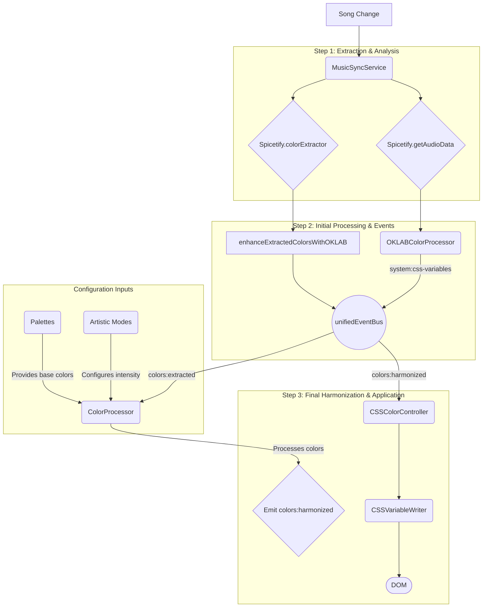

# StarryNight Theme: A Comprehensive Guide to the Color System

## 1. Introduction

This document provides a complete guide to the StarryNight theme's dynamic color system. Its purpose is to empower developers and designers to understand, customize, and extend the theme's colors to create new, beautiful palettes that align with project standards.

The color system is not a simple static theme; it's a multi-stage **vibrancy and enhancement pipeline**. It is designed to be dynamic, music-responsive, and visually striking. Understanding this pipeline is key to making effective changes.

## 2. Core Concepts

- **Palette Systems**: The theme has two foundational color systems, managed by the `PaletteSystemManager`.
  - **`Catppuccin Classic`**: The original, standard Catppuccin color definitions.
  - **`Year 3000 Cinematic`**: The advanced, default system responsible for the vibrant, gradient-heavy aesthetic. It uses its own set of palettes defined in `src-js/utils/color/Year3000Palettes.ts`.

- **OKLAB Color Space**: We use the OKLAB color space for all color manipulations. It is a *perceptually uniform* space, meaning changes in color values correspond directly to how a human perceives the change. This allows us to make colors brighter or more saturated in a way that feels natural and avoids "muddy" or distorted results.

- **Artistic Modes**: These are presets that define the *intensity* of the color enhancement pipeline. They control blend ratios and brightness/saturation boosts. The current modes are:
  - `corporate-safe`: The most subdued and least altered output.
  - `artist-vision`: The balanced, default mode.
  - `advanced-maximum`: The most intense mode, maximizing brightness and saturation. Note: `cosmic-maximum` is a legacy alias for this mode in the codebase.

- **Event-Driven Architecture**: The color pipeline is not a simple linear process. It is an **event-driven system** orchestrated by a central `unifiedEventBus`. Components emit and subscribe to events, allowing for a decoupled and flexible architecture.

- **Note on Flavors vs. Systems**: It is important to understand that `CatppuccinFlavor` (`mocha`, `latte`, etc.) and `Year3000Flavor` (`subtle`, `balanced`, etc.) are two separate and distinct sets of palettes. The "Palette System" setting (`sn-palette-system`) determines which system is active. The "Catppuccin flavour" setting (`catppuccin-flavor`) only applies when the "Catppuccin Classic" palette system is selected. The Year 3000 system uses its own internal flavor logic, which is not directly exposed as a separate setting.

## 3. The Modern Color Pipeline: An Event-Driven Breakdown

The final color you see is the result of a coordinated, event-driven process. Instead of a simple, linear data flow, multiple systems react to events and contribute to the final CSS output.

### Architecture Diagram (Mermaid)



### **Step 1: Initiation & Initial Enhancement (`MusicSyncService`)**

This is the starting point. When a new song plays, this service is responsible for the initial color generation and analysis.

- **File Location**: `src-js/audio/MusicSyncService.ts`
- **Process**:
    1.  **Color Extraction**: The `robustColorExtraction` function calls Spicetify's native `colorExtractor` to get a raw color palette from the current song's album art.
    2.  **Initial OKLAB Enhancement**: The raw colors are immediately processed by `enhanceExtractedColorsWithOKLAB`. This is the **first critical enhancement step**.
    3.  **Emotional Context**: This enhancement is guided by the music's "emotional temperature" (a calculation based on energy, valence, etc.). High-energy music will use the `'COSMIC'` or `'VIBRANT'` OKLAB presets, significantly increasing the brightness and saturation of the extracted colors from the very beginning.
    4.  **Event Emission**: The service then broadcasts the enhanced colors via a **`colors:extracted`** event on the `unifiedEventBus`.

### **Step 2: Main Harmonization (`ColorProcessor`)**

The `ColorProcessor` listens for the `colors:extracted` event and performs the main, final color processing.

- **File Location**: `src-js/core/color/ColorProcessor.ts`
- **Process**:
    1.  **Receives Extracted Colors**: It subscribes to the `colors:extracted` event.
    2.  **Selects Strategy**: It chooses an appropriate color processing strategy (e.g., `WebGLGradientStrategy`, `DepthLayeredStrategy`) based on device capabilities and user settings.
    3.  **Final OKLAB Enhancement**: It runs the colors through a final `MusicalOKLABProcessor` to apply music-reactive adjustments.
    4.  **Emits Final Event**: Once all processing is complete, it emits the **`colors:harmonized`** event, containing the final, ready-to-use color set.

### **Step 3: Final Aggregation & Application (`CSSColorController`)**

This is the central authority for all color-related CSS. It listens for events from all other systems and applies the final styles.

- **File Location**: `src-js/core/css/ColorStateManager.ts` (Note: This file still contains the `CSSColorController` class, despite the legacy filename).
- **Process**:
    1.  **Listens for Events**: It subscribes to the `colors:harmonized` event to receive the final, processed colors.
    2.  **Aggregates Variables**: It collects all the CSS variables from the event payload.
    3.  **DOM Update**: It uses the **`CSSVariableWriter`** to efficiently batch-write all the final CSS variables to the DOM, which updates the theme's appearance. This class is the **single source of truth** for writing color styles.

## 4. Supporting Components: Palettes and Modes

While the pipeline describes the flow of data, the **Palettes** and **Artistic Modes** are critical configuration inputs that define the theme's aesthetic.

### Color Palettes

- **Role**: Palettes provide the foundational set of base and accent colors (the "what"). During harmonization, a color from the active palette is chosen to be blended with the color extracted from the album art. This ensures the final color is harmonious with the overall theme.
- **File Locations**:
    - **Catppuccin Palettes**: `src-js/utils/color/CatppuccinPalettes.ts`
    - **Year 3000 Palettes**: `src-js/utils/color/Year3000Palettes.ts`
- **Accessed Via**: The `PaletteSystemManager` (`src-js/utils/color/PaletteSystemManager.ts`) is used by the `ColorProcessor` to access the currently selected palette.

### Artistic Modes

- **Role**: Artistic Modes are configuration profiles that control the *intensity* of the processing (the "how"). They define the boost multipliers for saturation and luminance, as well as the blend ratios used during harmonization. For example, `advanced-maximum` mode uses higher multipliers to create a more vibrant and dramatic effect than `corporate-safe`.
- **File Location**: `src-js/config/artisticProfiles.ts`
- **Accessed Via**: The `ColorProcessor` reads the currently selected artistic mode from the settings and applies the corresponding multipliers from the profile during the blending and enhancement steps.

## 5. How to Create a New Palette (Updated Process)

The process for adding a new palette has changed due to the new modal-based settings UI.

1.  **Define the Palette**:
    - Open `src-js/utils/color/Year3000Palettes.ts`.
    - Add a new entry to the `YEAR3000_PALETTES` object. Copy the structure of an existing flavor like `cinematic`. You must provide HEX values for all the required color names.
    - Update the `Year3000Flavor` type at the top of the file to include your new flavor's key.

2.  **Register the Palette in Settings**:
    - Open `src-js/ui/components/SettingsModal.tsx`.
    - Locate the `createSettingsSection` function.
    - Find the `flavourOptions` constant array.
    - Add the key for your new flavor to this array.
    ```typescript
    // In SettingsModal.tsx
    const flavourOptions = ["latte", "frappe", "macchiato", "mocha", "aurora", "bioluminescent", "my_new_flavor"] as const;
    ```

3.  **Build and Apply**:
    - Run `npm run build:js:dev` to compile your TypeScript changes.
    - Reload Spotify and select your new flavor from the settings menu.

## 6. How to Align and Tweak Colors

If you want to adjust the *behavior* of the color system (e.g., make it less bright) instead of defining new colors, you should modify the enhancement pipeline.

### To Reduce Overall Brightness and Saturation:

- **Target**: `OKLABColorProcessor`
- **File**: `src-js/audio/ColorHarmonyEngine.ts`
- **Action**:
    1.  Locate the `vibrancyConfig` object.
    2.  **Reduce `artisticSaturationBoost`**: Lower this from `1.35` to a smaller value (e.g., `1.1`).
    3.  **Reduce `enhancedLuminanceBoost`**: Lower this from `1.25` to a smaller value (e.g., `1.05`).
    4.  **Reduce `defaultBlendRatio`**: Lower this from `0.75` to give the base theme colors more influence over the final output.

### To Create a New Artistic Mode (e.g., "Studio Reference"):

- **Target**: `artisticProfiles.ts` and `OKLABColorProcessor`
- **Files**:
    - `src-js/config/artisticProfiles.ts`
    - `src-js/audio/ColorHarmonyEngine.ts`
- **Action**:
    1.  In `artisticProfiles.ts`, define a new profile with your desired blend ratios and boosts.
    2.  In `OKLABColorProcessor` (`ColorHarmonyEngine.ts`), add logic within `blendColors` to reference your new profile.
    3.  In `src-js/ui/components/SettingsModal.tsx`, find the `artisticOptions` constant array inside `createSettingsSection` and add your new mode's key to it.

## 7. Conclusion (Updated)

The StarryNight color system is a powerful and highly customizable **event-driven architecture**. Simple changes to base colors will be overridden by the enhancement pipeline. To make meaningful alterations, you must understand the flow of events and modify the correct components: `MusicSyncService` for initial extraction and enhancement, and `OKLABColorProcessor` for music-driven emotional analysis. All final color application is handled by the `CSSColorController`, which listens for events from these systems.

## 8. Action Items & Documentation Update Tasks

This guide has been partially updated to reflect the new architecture, but further work is required. The following tasks need to be completed to bring this document fully up to date:

-   [x] **Task 1: Update All Class Names.** Systematically replace outdated names.
-   [x] **Task 2: Redraw Architecture Diagram.** Create a new diagram that accurately represents the event-driven flow via `unifiedEventBus`.
-   [x] **Task 3: Investigate and Document Settings UI.** The new modal-based settings UI has been analyzed and the process for updating dropdowns is now documented.
-   [x] **Task 4: Clarify Palette Systems.** A note has been added to clarify the distinction between `CatppuccinFlavor` and `Year3000Flavor`.
-   [x] **Task 5: Clarify `colors:harmonized` Event.** The origin of the `colors:harmonized` event has been identified as the `ColorProcessor` and the pipeline documentation has been updated.
-   [x] **Task 6: Update Artistic Mode Names.** The guide now consistently refers to `advanced-maximum` and notes the `cosmic-maximum` legacy alias.
