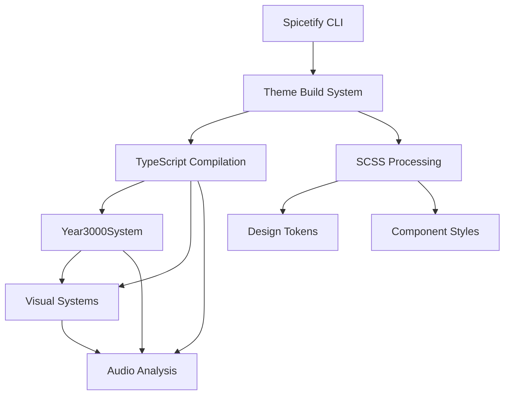

# Project Dependencies

Technical dependency mapping for the Catppuccin StarryNight Spicetify theme.

## Core System Dependencies



## TypeScript Module Dependencies

### High-Risk Dependencies (require coordination)

- **MusicSyncService**: Depends on Spicetify Player API, getAudioData
  - **Dependents**: BeatSyncVisualSystem, ColorHarmonyEngine, animation systems
  - **Risk**: API availability changes, version compatibility

- **Design Token System**: Core CSS variable definitions
  - **Dependents**: All SCSS files, all visual systems
  - **Risk**: Variable name conflicts, compilation cascade failures

- **UnifiedSystemBase**: Base class for all managed systems
  - **Dependents**: All system implementations
  - **Risk**: Interface changes affect all systems

### Medium-Risk Dependencies

- **ColorHarmonyEngine**: Audio-to-color processing
  - **Dependents**: Visual systems, theme customization
  - **Risk**: Performance impact on color updates

- **Performance Systems**: Monitoring and adaptive scaling
  - **Dependents**: All visual systems
  - **Risk**: Monitoring overhead, false performance alerts

### Low-Risk Dependencies

- **Utility Functions**: Helper functions and shared utilities
- **Type Definitions**: TypeScript interfaces and types
- **Configuration**: Build and development configurations

## SCSS Dependencies

### Critical Path (breaks build if conflicts occur)

1. **Design Tokens** (`src/design-tokens/tokens.scss`)
   - No dependencies
   - Required by ALL other SCSS files

2. **Core Variables** (`src/core/_variables.scss`)  
   - Depends on: Design tokens
   - Required by: Component styles, animations

3. **Component Styles** (`src/components/**/*.scss`)
   - Depends on: Design tokens, core variables
   - Output: Final user.css

### CSS Variable Hierarchy

- **Level 1 (Real-time)**: `--sn-music-*`, `--sn-color-accent-*`
- **Level 2 (Frame-based)**: `--sn-color-*`, `--sn-bg-*`  
- **Level 3 (Event-based)**: `--sn-animation-*`, `--sn-layout-*`
- **Level 4 (Static)**: `--sn-theme-*`, configuration variables

## Spicetify API Dependencies

### Runtime Detection Required

```typescript
// API availability must be checked at runtime
const apis = {
  player: typeof Spicetify?.Player !== 'undefined',
  platform: typeof Spicetify?.Platform !== 'undefined', 
  react: typeof React !== 'undefined',
  audioData: typeof Spicetify?.getAudioData !== 'undefined'
};
```

### Fallback Strategies

- **Player API**: Graceful degradation to static effects
- **Audio Analysis**: Fallback to basic beat detection
- **React Integration**: DOM manipulation fallback
- **Platform API**: Progressive enhancement only

## Build System Dependencies

### Critical Build Tools

- **esbuild**: TypeScript compilation (target: <30ms)
- **TypeScript**: Type checking and compilation
- **Jest**: Testing framework (90%+ coverage required)
- **SASS**: Manual SCSS compilation

### Development Commands

```bash
npm run build      # Main TypeScript build
npm run typecheck  # Type validation only
npm test          # Test suite execution
npm run lint:css  # SCSS linting
npm run lint:js   # TypeScript linting
```

## Conflict Detection

### Automatic Detection

- **TypeScript**: Compilation errors indicate import/type conflicts
- **SCSS**: Compilation warnings indicate variable conflicts  
- **Runtime**: Performance monitoring detects resource conflicts
- **APIs**: Runtime checks detect Spicetify availability issues

### Common Conflict Types

1. **CSS Variable Conflicts**: Multiple systems updating same variables
2. **Import Path Conflicts**: Circular dependencies or incorrect paths
3. **Performance Conflicts**: Multiple systems exceeding performance budgets
4. **API Conflicts**: Multiple systems accessing same Spicetify APIs

## Resolution Strategies

### Prevention
- Use module path mapping (`@/` prefix for imports)
- Implement unified design token system
- Follow performance budgeting (60fps, <50MB memory, <30ms builds)
- Check API availability before usage

### Detection
- Build system monitors compilation errors
- Performance system monitors resource usage
- Runtime checks monitor API availability

### Resolution
- Automatic import path correction
- Design token namespace separation  
- Adaptive performance scaling
- Progressive API enhancement patterns

---

*Dependency Mapping - Technical coordination for safe development*