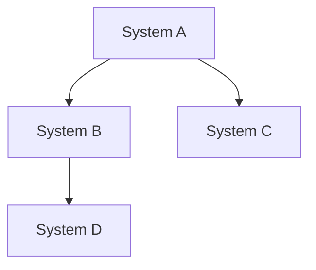

# Analysis Section Template

**Section**: Analysis | **Phase**: [PHASE_NAME] | **Status**: [STATUS] | **Progress**: [X]%

## Section Overview

**Purpose**: Comprehensive system analysis to understand existing architecture, identify consolidation opportunities, and plan unified implementation approach.

**Success Criteria**: 
- [ ] Complete system architecture documentation
- [ ] Dependency mapping with conflict identification
- [ ] Consolidation opportunities prioritized by impact
- [ ] Implementation strategy validated with stakeholders

## Section Status

### Current Progress
- [ ] **System Inventory** - Catalog all systems in scope
- [ ] **Architecture Analysis** - Document current implementation patterns  
- [ ] **Dependency Mapping** - Map inter-system dependencies and conflicts
- [ ] **Consolidation Assessment** - Identify optimization opportunities
- [ ] **Implementation Planning** - Define unified architecture approach

### Completion Criteria
- [ ] All systems analyzed with line counts and functionality mapping
- [ ] Architecture patterns documented with strengths/weaknesses
- [ ] Dependency graph created showing integration points
- [ ] Consolidation target identified with expected impact metrics
- [ ] Implementation approach validated for feasibility

## Analysis Deliverables

### 1. System Analysis (`system-analysis.md`)

**Template Structure**:
```markdown
## Systems in Scope
| System | File | Lines | Primary Function | Key Dependencies |
|--------|------|-------|------------------|------------------|
| [Name] | [Path] | [Count] | [Description] | [Dependencies] |

## Architecture Patterns Analysis
### Pattern 1: [Pattern Name]
- **Usage**: [Which systems use this]
- **Strengths**: [What works well]
- **Weaknesses**: [What could be improved]
- **Consolidation Opportunity**: [How this could be unified]

## Functionality Mapping
### Core Functions
- [Function 1]: Implemented in [Systems]
- [Function 2]: Implemented in [Systems]

### Duplicate Code Analysis
- **Estimated Duplication**: [Percentage]
- **Common Patterns**: [List of repeated code patterns]
- **Consolidation Potential**: [Expected reduction]
```

### 2. Dependency Analysis (`dependency-analysis.md`)

**Template Structure**:
```markdown
## System Dependencies


## Integration Points
| From System | To System | Integration Type | Risk Level |
|-------------|-----------|------------------|------------|
| [System] | [System] | [API/Event/etc] | [High/Med/Low] |

## Conflict Analysis
### Direct Conflicts
- [System A] vs [System B]: [Description of conflict]

### Resource Conflicts  
- [Resource]: Used by [Systems] - [Conflict description]

## Migration Considerations
- [Consideration 1]: [Impact and mitigation]
- [Consideration 2]: [Impact and mitigation]
```

### 3. Consolidation Opportunities (`consolidation-opportunities.md`)

**Template Structure**:
```markdown
## Consolidation Targets

### Primary Target: [Unified Controller Name]
**Systems to Consolidate**: [List]
**Expected Benefits**:
- Bundle Size Reduction: [X]KB ([Y]%)
- Code Deduplication: [X] lines → [Y] lines ([Z]% reduction)
- Architecture Simplification: [Description]
- Performance Impact: [Expected improvement]

### Implementation Approach
1. **Phase 1**: [Description]
2. **Phase 2**: [Description]  
3. **Phase 3**: [Description]

### Risk Assessment
- **Technical Risks**: [List with mitigations]
- **Timeline Risks**: [List with mitigations]
- **Integration Risks**: [List with mitigations]

## Alternative Approaches Considered
### Approach 1: [Name]
- **Pros**: [Benefits]
- **Cons**: [Drawbacks]
- **Decision**: [Why chosen/rejected]

### Approach 2: [Name]
- **Pros**: [Benefits]
- **Cons**: [Drawbacks]  
- **Decision**: [Why chosen/rejected]
```

## Analysis Methodology

### System Inventory Process
1. **File Discovery**: Use `find` and `grep` to locate all relevant system files
2. **Line Counting**: Document size and complexity of each system
3. **Function Mapping**: Identify primary responsibilities of each system
4. **API Analysis**: Document public interfaces and integration points

### Architecture Analysis Process  
1. **Pattern Identification**: Look for common architectural patterns
2. **Interface Analysis**: Document how systems communicate
3. **Dependency Tracking**: Map all inter-system dependencies
4. **Performance Profiling**: Identify performance bottlenecks

### Consolidation Assessment Process
1. **Similarity Analysis**: Identify systems with overlapping functionality
2. **Deduplication Potential**: Estimate code reduction opportunities
3. **Integration Complexity**: Assess difficulty of unification
4. **Risk Evaluation**: Identify potential issues with consolidation

## Tools and Commands

### Useful Analysis Commands
```bash
# System discovery
find src-js -name "*.ts" | grep -E "(System|Manager|Controller)" | sort

# Line counting
wc -l src-js/path/to/SystemFile.ts

# Dependency analysis  
grep -r "import.*SystemName" src-js/

# Function analysis
grep -n "export.*function\|export.*class" src-js/path/to/file.ts

# TODO/FIXME analysis
grep -r "TODO\|FIXME\|XXX" src-js/
```

### Analysis Validation Checklist
- [ ] All systems documented with accurate metrics
- [ ] Dependencies verified through code inspection
- [ ] Consolidation estimates validated with similar past work
- [ ] Risk assessment includes technical and timeline factors
- [ ] Implementation approach feasible within project constraints

## Communication

### Stakeholder Review Points
- **System Inventory Complete**: Present findings to technical leads
- **Architecture Analysis Ready**: Review patterns with architecture team
- **Consolidation Plan Drafted**: Validate approach with project stakeholders
- **Analysis Section Complete**: Formal review before Implementation section

### Documentation Standards
- Use consistent terminology across all analysis documents
- Include code examples where helpful for understanding
- Provide measurable metrics wherever possible (lines, bundle size, etc.)
- Link to relevant source files with line numbers when referencing code

---

**Section Status**: [In Progress/Complete]  
**Next Section**: Implementation (pending analysis completion)  
**Last Updated**: [DATE]  
**Estimated Completion**: [DATE]