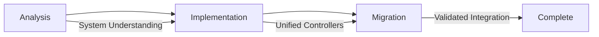

# Comprehensive Phase Template

**Phase**: [PHASE_NAME] | **Version**: 1.0.0 | **Created**: [DATE] | **Type**: Comprehensive A/I/M Development

## Phase Overview

**Purpose**: [Brief description of what this comprehensive phase achieves]
**Success Criteria**: [Measurable outcomes that define completion]
**Bundle Impact Target**: [Expected bundle size reduction/optimization]
**Timeline Estimate**: [Expected completion timeframe]

### Phase Architecture
This comprehensive phase follows the proven **Analysis → Implementation → Migration (A/I/M)** pattern:

- **Analysis Section**: System analysis, dependency mapping, consolidation opportunities
- **Implementation Section**: Unified controller design, development, API compatibility
- **Migration Section**: Integration updates, legacy compatibility, testing validation

## Section Coordination

### Current Section Status
- [ ] **Analysis** - System understanding and planning
- [ ] **Implementation** - Development and creation  
- [ ] **Migration** - Integration and validation

### Section Dependencies


### Gating Criteria

#### Analysis → Implementation
- [ ] System analysis complete with architecture documentation
- [ ] Dependency mapping finalized
- [ ] Consolidation opportunities identified and prioritized
- [ ] Success metrics defined with measurable targets

#### Implementation → Migration
- [ ] Unified controller(s) created and tested
- [ ] API compatibility layer implemented
- [ ] Code consolidation achieving target reduction
- [ ] TypeScript compilation successful with zero errors

#### Migration → Complete
- [ ] Integration points updated (VisualSystemFacade, Year3000System, etc.)
- [ ] Legacy compatibility maintained with getter delegation
- [ ] All tests passing with maintained functionality
- [ ] Bundle optimization achieved within target range

## Phase Resources

### Documentation Structure
```
plans/[phase-name]/
├── PHASE-STATUS.md              # This file - overall coordination
├── analysis/                    # Section 1: Analysis
│   ├── section-status.md
│   ├── system-analysis.md
│   ├── dependency-analysis.md
│   └── consolidation-opportunities.md
├── implementation/              # Section 2: Implementation  
│   ├── section-status.md
│   ├── unified-controller-design.md
│   ├── api-compatibility.md
│   └── implementation-progress.md
├── migration/                   # Section 3: Migration
│   ├── section-status.md
│   ├── integration-updates.md
│   ├── legacy-compatibility.md
│   └── testing-validation.md
└── artifacts/                   # Generated files, test results
    ├── before-metrics.md
    ├── after-metrics.md
    └── performance-comparison.md
```

### Key Contacts & Coordination
- **Primary Agent**: [Agent responsible for overall coordination]
- **Section Leads**: 
  - Analysis: [Agent name]
  - Implementation: [Agent name] 
  - Migration: [Agent name]
- **Review Required**: [Stakeholders for major decisions]

## Success Metrics

### Quantitative Targets
- **Bundle Size**: [Before] → [Target] ([Reduction %])
- **Build Time**: [Before] → [Target] ([Change])
- **TypeScript Errors**: 0 (maintained)
- **Test Coverage**: 90%+ (maintained)
- **Code Consolidation**: [Lines before] → [Lines after] ([Reduction %])

### Qualitative Targets
- [ ] Architecture simplification achieved
- [ ] Performance optimization maintained or improved
- [ ] API compatibility preserved for all consumers
- [ ] Documentation updated with new patterns
- [ ] Knowledge transfer completed for future phases

## Risk Management

### Identified Risks
- **Technical Risk**: [e.g., API compatibility challenges]
  - *Mitigation*: [Strategy to address]
- **Timeline Risk**: [e.g., complexity underestimation]
  - *Mitigation*: [Strategy to address]
- **Integration Risk**: [e.g., system interdependencies]
  - *Mitigation*: [Strategy to address]

### Rollback Plan
- [ ] Backup of existing system state before migration
- [ ] Feature flags for gradual rollout capability
- [ ] Automated tests to validate rollback functionality
- [ ] Documentation of rollback procedures

## Communication

### Status Updates
- **Daily**: Section status updates in respective section-status.md files
- **Weekly**: Overall phase status update in this file
- **Milestone**: Cross-section coordination meetings for gating criteria

### Escalation Path
1. **Section Issues**: Section lead → Phase coordinator
2. **Cross-Section Conflicts**: Phase coordinator → System architect
3. **Timeline Concerns**: Phase coordinator → Project management

---

## Phase History

### Decision Log
| Date | Decision | Rationale | Impact |
|------|----------|-----------|---------|
| [DATE] | [Decision] | [Why this was chosen] | [What changed] |

### Lessons Learned
- [Key insight from Analysis section]
- [Key insight from Implementation section]  
- [Key insight from Migration section]

---

**Template Version**: 1.0.0  
**Based on**: Phase 2.4A/2.4B success patterns  
**Last Updated**: [DATE]  
**Next Review**: [DATE]